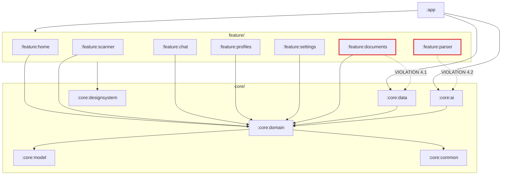

# Findings Report — State of Completion Audit

**Date:** 2026-08-07
**Commit:** `bceb6fd` (main)
**Method:** Full read of all 84 Kotlin files across 15 modules, plus build files,
manifest, resources and asset inspection. No Gradle build was executed.

---

## 0. Scope caveat

The repository contains **no specification, README, or roadmap** — this `documentation/`
directory is the first prose in the project. "Production ready" is therefore not measured
against a written spec but against the target the codebase implicitly declares for itself:

- the commit history (`Phase 0+1` … `Phase 5`, then Kokoro TTS integration),
- the interfaces it defines but does not implement,
- the dependencies it declares but does not use.

Where this report says something is "missing", it means *the code announces its intention
to have it and does not*.

**Update 2026-08-07 — direction confirmed.** The product intent is now known and is not
what the `AiProvider` enum suggested:

- **On-device AI first, privacy by construction.** The assistant does its whole job
  locally. Online models are an optional, per-query, user-approved escalation shipping
  *after* 1.0.
- **An agentic tool layer.** The model must be able to *act* — create profiles, link
  documents, set reminders — through tools that wrap existing use cases.
- **`feature:parser` is cut.** Arabic syntax analysis is out of scope, which resolves §3.2
  and §3.3 by deletion rather than repair.

The observations below are unchanged — they are facts about the code — but the **ranking in
§8 has been rewritten**. Several items previously called dead weight (`work-runtime-ktx`,
`security-crypto`, `hilt-work`, and three manifest permissions) turn out to be exactly what
the new direction needs, and **ONNX Runtime survives the parser cut** by being retargeted
at embeddings for retrieval.

---

## 1. Verdict

The project is a **well-architected, genuinely functional document-management app with an
AI layer that does not exist yet**. The scanning and document pipeline is real, working
software. The feature the product is named after — AI — is UI shells over an unimplemented
interface and two placeholder model files.

> **Progress since this audit** (2026-08-07): build verified · `feature:parser` and 180 MB of
> assets removed · APK 300.4 → 110.2 MB · test infrastructure built, **64 tests passing** ·
> 7 defects found and fixed. Live status: [04-task-list.md](04-task-list.md#live-metrics--2026-08-07).

| Dimension | Completion |
|---|---|
| Architecture & module structure | ~90% |
| Data layer (Room, DataStore, repos) | ~85% |
| Scan / OCR / extraction pipeline | ~90% |
| Document management UI | ~90% |
| Profiles | ~60% (list only, no detail) |
| **AI / LLM layer** | **~5%** |
| **Arabic syntax engine** | **~40% (code real, model fake)** |
| **TTS** | **~50% (model real, tokenizer fake)** |
| **Tests** | ~~0%~~ → **4 modules covered, 64 tests** (all 14 test-capable) |
| **Localization** | **~2%** |
| Release readiness (signing, CI, ProGuard) | ~5% |

---

## 2. What is genuinely built

These are not scaffolds. They are working implementations.

### 2.1 Persistence — real
- `core/data/database/PamDatabase.kt` — Room database, 12 entities declared in
  `entity/Entities.kt` with proper `@ForeignKey` and `@Index`.
- `DatabaseModule.kt` builds it via `Room.databaseBuilder` with
  `fallbackToDestructiveMigration()`.
- `UserPreferencesRepositoryImpl.kt` — real `androidx.datastore.preferences`
  (`pam_preferences`), real read/write of theme, language, model id, toggles.
- `DocumentRepositoryImpl`, `ProfileRepositoryImpl`, `TimelineRepositoryImpl` all inject
  real DAOs and wrap results in `PamResult`. **No in-memory fakes anywhere.**

### 2.2 Scan → OCR → extract pipeline — real
- `feature/scanner/ScannerViewModel.kt` — real ML Kit `GmsDocumentScanning`
  (Play Services document scanner), auto-launches, persists a `Document` + `DocumentPage`s.
- `core/data/ocr/OcrService.kt` — real ML Kit `TextRecognition` with
  `TextRecognizerOptions.DEFAULT_OPTIONS`, real `InputImage.fromFilePath`, real
  confidence averaging across text blocks.
- `core/data/.../EntityExtractor.kt` — a substantial hand-written engine: zone parsing for
  German DIN 5008 letters, IBAN / date / deadline / reference-number regexes, language
  detection by keyword frequency. Non-trivial, functional code.
- `core/data/.../DocumentProcessingPipeline.kt` — orchestrates OCR → extraction → save →
  timeline entry, exposing a `ProcessingState` flow for progress. Genuinely wired.
- `core/data/.../ProfileMatcher.kt` — real fuzzy matching (name / org / email scoring)
  against Room-backed `findSimilarProfiles`.
- `core/data/.../PdfGenerator.kt` — real Android `PdfDocument` rasterization.

### 2.3 UI — real
All 7 feature modules have a `@HiltViewModel` driving a `StateFlow` of real UI state with
Loading / Empty / Error / Success handling via `PamStates.kt`. No empty `Scaffold`s.

`feature/documents` is the strongest module: live search via `flatMapLatest`, favourite
toggling, extracted-field CRUD (add / edit / delete / confirm), PDF share through
`FileProvider`, OCR text copy, and profile auto-matching with
`EXACT_MATCH` / `POSSIBLE_MATCH` / `NEW_PROFILE` suggestions.

### 2.4 Foundation modules — complete
`core/model` (pure `@Serializable` data classes), `core/domain` (5 repository interfaces,
3 use cases), `core/common` (`PamResult` / `PamError` sealed hierarchy, dispatcher
qualifiers, extensions), `core/designsystem` (Material3 theme, light/dark, dynamic colour,
shared state composables). Nothing stubbed.

---

## 3. Critical gaps

### 3.1 🔴 The AI layer does not exist

This is the headline finding.

| Evidence | Detail |
|---|---|
| `core/ai/engine/AiEngine.kt` | Interface (`initialize` / `generate` / `generateStream`) with **zero implementations**. `grep -rl AiEngine` returns only the interface file itself. |
| `core/model/AiModel.kt` | `AiProvider` enum declares `LLAMA_CPP`, `CLAUDE`, `GEMINI`. None are wired — no llama.cpp bindings, no Anthropic/Google SDK, no HTTP client usage. |
| `core/ai/build.gradle.kts` | Ktor declared "for remote AI + model downloads", **never imported in any `.kt` file**. |
| `core/ai/di/AiModule.kt` | Provides only `OnnxArabicSyntaxEngine` and `TtsEngine`. **No `AiEngine` binding.** |
| `feature/chat/ChatViewModel.kt:34` | `// TODO: Replace with actual AI engine call` |
| `feature/chat/ChatViewModel.kt:38,49-72` | `delay(1500)` then `generatePlaceholderResponse()` — a hardcoded `when` on keywords ("summarize", "deadline", "draft", "sender") returning canned strings such as *"I'll summarize this document once the AI model is configured..."* |
| `core/domain/repository/ConversationRepository.kt` | Interface with **no implementation and no DAO**. `ConversationEntity` / `MessageEntity` exist in the `@Database` but have no DAO, so chat history cannot persist. |
| `core/ai/SystemPromptBuilder.kt` | Real, builds prompts from document/profile/extraction context — but has **no consumer**, because no engine exists to receive it. |

The chat UI is polished and complete. Behind it there is nothing.

### 3.2 🔴 The Arabic syntax model is a placeholder

```
arabic_syntax_hrm_v2.onnx                     617 bytes
arabic_syntax_hrm_v2.ort                    3,176 bytes
arabic_syntax_hrm_v2.with_runtime_opt.ort   3,176 bytes
```

`OnnxArabicSyntaxEngine` constructs **10 named input tensors** — `word_ids`, `pos_tags`,
`char_ids`, `bpe_ids`, `root_ids`, `pattern_ids`, `proclitic_ids`, `enclitic_ids`,
`diac_ids`, `mask` — against vocabularies up to 10,000 entries. A trained network with
those embedding tables cannot fit in 617 bytes.

The surrounding code is **genuinely good**: MD5-based stable hashing matching a described
Python training pipeline, UD-style post-processing (`HrmMappings`, `CaseEndingApplicator`,
`DiacriticCombiner`), a hand-curated ~150-entry `ArabicStemLexicon`, and a real
`ArabicRootExtractor`. It is a production-quality pipeline wrapped around an empty box.

`ParserViewModel.kt:44-67` force-deletes and re-copies the asset on every init and, on
failure, surfaces a raw debug string to the user:
`"Failed to load ONNX model. Ensure 'arabic_syntax_hrm_v2.ort' is in the Android assets folder. Trace: ${e.message}"`.

### 3.3 🔴 Kokoro TTS will produce unintelligible audio

The model is real — `kokoro_82m.onnx` is 86 MB, `voice_af_bella.bin` is 512 KB, and
`KokoroTtsEngine` performs real ONNX inference with `input_ids` / `style` / `speed`.

But `KokoroTtsEngine.kt:115-120` builds the token sequence as:

```kotlin
// STEP 1: Text Tokenization (Basic character mapping)
// Maps basic English text directly to Kokoro's Vocab JSON indices.
// For 'h' (104 ascii) -> 50 in Kokoro space, 'a' -> 43, ' ' -> 16
val simulatedTokens = LongArray(L.toInt()) { i -> ... }
```

Kokoro requires **IPA phonemes** from a g2p front end (espeak-ng or equivalent). Feeding it
raw lowercased ASCII characters produces a valid-shaped tensor and therefore runs without
error — but the audio will be noise, not speech. The variable is literally named
`simulatedTokens`.

`ArabicPhonemizer.kt:17` self-documents as `"Simplified dummy: translates String into raw
sequence length tensor sizes."` and is **never called from anywhere** — dead code.
`tools/AndroidNativeTtsEngine.kt` is a second, never-instantiated TTS implementation.

The engine actually bound in `AiModule` is `NativeArabicTtsEngine`, which uses Android's
system `TextToSpeech` for Arabic (real, works, depends on device voice packs) and falls
back to the broken Kokoro path for non-Arabic text.

### 3.4 🔴 Zero tests — *resolved 2026-08-07*

> **Status: fixed.** 64 tests now pass across 4 modules, and all 14 are test-capable via the
> `pam.test-conventions` convention plugin. The original finding is preserved below because
> it explains what the tests then found — see §3.7.

Not "low coverage" — **`src/test/` and `src/androidTest/` did not exist in any of the 15
modules.** Not even the AGP-default `ExampleUnitTest`. The test source sets were never
created.

Meanwhile every module's `build.gradle.kts` declared a full stack: JUnit5, Truth, MockK,
Turbine, `room-testing`, `coroutines-test`. The infrastructure was wired into Gradle and
completely unused.

**Worse than unused — a trap.** JUnit 5 was declared everywhere but *activated nowhere*: no
`android-junit5` plugin, no `useJUnitPlatform()`. AGP's default JUnit 4 runner discovers
zero JUnit 5 tests and reports the task **green**. Anyone adding tests would have watched
them silently not run and concluded the code was covered.

### 3.7 What the tests found

Writing the first suites surfaced **9 defects** in code that had looked fine on reading.
Seven are fixed; two remain open.

| # | Defect | Status |
|---|---|---|
| 1 | Reference regex included `\s` and was greedy — stored body prose as the reference number | ✅ Fixed |
| 2 | IBAN pattern allowed digits only after the check digits — every non-German IBAN dropped | ✅ Fixed (+ mod-97 checksum) |
| 3 | Email regex greedy on the final class — captured the sentence-ending period | ✅ Fixed |
| 4 | `ProfileMatcher` branched on `isNotEmpty()`, not confidence — 0-confidence candidates offered for linking | ✅ Fixed |
| 5 | `similar.first()` taken before scoring — "best match" was Room's arbitrary row order | ✅ Fixed |
| 6 | `orgContains` matched bare legal forms — `"AG"` scored 0.8 against every AG | ✅ Fixed |
| 7 | `if (updated != profile)` guard dead — `modifiedAt` set in the same `copy()` | ✅ Fixed |
| 8 | ViewModels discard `PamResult` from writes — failures invisible | 🔴 Open (6.7.12) |
| 9 | Language detection defaults to German below 3 marker words | 🟡 Open, documented limitation |

**The pattern worth noting:** every one of #1–#3 is a regex returning the *wrong span*
rather than throwing. None would ever surface as a crash, a log line, or a failed build —
only as quietly corrupted data. This is precisely why §3.4 mattered.

Two of the seven fixes were themselves corrected by the tests: a first attempt at #6 used a
blunt 4-character length floor that also broke legitimate short names like `"Max"`, and a
hypothesis about #9 proved wrong on contact with the actual marker list.

This is most costly around the code that most needs it: `EntityExtractor`'s regex engine,
`CaseEndingApplicator` / `DiacriticCombiner`, `ProfileMatcher`'s scoring, and the
`OnnxArabicSyntaxEngine` post-processing.

### 3.5 🔴 Localization is a facade

- `stringResource` appears **zero times** in the entire codebase.
- `app/src/main/res/values/strings.xml` contains exactly **one** string: `app_name`.
- `values-ar/` and `values-de/` exist, are wired via `android:localeConfig="@xml/locales_config"`
  (de, ar, en) — and each translates only `app_name`
  (`مدير البريد الذكي`, `Post-KI-Manager`).
- ~67 hardcoded English `Text("...")` literals across 8 files, concentrated in
  `DocumentDetailScreen.kt` (37) and `ProfileEditSheet.kt` (19).

For an app whose flagship differentiator is Arabic language support, and whose extraction
engine targets German letters, this is a product-level gap, not just a polish item.

### 3.6 🔴 Error handling is systemically weak

Individually minor; collectively a reliability problem, and the AI layer will amplify every
instance of it.

| Symptom | Evidence |
|---|---|
| Silent exception swallowing | `DocumentDetailScreen.kt:364` — `catch (_: Exception) { null }` with only a generic toast. No logging, no typed error, no user recourse. |
| Raw debug strings shown to users | `ParserViewModel.kt:66` — `"Failed to load ONNX model. Ensure '…' is in the Android assets folder. Trace: ${e.message}"` |
| No logging abstraction | Zero `PamLogger`-style indirection. Any future direct `android.util.Log` use makes `core:domain` untestable and risks leaking OCR text into logcat. |
| Errors that answer only one question | Existing error states say *what* failed. Almost none say *why*, and none offer an action that resolves the cause. |
| `PamError` under-used | `:core:common` defines a genuinely good sealed hierarchy — including AI, OCR and download cases — but much of the codebase does not route through it. |
| **ViewModels discard write results** | *Added 2026-08-07, found by test.* Every `SettingsViewModel` setter is `viewModelScope.launch { repo.setX(...) }` with the returned `PamResult` thrown away. A failed write is invisible — the toggle silently reverts on the next emission and the user is given no explanation. Tracked as task **6.7.12**. |

The foundation is sound; the discipline is not. `PamResult` / `PamError` should be extended
and used consistently, not replaced.

This matters disproportionately now because Phase 7 adds three failure classes the app has
never had: **JNI crashes** (a process kill, not a catchable exception), **OOM on model
load**, and **multi-gigabyte downloads that fail midway**. Retrofitting error handling after
those land is far more expensive than establishing it first — hence Phase 6.5.

---

## 4. Architecture violations

Derived from the actual `project(":...")` edges in every `build.gradle.kts`.

### 4.1 ✅ **RESOLVED 2026-08-09** (task 7.15.2) — `feature:documents` → `core:data`

Every other feature module depends only on `core:common`, `core:designsystem`,
`core:domain`, `core:model`. `feature:documents` additionally depends on **`core:data`**,
reaching past the domain boundary to use `ProfileMatcher`, `DocumentProcessingPipeline`
and `PdfGenerator` directly.

**Consequence:** the UI layer is compile-time coupled to Room and to Android's PDF APIs.
`DocumentDetailViewModel` cannot be unit-tested without the data layer on the classpath.

**Fix:** promote those three to `core:domain` interfaces, implement in `core:data`, bind
in Hilt.

### 4.2 🟠 `feature:parser` → `core:ai`, skipping `core:domain`

`feature:parser` depends on `core:ai` directly and does **not** depend on `core:domain` at
all. It is the only feature module that bypasses the domain layer entirely.

**Fix:** define `ArabicSyntaxEngine` / `TtsEngine` interfaces in `core:domain`; let
`core:ai` provide the implementations.

### 4.3 🟠 The use-case layer is anemic

`core:domain` contains only 3 use cases (`GetDocumentsUseCase`,
`GetDocumentDetailUseCase`, `DeleteDocumentUseCase`), yet 8 ViewModels exist. Most
ViewModels call repositories directly, putting orchestration logic in the presentation
layer. `DocumentDetailViewModel` in particular carries pipeline, matching, PDF and field
CRUD orchestration.

### 4.4 Current module graph



---

## 5. Dead weight

### 5.1 Assets — ~94 MB recoverable

| File | Size | Status |
|---|---|---|
| `kokoro_82m.onnx` | 86.0 MB | **Loaded** by `KokoroTtsEngine` |
| `kokoro_82m.ort` | 93.9 MB | **Unused** — same model, second format |
| `voice_af_bella.bin` | 512 KB | Used |
| `arabic_syntax_hrm_v2.onnx` | 617 B | Placeholder |
| `arabic_syntax_hrm_v2.ort` | 3.1 KB | Placeholder, loaded by parser |
| `arabic_syntax_hrm_v2.with_runtime_opt.ort` | 3.1 KB | Unused |
| `*.required_operators.config` ×2 | 454 B | Build-time artifacts, should not ship |

Total ≈ **180 MB** in the APK. Deleting `kokoro_82m.ort` alone recovers ~94 MB. Both ML
assets should move to on-demand download (see Phase 9).

### 5.2 Declared-but-unused dependencies

| Dependency | Declared in | Reality |
|---|---|---|
| `mlkit-language-id` | `core/data` | `EntityExtractor` does language ID with hand-rolled keyword counting. Never imported. |
| `mlkit-entity-extraction` | `core/data` | Extraction is entirely regex. Never imported. |
| `work-runtime-ktx` | `core/ai`, `core/data` | Zero `Worker` subclasses, zero `WorkManager.getInstance()` calls repo-wide. |
| `firebase-bom`, `firebase-crashlytics` | catalog | No `google-services` plugin applied, no module depends on them. |
| `security-crypto` | catalog | Never referenced, despite a Settings "Biometric lock" toggle. |
| `hilt-work`, `hilt-work-compiler` | catalog | Aliases exist, referenced by no build file. |

**Catalog `[versions]` entries with no library alias at all** (unreferenceable):
`credentialManager`, `googleDrive`, `playServicesAuth`, `robolectric`, `protobuf`,
`protobufPlugin` — leftovers from a planned Drive sync / credential sign-in / Robolectric
setup that was never built.

`onnxruntime-android:1.24.3` is hardcoded in `core/ai` and `core/data` rather than going
through the version catalog — inconsistent with the rest of the project.

### 5.3 Dead code
- `core/ai/engine/ArabicPhonemizer.kt` — never called.
- `core/ai/tools/AndroidNativeTtsEngine.kt` — never instantiated.
- `HomeViewModel.kt:46` — `HomeUiState.Success.totalCount` computed, never rendered.
- `DocumentsViewModel.onDeleteDocument` (lines 63-67) — defined, never called; there is no
  delete affordance in the documents list UI.

---

## 6. Loose ends and paper features

| Item | Location | Detail |
|---|---|---|
| Profile detail missing | `PamApp.kt:92` | `onProfileClick = { /* TODO: profile detail */ }` — tapping a profile does nothing. No `ProfileDetailScreen` exists anywhere. |
| Re-scan is a toast | `DocumentDetailScreen.kt:325` | `Toast.makeText(context, "Re-scan coming in next update", ...)` |
| Biometric lock is fiction | `SettingsScreen.kt` | Toggle persists a boolean nothing reads. No `androidx.biometric` dependency exists at all. |
| Notifications are fiction | `SettingsScreen.kt` | Toggle persists a boolean. No notification channel, no `NotificationManager` usage repo-wide. |
| Unused permissions | `AndroidManifest.xml` | `FOREGROUND_SERVICE`, `FOREGROUND_SERVICE_DATA_SYNC`, `POST_NOTIFICATIONS` declared; **no `Service` is declared and none is implemented**. *Update 2026-08-07: keep them. Resumable multi-GB model download (Phase 7.5) is exactly this use case — the manifest anticipated a subsystem that is now planned.* |
| Page dimensions never read | `ScannerViewModel.kt:54-55` | `DocumentPage` created with hardcoded `width = 0, height = 0`. |
| Silent exception swallowing | `DocumentDetailScreen.kt:364` | `catch (_: Exception) { null }` with only a generic toast, no logging. |
| Version row no-op | `SettingsScreen.kt:119-124` | `onClick = {}` |
| Orphan feature | `feature/parser` | Arabic syntax analysis occupies a 5th bottom-nav tab in a document-management app. Product coherence question, not a defect. |
| Entities without DAOs | `PamDatabase.kt` | `TagEntity`, `DocumentTagEntity`, `DocumentRelationEntity`, `ReminderEntity`, `ConversationEntity`, `MessageEntity` — 6 of 12 entities have no DAO and therefore no CRUD path. |

---

## 7. Build & release readiness

- **Gradle 8.9** (`gradle-wrapper.properties`), AGP 8.7.3, Kotlin 2.1.0.
- **Uncommitted change in `gradle.properties`:**
  ```diff
  + # Enabled parallel sync for Gradle 9.4+
  + org.gradle.tooling.parallel=true
  ```
  This targets Gradle 9.4+ behaviour on a wrapper pinned to 8.9. Gradle silently ignores
  unrecognized properties, so it is inert — not build-breaking, but misleading. Either
  upgrade the wrapper or drop the line.
- **No CI configuration** of any kind (no `.github/`, no workflow files).
- **No release signing config**, no `versionCode` strategy, ProGuard rules file exists but
  was not customized for ONNX Runtime / ML Kit / Room reflection needs.
- `fallbackToDestructiveMigration()` is enabled — **any schema change wipes user data.**
  Unacceptable for production.
- No crash reporting despite Firebase Crashlytics sitting unused in the catalog.

**Compilation: ✅ VERIFIED 2026-08-07.** `./gradlew assembleDebug` → **BUILD SUCCESSFUL in
3m 8s**, 451 tasks. The inference from static reading held. The risk is entirely at
**runtime** (mocked chat, placeholder ONNX model), not at build time.

### 7.1 Measured APK composition 🔴

The debug APK is **300 MB compressed / 402.7 MB uncompressed** — far worse than the ~180 MB
the asset audit predicted, because **no `abiFilters` are configured** and ONNX Runtime ships
native libraries for four ABIs.

| Component | Uncompressed | Note |
|---|---:|---|
| `assets/` | **173.8 MB** | ML assets — all deletable (§5.1) |
| `lib/x86_64` | 46.8 MB | emulator only |
| `lib/x86` | 46.6 MB | **obsolete** — no modern device |
| `lib/arm64-v8a` | 40.0 MB | the only one real devices use |
| `lib/armeabi-v7a` | 26.9 MB | 32-bit, cannot host an LLM |
| `classes*.dex` | 66.3 MB | debug, un-minified |
| everything else | ~1.2 MB | |

**`lib/` totals 160.3 MB across four ABIs — three of which are dead weight on any given
device.** Every install carries all four.

Two independent fixes, neither requiring design work:

| Fix | Saving |
|---|---:|
| Delete ML assets (Phase 6.2.5) | −173.8 MB |
| `abiFilters += "arm64-v8a"` (+ `x86_64` for debug only) | −120.3 MB |
| **Combined** | **−294 MB of 402 MB** |

The APK also packages `language-id.properties` and `entity-extraction.properties`,
confirming the unused ML Kit NLP dependencies (§5.2) are being shipped, along with
`firebase-*.properties` pulled in transitively.

---

## 8. Ranked remediation order

> **Re-ranked 2026-08-07** against the confirmed direction: on-device AI first, privacy by
> construction, an agentic tool layer, and cloud providers post-1.0. Earlier rankings
> assuming a cloud-first path are superseded. `feature:parser` is **cut**, so every Arabic
> item has moved from "fix or remove" to "remove".

| # | Item | Severity | Effort | Rationale |
|---|---|---|---|---|
| 1 | **On-device LLM engine** (llama.cpp + GGUF) | 🔴 Critical | XL | The product thesis. `AiEngine` has zero implementations; nothing about the app's privacy claim is true until this exists. |
| 2 | **Model management** — catalog, resumable download, import | 🔴 Critical | L | Blocks #1 in practice: an engine with no model is inert. Resumability is a correctness requirement at multi-GB sizes, not a nicety. |
| 3 | `ConversationRepository` + `ConversationDao`/`MessageDao` | 🔴 Critical | M | Blocks #1 — chat cannot persist. Entities already exist in the `@Database`; only DAOs are missing. |
| 4 | Test infrastructure + core coverage | 🔴 Critical | L | 0% coverage on regex/NLP logic that is inherently error-prone. Must land before the codebase doubles in size. |
| 5 | **Tool & agent layer** | 🔴 Critical | L | What turns a chatbot into an assistant. `AiTool` wraps use cases exactly as `ViewModel` does; GBNF grammar constraints make tool calls work even on models with no native tool support. |
| 6 | Fix module boundary violations + split `:core:ai` into six | 🟠 High | M | Cheapest now; cost grows with every new file. The split is what makes both privacy guarantees Gradle facts rather than review habits. |
| 7 | **Error-handling foundation** | 🟠 High | M | `catch (_: Exception) { null }`, raw debug strings shown to users, no logging abstraction. Native inference, downloads and HTTP will amplify all of it. Land the pattern *before* the code that needs it. |
| 8 | **Delete `feature:parser` + 180 MB of assets** | 🟠 High | S | Out of scope, confirmed. Also removes the largest source of dead weight in the repo. Keep ONNX Runtime — retarget it at embeddings. |
| 9 | RAG / semantic search | 🟠 High | M | A 4–8k context cannot hold 200 letters. Cross-document questions need retrieval, and embeddings run even on Tier 0 devices. |
| 10 | Escalation consent gate + provider plugin contract | 🟠 High | L | Ships with **zero providers**. The gate must be proven before anything sits behind it. |
| 11 | Externalize all strings + translate | 🟠 High | M | Required for the ar/de markets. Scheduled after the AI phases so screens are translated once, not twice. |
| 12 | Room migrations (drop destructive fallback) | 🟠 High | M | Data loss on every update. Phases 7, 8 and 10 all add tables. |
| 13 | CI + Konsist architecture enforcement | 🟠 High | M | Nothing ships safely without it, and both privacy guarantees need a build step to stay true. |
| 14 | Profile detail screen | 🟡 Medium | S | Visible dead end in shipped UI. |
| 15 | Honour or remove biometric + notification toggles | 🟡 Medium | M | Settings currently lie to the user. Notifications become load-bearing for #2. |
| 16 | Dependency cleanup | 🟢 Low | S | Build hygiene. **Note:** `work-runtime-ktx`, `security-crypto` and `hilt-work` are no longer dead weight — #2 and #10 need all three. |

---

## 9. Method note

This audit was produced by exhaustive file reading, not sampling. Claims about "zero
implementations" and "never called" were verified with repo-wide `grep -rl`. Asset sizes
were read from the filesystem. The module graph was extracted mechanically from
`project(":...")` declarations in all 15 `build.gradle.kts` files. No Gradle build was
run, so **compilation success is inferred from static reading, not verified** — this is
the one claim in this document that should be confirmed by actually building
(see Task 0.1 in the task list).
