# Architecture

Current state, target state, and the rules that get us from one to the other.

> ## Product thesis
> **An on-device AI assistant for physical mail. Privacy by construction.**
>
> The assistant does its whole job locally — reading, answering, and *acting on* the user's
> documents through a tool layer. Online models are an optional, per-query, user-approved
> escalation. No feature depends on the network.

**Revision log**
| Date | Change |
|---|---|
| 2026-08-07 | Initial architecture from codebase audit |
| 2026-08-07 | Reversed to on-device-first; added consent gate and provider plugin layer |
| 2026-08-07 | Added tool/agent layer and RAG; cut `feature:parser`; retargeted ONNX Runtime at embeddings; added remote config |

---

## 1. Layering model

Clean Architecture with a Google *Now in Android*–style module split. One addition matters
more than any other:

> **The LLM is a client of the domain layer, exactly like the UI is.**
> `AiTool` is to the model what `ViewModel` is to Compose — an adapter over use cases.
> Neither holds business logic.

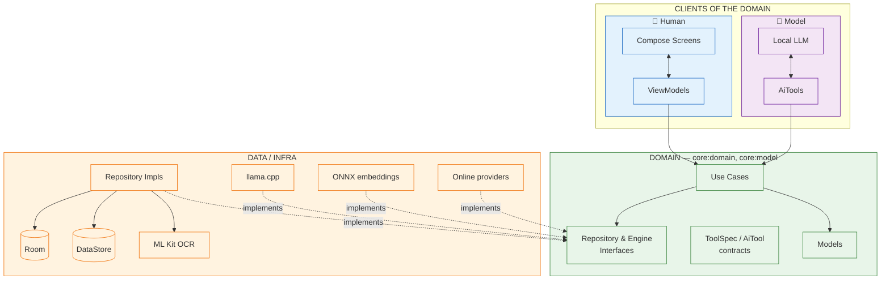
```mermaid
graph TB
    subgraph CLIENTS["CLIENTS OF THE DOMAIN"]
        direction LR
        subgraph H["👤 Human"]
            UI["Compose Screens"]
            VM["ViewModels"]
            UI <--> VM
        end
        subgraph A["🤖 Model"]
            LLM["Local LLM"]
            TOOLS["AiTools"]
            LLM <--> TOOLS
        end
    end

    subgraph D["DOMAIN — core:domain, core:model"]
        UC["Use Cases"]
        RI["Repository &amp; Engine<br/>Interfaces"]
        TS["ToolSpec / AiTool<br/>contracts"]
        EN["Models"]
        UC --> RI
        UC --> EN
    end

    subgraph DA["DATA / INFRA"]
        RImpl["Repository Impls"]
        Room[("Room")]
        DS[("DataStore")]
        MLK["ML Kit OCR"]
        LOC["llama.cpp"]
        EMB["ONNX embeddings"]
        NET["Online providers"]
        RImpl --> Room & DS & MLK
    end

    VM --> UC
    TOOLS --> UC
    RImpl -.implements.-> RI
    LOC & EMB & NET -.implements.-> RI

    classDef human fill:#e3f2fd,stroke:#1565c0
    classDef ai fill:#f3e5f5,stroke:#6a1b9a
    classDef dom fill:#e8f5e9,stroke:#2e7d32
    classDef dat fill:#fff3e0,stroke:#ef6c00
    class H,UI,VM human
    class A,LLM,TOOLS ai
    class D,UC,RI,TS,EN dom
    class DA,RImpl,Room,DS,MLK,LOC,EMB,NET dat
```

**The dependency rule:** arrows point inward. Domain knows nothing about data, UI, or
models. Implementations are bound at the composition root (`:app`) via Hilt.

---

## 2. Module graph

### 2.1 Current — with violations

Extracted mechanically from `project(":...")` edges in all 15 `build.gradle.kts` files.

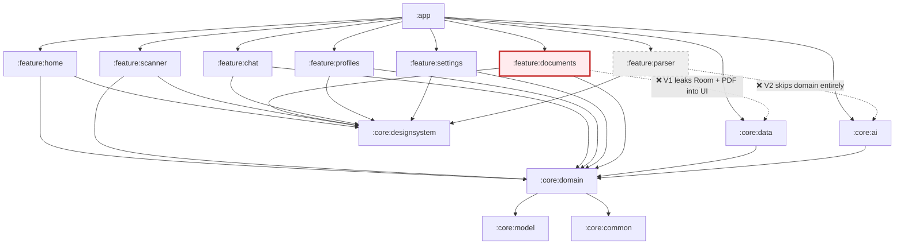
```mermaid
graph TD
    app[":app"]
    home[":feature:home"]
    scanner[":feature:scanner"]
    documents[":feature:documents"]
    chat[":feature:chat"]
    profiles[":feature:profiles"]
    settings[":feature:settings"]
    parser[":feature:parser"]
    data[":core:data"]
    ai[":core:ai"]
    domain[":core:domain"]
    model[":core:model"]
    common[":core:common"]
    ds[":core:designsystem"]

    app --> home & scanner & documents & chat & profiles & settings & parser
    app --> data & ai
    home & scanner & chat & profiles & settings & documents --> domain
    documents -.->|"❌ V1 leaks Room + PDF into UI"| data
    parser -.->|"❌ V2 skips domain entirely"| ai
    data --> domain
    ai --> domain
    domain --> model & common
    home & scanner & documents & chat & profiles & settings & parser --> ds

    classDef violation fill:#ffebee,stroke:#c62828,stroke-width:3px
    classDef cut fill:#eeeeee,stroke:#9e9e9e,stroke-dasharray:5
    class documents violation
    class parser cut
```

`:feature:parser` (dashed) is **cut** — see §9.

### 2.2 Target

`:core:ai` is too coarse once native inference, embeddings, model downloads, a tool runtime
and HTTP providers all live in it. It splits into six modules, and the split is what turns
the privacy rules into **Gradle facts** rather than review habits.

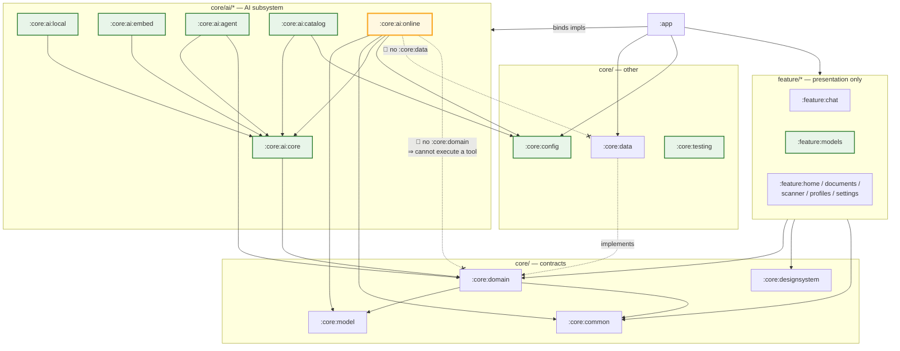
```mermaid
graph TD
    app[":app"]

    subgraph F["feature/* — presentation only"]
        chat[":feature:chat"]
        models[":feature:models"]
        rest[":feature:home / documents /<br/>scanner / profiles / settings"]
    end

    subgraph C["core/ — contracts"]
        domain[":core:domain"]
        model[":core:model"]
        common[":core:common"]
        ds[":core:designsystem"]
    end

    subgraph AI["core/ai/* — AI subsystem"]
        aicore[":core:ai:core"]
        local[":core:ai:local"]
        embed[":core:ai:embed"]
        agent[":core:ai:agent"]
        catalog[":core:ai:catalog"]
        online[":core:ai:online"]
    end

    subgraph I["core/ — other"]
        data[":core:data"]
        config[":core:config"]
        testing[":core:testing"]
    end

    app --> F
    app -->|binds impls| AI
    app --> data & config

    F --> domain & ds & common

    aicore --> domain
    local & embed & agent & catalog --> aicore
    agent --> domain
    online --> model & common & aicore

    data -.implements.-> domain
    catalog --> config
    online --> config
    domain --> model & common

    online -. "🚫 no :core:data" .-x data
    online -. "🚫 no :core:domain<br/>⇒ cannot execute a tool" .-x domain

    classDef new fill:#e8f5e9,stroke:#2e7d32,stroke-width:2px
    classDef key fill:#fff8e1,stroke:#f9a825,stroke-width:3px
    class models,aicore,local,embed,catalog,testing,config,agent new
    class online key
```

| Module | Owns | Must not contain |
|---|---|---|
| `:core:ai:core` | `AiEngine` contract, `ShareableContext`, prompt building | Provider or runtime specifics |
| `:core:ai:local` | llama.cpp JNI, GGUF loading, GBNF grammars | Network, UI |
| `:core:ai:embed` | ONNX embedding models, `EmbeddingService` | Persistence, retrieval policy |
| `:core:ai:agent` | `ToolRegistry`, `ToolProtocol`s, `AgentLoop`, `ToolExecutor` | Tool business logic |
| `:core:ai:catalog` | Model catalog, resumable download, import, storage | Inference, UI |
| `:core:ai:online` | Provider registry, HTTP adapters | **`:core:domain`, `:core:data`, any persistence** |
| `:core:config` | Signed remote manifest fetch/verify/cache | Domain logic |
| `:feature:models` | Model browser / download / import UI | Inference |
| `:core:testing` | Fakes, fixtures, rules | Production code |

### 2.3 The two structural guarantees

Both are enforced by module dependencies and checked by Konsist in CI (Phase 11).

**Guarantee 1 — an online provider cannot read a document.**
`:core:ai:online` has no dependency on `:core:data`. No DAO, DataStore, or file handle can
be injected into a provider.

**Guarantee 2 — an online provider cannot execute a tool.**
`ToolSpec` (an inert description) lives in `:core:model`. `AiTool` (which has `execute`)
lives in `:core:domain`. `:core:ai:online` depends on `:core:model` and **not**
`:core:domain` — so it can *render* tool descriptions into a payload and *parse* proposals
out, but the executable type is not on its classpath. Not "we won't"; **can't**.

---

## 3. Use cases

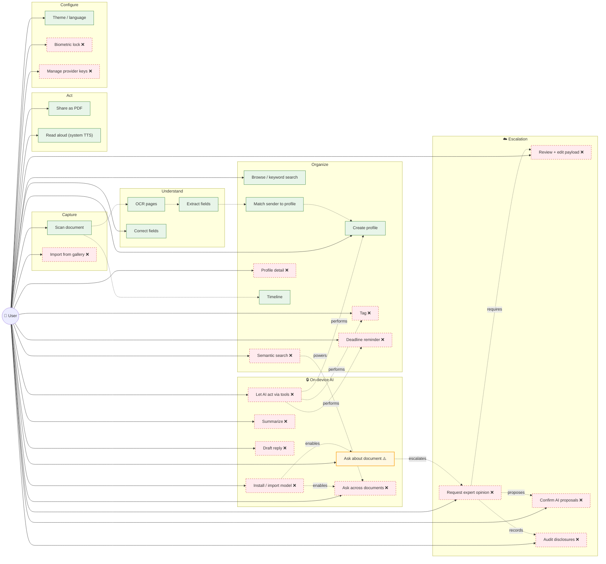
```mermaid
graph LR
    User(("👤 User"))

    subgraph Capture
        UC1["Scan document"]
        UC2["Import from gallery ❌"]
    end
    subgraph Understand
        UC3["OCR pages"]
        UC4["Extract fields"]
        UC5["Correct fields"]
    end
    subgraph Organize
        UC6["Browse / keyword search"]
        UC7["Semantic search ❌"]
        UC8["Match sender to profile"]
        UC9["Create profile"]
        UC10["Profile detail ❌"]
        UC11["Timeline"]
        UC12["Tag ❌"]
        UC13["Deadline reminder ❌"]
    end
    subgraph LocalAI["🔒 On-device AI"]
        UC14["Install / import model ❌"]
        UC15["Ask about document ⚠️"]
        UC16["Ask across documents ❌"]
        UC17["Summarize ❌"]
        UC18["Draft reply ❌"]
        UC19["Let AI act via tools ❌"]
    end
    subgraph OnlineAI["☁️ Escalation"]
        UC20["Request expert opinion ❌"]
        UC21["Review + edit payload ❌"]
        UC22["Confirm AI proposals ❌"]
        UC23["Audit disclosures ❌"]
    end
    subgraph Act
        UC24["Share as PDF"]
        UC25["Read aloud (system TTS)"]
    end
    subgraph Configure
        UC26["Theme / language"]
        UC27["Biometric lock ❌"]
        UC28["Manage provider keys ❌"]
    end

    User --> UC1 & UC2 & UC5 & UC6 & UC7 & UC9 & UC10 & UC12 & UC13
    User --> UC14 & UC15 & UC16 & UC17 & UC18 & UC19
    User --> UC20 & UC21 & UC22 & UC23
    User --> UC24 & UC25 & UC26 & UC27 & UC28

    UC1 -.-> UC3 -.-> UC4
    UC4 -.-> UC8 -.-> UC9
    UC1 -.-> UC11
    UC14 -.enables.-> UC15 & UC16
    UC7 -.powers.-> UC16
    UC19 -.performs.-> UC9 & UC12 & UC13
    UC15 -.escalates.-> UC20 -.requires.-> UC21
    UC20 -.proposes.-> UC22
    UC20 -.records.-> UC23

    classDef ok fill:#e8f5e9,stroke:#2e7d32
    classDef partial fill:#fff8e1,stroke:#f9a825,stroke-width:2px
    classDef missing fill:#ffebee,stroke:#c62828,stroke-dasharray:4
    class UC1,UC3,UC4,UC5,UC6,UC8,UC9,UC11,UC24,UC25,UC26 ok
    class UC15 partial
    class UC2,UC7,UC10,UC12,UC13,UC14,UC16,UC17,UC18,UC19,UC20,UC21,UC22,UC23,UC27,UC28 missing
```

✅ working · ⚠️ built over a mock · ❌ not implemented.

---

## 4. Document capture — the pipeline that works today

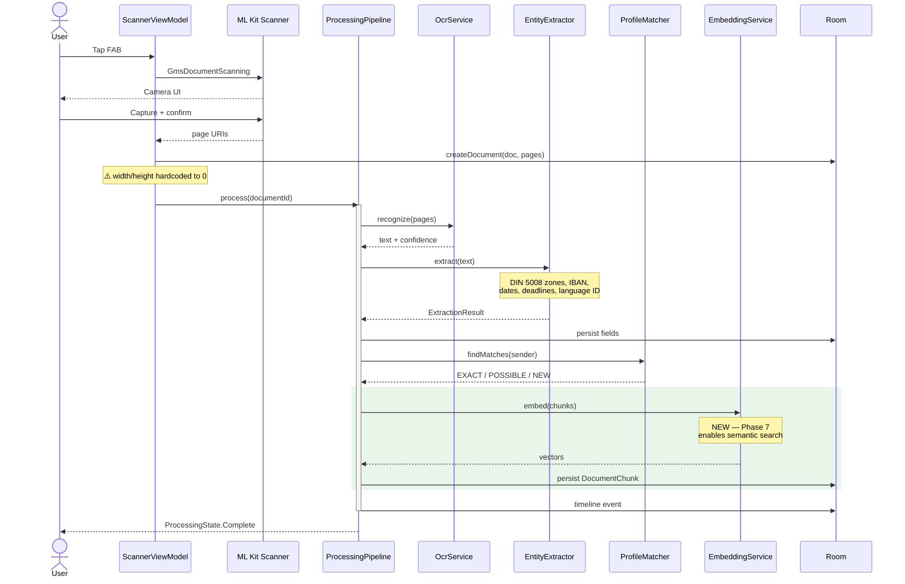
```mermaid
sequenceDiagram
    actor U as User
    participant SVM as ScannerViewModel
    participant MK as ML Kit Scanner
    participant P as ProcessingPipeline
    participant OCR as OcrService
    participant EX as EntityExtractor
    participant PM as ProfileMatcher
    participant EMB as EmbeddingService
    participant DB as Room

    U->>SVM: Tap FAB
    SVM->>MK: GmsDocumentScanning
    MK-->>U: Camera UI
    U->>MK: Capture + confirm
    MK-->>SVM: page URIs
    SVM->>DB: createDocument(doc, pages)
    Note over SVM: ⚠️ width/height hardcoded to 0

    SVM->>P: process(documentId)
    activate P
    P->>OCR: recognize(pages)
    OCR-->>P: text + confidence
    P->>EX: extract(text)
    Note over EX: DIN 5008 zones, IBAN,<br/>dates, deadlines, language ID
    EX-->>P: ExtractionResult
    P->>DB: persist fields
    P->>PM: findMatches(sender)
    PM-->>P: EXACT / POSSIBLE / NEW
    rect rgb(232, 245, 233)
        P->>EMB: embed(chunks)
        Note over EMB: NEW — Phase 7<br/>enables semantic search
        EMB-->>P: vectors
        P->>DB: persist DocumentChunk
    end
    P->>DB: timeline event
    deactivate P
    P-->>U: ProcessingState.Complete
```

Green block is new; everything else works today.

---

## 5. The AI subsystem

> Specification, not description. Today `AiEngine` has zero implementations and
> `ChatViewModel` returns canned strings after `delay(1500)`.

### 5.1 The privacy boundary

The load-bearing design decision in the whole application.

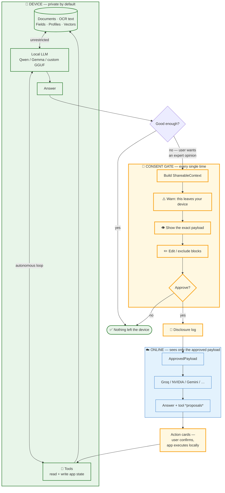
```mermaid
graph TB
    subgraph Device["📱 DEVICE — private by default"]
        DOC[("Documents · OCR text<br/>Fields · Profiles · Vectors")]
        LOCAL["Local LLM<br/>Qwen / Gemma / custom GGUF"]
        TOOLS["🔧 Tools<br/>read + write app state"]
        DOC <-->|unrestricted| LOCAL
        LOCAL <-->|"autonomous loop"| TOOLS
        TOOLS --> DOC
        LOCAL --> ANS["Answer"]
    end

    ANS --> GOOD{"Good enough?"}
    GOOD -->|yes| DONE(["✅ Nothing left the device"])
    GOOD -->|"no — user wants<br/>an expert opinion"| ESC

    subgraph Gate["🚪 CONSENT GATE — every single time"]
        ESC["Build ShareableContext"]
        WARN["⚠️ Warn: this leaves your device"]
        SHOW["👁 Show the exact payload"]
        EDIT["✏️ Edit / exclude blocks"]
        APPR{"Approve?"}
        ESC --> WARN --> SHOW --> EDIT --> APPR
    end

    APPR -->|no| DONE
    APPR -->|yes| LOG["📝 Disclosure log"]
    LOG --> SEND

    subgraph Cloud["☁️ ONLINE — sees only the approved payload"]
        SEND["ApprovedPayload"]
        PROV["Groq / NVIDIA / Gemini / …"]
        SEND --> PROV
        PROV --> RESP["Answer + tool *proposals*"]
    end

    RESP --> PROPOSE["Action cards —<br/>user confirms,<br/>app executes locally"]
    PROPOSE --> TOOLS

    classDef priv fill:#e8f5e9,stroke:#2e7d32,stroke-width:2px
    classDef gate fill:#fff8e1,stroke:#f9a825,stroke-width:3px
    classDef cloud fill:#e3f2fd,stroke:#1565c0
    class Device,DOC,LOCAL,TOOLS,ANS,DONE priv
    class Gate,ESC,WARN,SHOW,EDIT,APPR,LOG,PROPOSE gate
    class Cloud,SEND,PROV,RESP cloud
```

**Seven rules that make this real rather than aspirational:**

1. **Local is complete.** Every AI capability — ask, summarize, draft, act — works fully
   on-device. Online is never required.
2. **Escalation is always user-initiated.** No automatic fallback, ever.
3. **Consent is per-query.** No "always allow" — each query carries different data.
4. **What you see is what is sent.** The preview is the final payload; nothing is appended
   after approval.
5. **Online adapters cannot reach data.** Structural — §2.3 Guarantee 1.
6. **Online models cannot execute tools.** Structural — §2.3 Guarantee 2. They may only
   *propose*; the user confirms and the app executes locally.
7. **Tool results never auto-return to a remote model.** Feeding a result back would ship
   document data on a path the consent sheet never covered. A follow-up needs fresh consent.

Rule 7 is the one that is easy to lose. Agentic loops are built on feeding results back —
so the loop is a **local-only** capability by design, not by omission.

### 5.1a What is sent to the model

The `system` half of `formatPrompt(system + history + user text)` (see the sequence diagram
below) is assembled by
[`BuildChatContextUseCase`](../core/domain/src/main/kotlin/com/postsaimanager/core/domain/usecase/BuildChatContextUseCase.kt),
in `:core:domain` — deciding what the model is told is domain logic, not an infrastructure
detail. Content is added in descending order of signal per token (instructions, document
metadata, extracted fields, then raw OCR text, budgeted and truncated to fit the local
model's context window). The instruction list ends with a short, standalone, imperative
line: *"Always answer in the same language the user writes in. If the user writes in
English, answer in English, even if the document is in another language."* It is placed
last and phrased without a qualifying "unless" clause because small on-device models weight
recent, unambiguous instructions far more reliably than an earlier, hedged one — an earlier
version buried this rule mid-prompt as "reply in the document's language unless the user
writes in another," which the 0.8B model routinely ignored, answering in the document's
language even when the user asked in English. Documents may be in any language; the prompt
does not assume German.

A reasoning model (Qwen3/Qwen3.5, DeepSeek) writes its chain of thought and its answer into
the *same* token stream, delimited by `<think>…</think>`. Chat treats that boundary as
load-bearing, not cosmetic — the same discipline as the online-escalation payload above,
applied to a much more common path: **every local turn**, not just the rare one that leaves
the device.

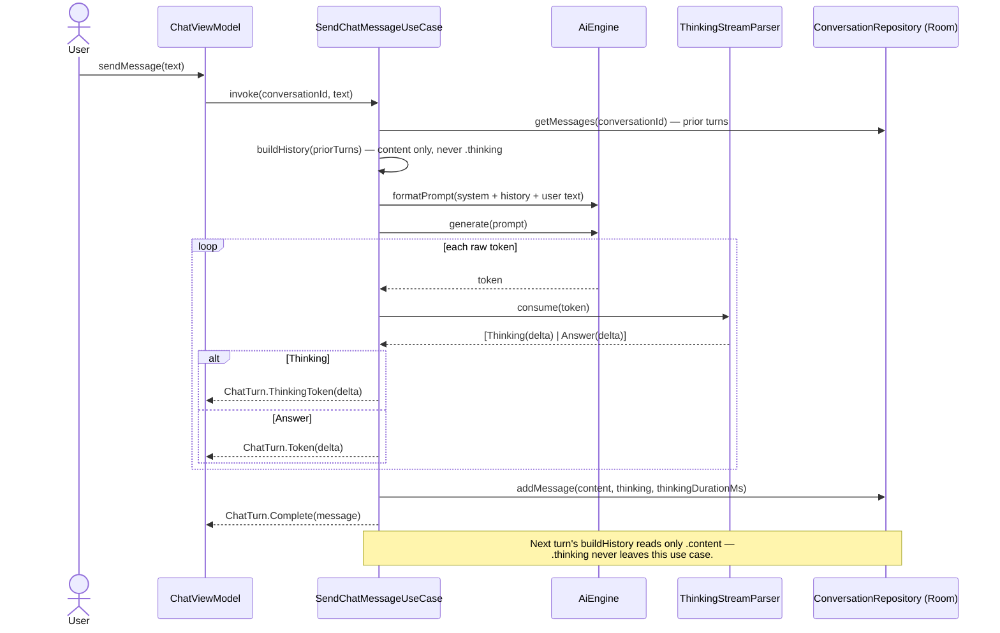
```mermaid
sequenceDiagram
    actor U as User
    participant CVM as ChatViewModel
    participant UC as SendChatMessageUseCase
    participant AE as AiEngine
    participant TSP as ThinkingStreamParser
    participant Repo as ConversationRepository (Room)

    U->>CVM: sendMessage(text)
    CVM->>UC: invoke(conversationId, text)
    UC->>Repo: getMessages(conversationId) — prior turns
    UC->>UC: buildHistory(priorTurns) — content only, never .thinking
    UC->>AE: formatPrompt(system + history + user text)
    UC->>AE: generate(prompt)

    loop each raw token
        AE-->>UC: token
        UC->>TSP: consume(token)
        TSP-->>UC: [Thinking(delta) | Answer(delta)]
        alt Thinking
            UC-->>CVM: ChatTurn.ThinkingToken(delta)
        else Answer
            UC-->>CVM: ChatTurn.Token(delta)
        end
    end

    UC->>Repo: addMessage(content, thinking, thinkingDurationMs)
    UC-->>CVM: ChatTurn.Complete(message)

    Note over UC,Repo: Next turn's buildHistory reads only .content —<br/>.thinking never leaves this use case.
```

**The rule:** [`AiMessage.thinking`](../core/model/src/main/kotlin/com/postsaimanager/core/model/AiConversation.kt)
is display-only. The *only* place a prior turn's text is read back into a prompt is
`SendChatMessageUseCase.buildHistory`, and it maps `AiMessage.content` — never
`AiMessage.thinking` — into `AiChatMessage`. There is exactly one code path from persisted
history into a prompt, which is what makes this an enforceable rule rather than a
convention: `SendChatMessageUseCaseTest`'s `` `thinking is never sent back to the model` ``
asserts it directly, by running two turns and checking the second prompt's message content
for the first turn's thinking text.

Why this matters, concretely: a `<think>` block can run to hundreds of tokens per turn.
Folding it back into history would (a) balloon every later prompt's token cost for content
nobody asked the model to reconsider, and (b) feed the model text in a shape (its own past
reasoning, presented as conversation history) no chat-tuned model was trained to receive —
degrading output in a way that is easy to miss in casual testing and hard to diagnose later.

`ThinkingStreamParser` (`:core:domain`) is the only place the split happens — a small,
stateful, pure-Kotlin class that buffers only the unresolved suffix of a possible tag split
across chunk boundaries, so `<think>`/`</think>` are recognised correctly no matter how the
token stream happens to chunk them. A stream that ends mid-`<think>` (never closed) is
treated as entirely reasoning, with the answer left empty — surfaced to the user as "the
model finished thinking but did not produce an answer" rather than a blank reply.

### 5.2 Engine routing

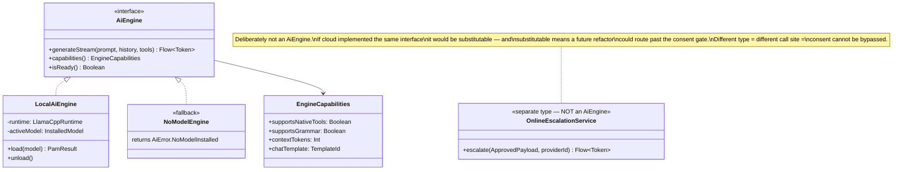
```mermaid
classDiagram
    class AiEngine {
        <<interface>>
        +generateStream(prompt, history, tools) Flow~Token~
        +capabilities() EngineCapabilities
        +isReady() Boolean
    }
    class LocalAiEngine {
        -runtime: LlamaCppRuntime
        -activeModel: InstalledModel
        +load(model) PamResult
        +unload()
    }
    class NoModelEngine {
        <<fallback>>
        returns AiError.NoModelInstalled
    }
    class OnlineEscalationService {
        <<separate type — NOT an AiEngine>>
        +escalate(ApprovedPayload, providerId) Flow~Token~
    }
    class EngineCapabilities {
        +supportsNativeTools: Boolean
        +supportsGrammar: Boolean
        +contextTokens: Int
        +chatTemplate: TemplateId
    }

    AiEngine <|.. LocalAiEngine
    AiEngine <|.. NoModelEngine
    AiEngine --> EngineCapabilities

    note for OnlineEscalationService "Deliberately not an AiEngine.\nIf cloud implemented the same interface\nit would be substitutable — and\nsubstitutable means a future refactor\ncould route past the consent gate.\nDifferent type = different call site =\nconsent cannot be bypassed."
```

### 5.3 AI inference configuration & lifecycle

> Implemented — this section describes code in the tree, not a plan. Design patterns below
> are adapted from Google AI Edge Gallery's `Config`/`BackendSpec`/`InitializationStatus`
> machinery, ported to llama.cpp over JNI/AIDL rather than MediaPipe.

Before this, context size and thread count were loose `Int` parameters threaded separately
through `AiEngine.load`, the AIDL boundary, `LlamaNative` and the JNI layer; mmap, mlock,
flash attention and GPU offload were hardcoded in `llama_jni.cpp` and could not change
without touching C++. Four things replace that: one config type, an explicit accelerator
seam, a race-safe load state machine, and a persisted, schema-driven settings screen.

#### `InferenceConfig` — the single source of truth

`InferenceConfig` (`:core:model`) is every field llama.cpp needs to load a model and sample
from it: `contextTokens`, `batchTokens` (default 512), `threads`/`threadsBatch`, `useMmap`,
`useMlock`, `flashAttention`, `accelerator`, `gpuLayers`, and a nested `SamplingConfig`
(temperature, topK, topP, seed). It is immutable — changing a setting produces a new
`InferenceConfig` — and `requiresReload(other)` classifies how expensive moving to it is:

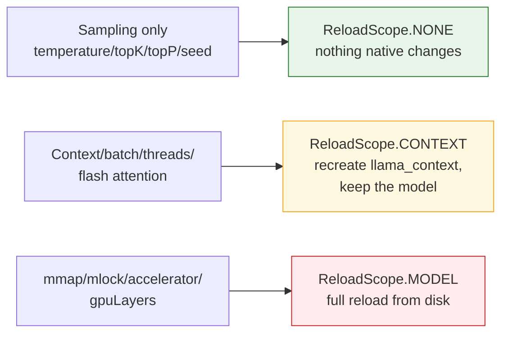
```mermaid
graph LR
    S["Sampling only<br/>temperature/topK/topP/seed"] --> N["ReloadScope.NONE<br/>nothing native changes"]
    C["Context/batch/threads/<br/>flash attention"] --> CX["ReloadScope.CONTEXT<br/>recreate llama_context,<br/>keep the model"]
    M["mmap/mlock/accelerator/<br/>gpuLayers"] --> MD["ReloadScope.MODEL<br/>full reload from disk"]

    classDef none fill:#e8f5e9,stroke:#2e7d32
    classDef ctx fill:#fff8e1,stroke:#f9a825
    classDef mod fill:#ffebee,stroke:#c62828
    class N none
    class CX ctx
    class MD mod
```

`InferenceConfig.defaults(deviceCapability, catalogedContextTokens)` centralises the RAM- and
core-count-based heuristics that used to live scattered in `CatalogActiveModelProvider` and
`LocalAiEngine`: context is capped by what available RAM can afford (2048 below 1.5 GB free,
4096 otherwise — a ceiling set from a device test where 8192 aborted the inference process
even with more memory free than the 4096 run that succeeded, so "available RAM" does not
reliably predict whether a larger allocation lands), and thread count defaults to half the
cores, floor two, so generation does not starve the UI thread.

#### Overrides, persistence, and the schema-driven Settings UI

`InferenceOverrides` (`:core:model`) is a nullable-everything patch — null means "no
opinion, keep tracking the default" rather than freezing whatever `defaults` computed the
day the user first opened Settings. `InferenceConfig.applying(overrides, device, model)`
layers it on top of a `defaults` result, clamping every field to what the device and the
active model's `BackendSpec` can actually support (context is only ever clamped *down* to
the RAM ceiling, never above it — that ceiling is a safety limit against a native abort, not
a suggestion the user can override upward).

Persistence is a `core:domain` port, `InferenceSettingsRepository { overrides: Flow<..>;
update(); reset() }`, implemented in `:core:ai:catalog` as
`DataStoreInferenceSettingsRepository` — Preferences DataStore, file `inference_settings`,
one key per override field, mirroring `UserPreferencesRepositoryImpl`'s shape in `:core:data`.
It lives in `:core:ai:catalog` rather than `:core:data` because that module already combines
overrides with device capability and the model's `BackendSpec` into an effective
`InferenceConfig` (`CatalogActiveModelProvider`), and putting the store there keeps that
combination local instead of adding a cross-module dependency for one settings flow.

The Settings screen renders itself from data rather than hand-writing a control per setting.
`ConfigSpec` (`:core:model`) is a sealed type — `Slider`, `Switch`, `Choice` — each carrying a
`key` (the `InferenceOverrides` field it writes), a label, and a `reloadScope`.
`inferenceConfigSchema(device, model, defaults)` builds the list fresh from the device and
model every time: the thread slider tops out at the actual core count, the context choice
list is filtered to what `defaults` already decided the device can afford, and the
accelerator choice is omitted entirely on a CPU-only device. `feature:settings` renders one
composable per `ConfigSpec` type (`SliderSpecItem`/`SwitchSpecItem`/`ChoiceSpecItem`) and
shows a "Requires model reload" hint whenever `reloadScope != NONE`, reached through
`ActiveModelProvider.activeModelSchema()` and the `ObserveInferenceSettingsUseCase` /
`UpdateInferenceSettingUseCase` / `ResetInferenceSettingsUseCase` use cases — never a direct
import of `core:ai:*`, respecting rule 1.

#### Accelerator resolution and the native probe

`Accelerator` is `CPU | GPU`. A model declares what it may run on via `BackendSpec
(accelerators: List<Accelerator>, gpuLayers: Int)` on `AiModelDescriptor`, in preference
order; every catalog entry defaults to CPU-only. `DeviceCapability.accelerators` reports what
the device can actually do, probed by `LlamaNative.availableAccelerators()` — over
`ggml_backend_dev_count()`/`ggml_backend_dev_type()`, run in the `:inference` process and
exposed to the app process through `IInferenceService.availableAccelerators()`. GPU is
reported only when a `GGML_BACKEND_DEVICE_TYPE_GPU`/`_IGPU` device is actually enumerated,
which — until a GPU backend is compiled in — is never; a CPU-only build always reports
CPU-only, and any caller that cannot reach the probe (service not yet bound) defaults to
CPU-only as the always-safe answer.

`resolveAccelerator(preference, device, model)` is the one function both the load path and
the settings schema use: the user's preference wins only if both the device and the model
agree it will work; failing that, the first accelerator the model prefers that the device
also supports wins; CPU is the unconditional fallback. `resolveGpuLayers` forces zero offload
whenever the resolved accelerator is CPU, regardless of what `BackendSpec.gpuLayers` says.

**The `pam.gpuBackend` Gradle switch.** `core/ai/local/build.gradle.kts` exposes a property,
`pam.gpuBackend` (`none` default, `vulkan`), that adds `-DGGML_VULKAN=ON` to the CMake
configure step — the one CMake `-D` that is genuinely a per-build choice rather than a fixed
project setting; every other flag (`GGML_OPENMP=OFF`, `LLAMA_CURL=OFF`,
`LLAMA_BUILD_TESTS/EXAMPLES/SERVER=OFF`) lives once, in `CMakeLists.txt`, after this refactor
removed a duplicate copy in `build.gradle.kts` that did nothing (`CACHE ... FORCE` in
CMakeLists.txt always wins over a command-line `-D`) except invite the two copies to drift.

`-Ppam.gpuBackend=vulkan` builds. Three problems stood between the CMake configure that used
to fail and an app that reports a GPU device on the phone, all worked around from
`core/ai/local/src/main/cpp/CMakeLists.txt` and `build.gradle.kts` — `ggml`'s own
`ggml-vulkan/CMakeLists.txt`, vendored inside the `llama.cpp` submodule, is never edited:

1. **`find_package(SPIRV-Headers CONFIG REQUIRED)` fails at configure.** The NDK toolchain
   file sets `CMAKE_FIND_ROOT_PATH_MODE_PACKAGE=ONLY`, which restricts a CONFIG-mode
   `find_package` to the NDK sysroot — and the sysroot never ships a SPIRV-Headers CMake
   package. This call runs directly in the Android-*target* configure (not only inside the
   `vulkan-shaders-gen` host sub-build `GGML_VULKAN_SHADERS_GEN_TOOLCHAIN` covers), so that
   toolchain-file argument alone does not fix it. `CMakeLists.txt` instead relaxes just
   `CMAKE_FIND_ROOT_PATH_MODE_PACKAGE` to `BOTH` when `GGML_VULKAN` is on, and adds a host
   prefix to `CMAKE_PREFIX_PATH` — Homebrew by default (`brew --prefix`, or
   `$HOMEBREW_PREFIX`), or `-DPAM_HOST_PREFIX_PATH=<prefix>` (forwarded from the Gradle
   property `pam.hostPrefixPath`) as an override, which CI uses to point at
   `/usr` (the LunarG Vulkan SDK apt package's install prefix). `CMAKE_FIND_ROOT_PATH_MODE_
   LIBRARY`/`_INCLUDE` are left untouched (still sysroot-only), so the actual `Vulkan::Vulkan`
   link target still resolves to the NDK's arm64 `libvulkan.so`, never a host binary.
   `vulkan-shaders-gen`'s own host sub-build gets an explicit toolchain file,
   `core/ai/local/src/main/cpp/cmake/host-toolchain.cmake`, passed as
   `GGML_VULKAN_SHADERS_GEN_TOOLCHAIN`: it finds a host C/C++ compiler and reuses the `ninja`
   that ships next to whichever `cmake` binary is running it (Android Studio's bundled Ninja
   usually is not on `PATH` by itself).
2. **`ggml-vulkan.cpp` fails to compile: `'vulkan/vulkan.hpp' file not found`.** The NDK
   sysroot ships the plain C Vulkan header but not the Vulkan-Hpp C++ bindings. Since
   `vulkan.hpp` is header-only and pulls in nothing but `vulkan.h` itself, `CMakeLists.txt`
   adds the same host prefix's `include/` to `ggml-vulkan`'s include path once the target is
   built, which is safe even though the rest of that target compiles for the NDK sysroot.
3. **Link fails: `undefined symbol: vkGetPhysicalDeviceFeatures2`.** `ggml-vulkan.cpp` calls
   that Vulkan 1.1 *core* entry point directly against `libvulkan.so`, rather than through its
   own runtime dispatcher (`DispatchLoaderDynamic`, used everywhere else in that file). The
   NDK's per-API-level `libvulkan.so` link stub only exports the core symbol from API 29 on —
   the app's `minSdk` 26 stub only has the `_KHR`-suffixed extension version. `build.gradle.kts`
   links this one native target against `-DANDROID_PLATFORM=29` when `pam.gpuBackend=vulkan`,
   without raising the app's `minSdk`: a device below API 29 not reporting Vulkan 1.1 is a
   runtime capability question `DeviceCapabilityChecker` already gates the GPU backend behind,
   and every other symbol this library imports keeps resolving fine on API 26.

`glslc` compiles the shaders at build time and never ships to the device;
`build.gradle.kts`'s `findHostGlslc()` prefers the one the NDK ships under
`shader-tools/<host>/glslc` (pinned the same way the rest of the NDK is) and falls back to
`which glslc` (Homebrew's `shaderc`, or the LunarG SDK's, on `PATH`) otherwise, failing the
build with a clear message if neither is found rather than letting CMake print a confusing
"glslc not found".

**What it costs and what the device reports.** The Vulkan backend adds one library,
`libggml-vulkan.so` — compiled-in shader SPIR-V bytecode for every quantisation format
dominates its size. Stripped, arm64-v8a, debug build:

| Build | Native libs total | `libggml-vulkan.so` |
| --- | --- | --- |
| `none` (default) | 5.9 MB | — |
| `vulkan` | 39 MB | 35 MB |

On a Samsung Galaxy S23 Ultra (SM-S918B, Adreno 740), `InferenceService.availableAccelerators()`
logs both the probe result and the backend description:

```
InferenceService: availableAccelerators() -> [0, 1] ; backendDescription() -> Vulkan0 (Adreno (TM) 740)
```

`0`/`1` are `Accelerator.CPU`/`Accelerator.GPU` ordinals — the probe now reports a GPU where a
CPU-only build always reported CPU-only. `core/ai/local/src/androidTest/.../GpuSmokeTest.kt`
loads the spike model both ways and logs tokens/sec; on that device, with a ~400 MB Q4 model
and 64 generated tokens:

| Accelerator | Load | Generation |
| --- | --- | --- |
| CPU | 479 ms | 64 tok in 2.24 s ≈ **28.6 tok/s** |
| GPU (Vulkan, all layers offloaded) | 612 ms | 64 tok in 4.87 s ≈ **13.1 tok/s** |

GPU is *slower* here, not faster — a phone-class model this small, generating one token at a
time, is dominated by per-dispatch Vulkan kernel-launch overhead rather than the FLOPs the
GPU is actually good at; the CPU path's SIMD kernels have far less per-token overhead at this
scale. This is a real first measurement, not a placeholder — it argues for gating the GPU
accelerator by model size (or leaving it opt-in) rather than assuming "GPU" beats "CPU"
unconditionally, a decision left to whoever tunes `resolveAccelerator`'s preference order next.

Default stays `none` (CPU-only) for every normal build — `pam.gpuBackend=vulkan` is opt-in via
the Gradle property or the commented line in `gradle.properties`. `.github/workflows/ci.yml`
runs both: `native-build` (the default) and `native-build-vulkan`
(`-Ppam.gpuBackend=vulkan -Ppam.hostPrefixPath=/usr`, after installing the LunarG Vulkan SDK
apt package for its SPIRV-Headers CMake package and Vulkan-Hpp headers), so a change that
breaks either backend fails CI rather than surfacing on a developer's machine.

#### Chat sessions — the KV cache is the conversation

> Implemented. Replaces an earlier "prompt-prefix diffing" design that was rejected as
> reinventing something llama.cpp already solves — see below.

**The problem this fixes.** Every chat turn used to call `llama_memory_clear()` and
re-decode the *entire* formatted conversation — grounding, every prior turn, and the new
message — from scratch. On a long-running chat that is tens of thousands of prompt tokens
reprocessed for one new sentence: on the reference S23 Ultra (Qwen3.5 0.8B Q4_K_M, CPU), a
20-turn conversation took **41.4 s** just to re-evaluate the prompt before generation could
even begin, on top of the actual reply.

**The fix.** `PamSession` (`llama_jni.cpp`) keeps a standing chat session bound to the
`llama_context`'s KV cache: `chatHistory` (the message list last rendered) and
`chatPrevLen` (how many characters of that rendering were decoded). This mirrors
llama.cpp's own `examples/simple-chat/simple-chat.cpp` — the KV cache *is* the
conversation; it is **never cleared between turns**, only ever on `openChatSession`/
`resetChatSession`. Each turn:

1. `sendChatMessage(userText)` appends the user turn to `chatHistory` and renders the
   *whole* history with the model's own template (`llama_chat_apply_template`,
   `addAssistant=true`).
2. Only the **diff** — the template text beyond `chatPrevLen`, i.e. essentially just the new
   user turn and the assistant header — is tokenised and decoded. `chatPrevLen` moves to the
   end of that rendering.
3. Tokens stream out through the existing pull-based `nextToken()`; each sampled token is
   decoded into the KV cache as it always was, so the reply's tokens are already resident
   once generation ends.
4. `commitChatReply(answer)` appends the (thinking-stripped) reply to `chatHistory` and
   re-renders once more (`addAssistant=false`) to fix `chatPrevLen` for the *next* turn —
   this decodes nothing; those tokens are already in the cache from step 3.

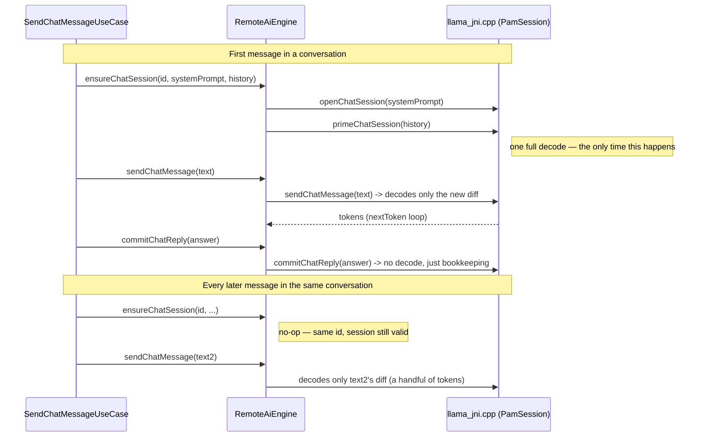
```mermaid
sequenceDiagram
    participant VM as SendChatMessageUseCase
    participant Engine as RemoteAiEngine
    participant JNI as llama_jni.cpp (PamSession)

    Note over VM,JNI: First message in a conversation
    VM->>Engine: ensureChatSession(id, systemPrompt, history)
    Engine->>JNI: openChatSession(systemPrompt)
    Engine->>JNI: primeChatSession(history)
    Note right of JNI: one full decode — the only time this happens
    VM->>Engine: sendChatMessage(text)
    Engine->>JNI: sendChatMessage(text) -> decodes only the new diff
    JNI-->>Engine: tokens (nextToken loop)
    VM->>Engine: commitChatReply(answer)
    Engine->>JNI: commitChatReply(answer) -> no decode, just bookkeeping

    Note over VM,JNI: Every later message in the same conversation
    VM->>Engine: ensureChatSession(id, ...)
    Note right of Engine: no-op — same id, session still valid
    VM->>Engine: sendChatMessage(text2)
    Engine->>JNI: decodes only text2's diff (a handful of tokens)
```

**Session ownership and invalidation.** `RemoteAiEngine`/`LocalAiEngine` track
`sessionConversationId` — which conversation's session is primed in the `:inference`
process right now. `AiEngine.ensureChatSession(conversationId, systemPrompt, history)` is
cheap to call on every send (mirroring the existing "reconcile config on every send"
pattern for `engine.load`): a no-op when `sessionConversationId` already matches, otherwise
it opens a fresh session and replays `history` — the *one* legitimate full re-decode,
paid once per conversation per app/process lifetime rather than once per turn. The tracked
id is cleared (forcing a re-prime on the next chat turn) whenever the KV cache is actually
invalidated: `loadModel`/`recreateContext`/`unloadModel`, and a one-shot `generate()` call
(`AiExtractionUseCase`'s grammar path, which still clears the KV cache unconditionally on
every call — see `startGeneration`'s doc in `llama_jni.cpp`) — so extraction and chat can
share the one resident `llama_context` without corrupting each other's state; whichever ran
most recently owns the cache, and the other side notices and re-primes.

**Context overflow.** If a turn's diff plus `maxTokens` would not fit in the remaining
`n_ctx`, `sendChatMessage` drops the oldest non-system turn(s) from `chatHistory`, clears
the KV cache, and re-decodes the (smaller) remaining history once — logged as `pam_llama:
context overflow (...) — dropping oldest turns`.

**Truncation stays prefix-stable.** `BuildChatContextUseCase`'s grounding text depends only
on the document and the context window size, never on how many turns have happened, so it
never shifts underneath a growing conversation. `SendChatMessageUseCase.buildHistory` caps
history at the last 20 turns by dropping from the oldest turn boundary only — the tail a
session's diff decoding sees is always a clean suffix, never a reshuffled window.

**Rejected alternative — prompt-prefix diffing.** An earlier design kept `cachedTokens` and
computed the longest common token prefix with the new prompt on every turn
(`llama_memory_seq_rm` to drop the divergent tail). Correct, but strictly more complex than
necessary for a use case where the "prefix" is *always* the entire prior conversation by
construction — the chat template only ever appends. Session-based turn tracking (this
section) gets the same KV-cache reuse with less bookkeeping and no dependence on
`llama_memory_seq_rm`'s partial-removal support (which some KV cache types, e.g. SWA, do not
have).

**Thinking toggle.** `InferenceOverrides.thinkingEnabled` (default null = on) surfaces as a
`ConfigSpec.Switch("thinking", reloadScope = NONE)` in the chat model sheet. When off,
`sendChatMessage`'s `noThink` parameter appends `/no_think` to the user turn before
rendering — the practical way to disable Qwen3/3.5 reasoning: `llama_chat_apply_template`
has no mechanism for passing template kwargs like Python's `enable_thinking`, but the
Qwen3.5 GGUF's baked-in Jinja template reacts to this in-band marker in the user message
text itself. Verified on device: with thinking on, a turn produces a `<think>…</think>`
block before the answer (`ThinkingStreamParser` splits it out for display, as before); with
it off, the model answers directly and turnaround drops accordingly (measured: 78–96 tokens
over ~7s with thinking vs. 38 tokens over 3.4s without, for a comparable question).

**Measured before/after** (S23 Ultra, Qwen3.5 0.8B Q4_K_M, CPU, existing 20-turn
conversation):

| Turn | Before (full re-decode every turn) | After |
|---|---|---|
| Cold open (prime 20 turns, 1164 tok) | ~30 s+ reported per message, every message | 41.4 s once, at session open |
| Turn 2 (new diff only) | full re-decode again | `new_tokens=14`, `prompt_eval_ms≈0`, TTFT ~instant |
| Turn 3 | full re-decode again | `new_tokens=10`, `prompt_eval_ms≈0` |
| Turn 4 | full re-decode again | `new_tokens=13`, `prompt_eval_ms≈0` |
| Turn 5 (thinking off) | — | `new_tokens=15`, `prompt_eval_ms=0.1`; 38 tok in 3.4 s, no `<think>` block |

Per-turn latency after the fix is dominated entirely by generation speed (~11–14 tok/s on
this device/model), not prompt reprocessing — the 30 s/message complaint this section fixes
was almost entirely the full re-decode, not generation.

#### GPU crash fallback — Adreno pipeline-link failure

On the reference S23 Ultra, one model — Qwen3.5 2B (Q4_K_M) — aborts the `:inference`
process on the very first generation on GPU:

```
AdrenoVK-0: Failed to link shaders.
AdrenoVK-0: Pipeline create failed
libc++abi: terminating due to uncaught exception of type vk::SystemError:
  vk::Device::createComputePipeline: ErrorUnknown
F libc: Fatal signal 6 (SIGABRT) ... in Java_..._LlamaNative_startGeneration
```

The 400 MB Q4 spike model used for `GpuSmokeTest` (above) generates fine on the same GPU —
this is model-specific (likely a shader variant Adreno's compiler rejects for this model's
tensor shapes/quantisation mix), not "Vulkan is broken on this device" in general.

**What used to happen.** Two compounding bugs, both fixed:

1. `SendChatMessageUseCase`/`AiExtractionUseCase` only called `engine.load(...)` when the
   engine reported not-ready or the model path had changed — a config-only change (the user
   flipping the accelerator chip while the old model was still `Ready`) was silently ignored,
   and `ModelLoadCoordinator.lastRequested` kept the *old* config, so crash recovery
   (`ensureLoaded()`) replayed the same GPU config that had just crashed. Both use cases now
   call `engine.load(path, activeModelConfig())` on every send/extraction — a no-op when
   nothing changed (`ReloadScope.NONE`), and always current otherwise.
2. `RemoteAiEngine.generate()`'s `callbackFlow` waited only on the AIDL token callback. A
   binder death *during* generation (after `startGeneration()` had already returned `true`)
   updates `ModelLoadCoordinator`'s state to `Failed` — via the existing `DeathRecipient` —
   but nothing closed the flow waiting on tokens that would now never arrive, so the chat UI
   hung on "Thinking…" forever even though the engine had already given up. `generate()` now
   also watches `state` for a transition to `Failed` while a generation is in flight and closes
   the flow with that failure, so `SendChatMessageUseCase`'s existing `catch` block turns it
   into a `ChatTurn.Failed` — a visible error bubble — every time.

**Automatic CPU fallback.** `AiEngine.crashEvents: SharedFlow<InferenceCrash>` (carrying the
model id and the `InferenceConfig` that was active) is emitted by `RemoteAiEngine`'s death
recipient alongside its existing `reportExternalFailure` call.
`InferenceCrashObserver` (`:core:ai:local`, started from `PostsAiManagerApp.onCreate`
next to `InferenceMemoryPressureObserver`) collects it and, only when the crashed config's
accelerator was GPU, calls `InferenceSettingsRepository.blockGpu(modelId)` — a new
DataStore-backed set of model paths, `gpuBlockedModels`, that survives `reset()` (it is a
fact about hardware compatibility, not a user preference). `CatalogActiveModelProvider`
consumes it two ways: `activeModelConfig()`/`extractionModelConfig()` remove `GPU` from the
`DeviceCapability.accelerators` set passed into `resolveAccelerator` for a blocked model —
the same path a CPU-only build already goes through, so the effective config is CPU even if
the user's persisted preference still says GPU — and `activeModelSchema()` marks the
accelerator `ConfigSpec.Choice`'s `GPU` option `disabledOptions` with reason `"GPU driver
failed to compile shaders for this model"` (`ConfigSpec.withGpuBlocked()`), alongside the
existing "not available in this build" reason for a device/model that never supported GPU at
all. (This reason string used to just say "Crashed on this device" — reworded once the §5.3
Adreno investigation below established this is a driver limitation, not an app bug, and that
none of `ggml-vulkan.cpp`'s env toggles avoid it.) The model sheet also offers "Try GPU
again" next to that reason (`ConfigSpec.isGpuBlockedByDriver`, `ChatViewModel.tryGpuAgain()`
→ `UnblockGpuUseCase`) — it only clears the persisted block, it does not itself re-select GPU
or retry generation, so re-testing after a driver update, or after `documentation/02-
architecture.md` §5.3 gains a real fix, no longer requires wiping app data.

**Verified on device** (S23 Ultra, `-Ppam.gpuBackend=vulkan`, Qwen3.5 2B, GPU selected):
send "Hello" → the process aborts as above → the chat shows *"The AI engine crashed while
generating. Switched to CPU — please retry."* with a Dismiss action, instead of hanging →
reopening the model sheet shows GPU disabled, "GPU driver failed to compile shaders for this
model" — persisted across an app restart, not just the current session.

**Residual gap found during verification — fixed via `llama_model_params.devices`.**
Retrying after the fallback still crashed with the identical
`vk::Device::createComputePipeline` abort, even though the config that load logged was
`gpu_layers=0` — nominally CPU-only:

```
pam_llama: model loaded, n_ctx=4096 n_batch=512 threads=4 threads_batch=4 gpu_layers=0
AdrenoVK-0: Failed to link shaders.
AdrenoVK-0: Pipeline create failed
Abort message: 'terminating due to uncaught exception of type vk::SystemError: ...'
```

`gpu_layers=0` only controls how many *model weights* are placed on the GPU. It does not
stop `ggml_backend_sched` from still registering — and dispatching large-batch ops, prompt
processing in particular, to — every backend device that is enumerated, and
`LlamaNative.ensureLoaded()`'s single `backendInit()` (`llama_backend_init()` →
`ggml_backend_load_all()`) registers Vulkan for the whole lifetime of the `:inference` process
the first time any load happens, GPU or not: a later "CPU" load in the same process still has
the Vulkan device available to the scheduler, and constructing pipelines against it is enough
to reproduce the same abort.

The actual switch is `llama_model_params.devices` (`llama.h`, pinned b10299): "NULL-terminated
list of devices to use for offloading (if NULL, all available devices are used)". `loadModel`
in `llama_jni.cpp` now branches on the `accelerator` ordinal it receives (plumbed end-to-end:
`InferenceConfig.accelerator` → `InferenceConfigParcel.accelerator` (already a `String`) →
`LlamaNative.loadModel(..., accelerator: Int)` → the JNI layer):

- **`accelerator == CPU`:** enumerates every registered backend device
  (`ggml_backend_dev_count()`/`ggml_backend_dev_get()`/`ggml_backend_dev_type()`), keeps only
  `GGML_BACKEND_DEVICE_TYPE_CPU` ones, appends a `nullptr` terminator, and points
  `modelParams.devices` at that list — so Vulkan is never registered for *this model's*
  scheduler at all, not just excluded from weight placement. `n_gpu_layers` is also forced to
  `0` regardless of what was forwarded, belt-and-braces. The backing `std::vector` only needs
  to outlive the synchronous `llama_model_load_from_file` call — llama.cpp reads the list
  during loading, it does not retain the array — so a function-local vector is enough.
- **`accelerator == GPU`:** `modelParams.devices = nullptr` (every registered device eligible,
  the original behaviour) and `n_gpu_layers` comes from `InferenceConfig.gpuLayers` as before.

Other GPU-related `llama_model_params` fields were checked and left alone: `split_mode`
defaults to `LLAMA_SPLIT_MODE_LAYER`, irrelevant with a single GPU device; `main_gpu` (which
GPU to use when `split_mode == NONE`) and `tensor_split`/`tensor_buft_overrides` all default to
"no override" and only matter once more than one non-CPU device can be registered, which does
not happen on this hardware.

Both branches log which device list was used — `pam_llama: devices=[CPU]` /
`pam_llama: devices=[all]` — and a diagnostic JNI export, `LlamaNative.lastLoadDevices()`,
returns the same value (`"CPU"`/`"all"`/`"none"`) for a test to assert on directly rather than
scrape logcat; `GpuSmokeTest.cpuAcceleratorNeverTouchesTheGpuDeviceOnAVulkanBuild()` does
exactly that. This closes the gap without needing the `:inference` process to restart between
the crash and the next load — a model must be resident on exactly one accelerator at a time,
and the process-lifetime Vulkan *registration* from `ggml_backend_load_all()` is now harmless
for a CPU load because that load's own device list never includes it.

`ggml-vulkan.cpp`'s `GGML_VK_DISABLE_*` env-var knobs (`COOPMAT`, `INTEGER_DOT_PRODUCT`, `F16`,
etc., set via the debug-only `LlamaNative.applyVulkanWorkaroundEnv()` /
`debug.pam.vk_env` system property) remain in the tree as a debugging aid for a *genuine* GPU
load that fails to compile shaders — that is a separate question from this fix, which is about
a CPU load never touching Vulkan in the first place — but are no longer needed to make CPU
fallback recovery reliable.

**Adreno 740 investigation — no env toggle avoids the shader-link failure (2026-09-22).**
Every `getenv()`-gated knob this pinned llama.cpp (b10299) exposes in
`ggml/src/ggml-vulkan/ggml-vulkan.cpp` was tried, one at a time and in combination, against the
model that actually reproduces the crash — Qwen3.5 0.8B Q4_K_M, GPU, all layers offloaded —
using `RemoteAiEngine` directly from an instrumentation test (a real model load + `generate()`
call through the same AIDL path the app uses, not just the tiny spike model that never hit
this bug). Reproduced in ~3 s every time, always at the same point — `pam_llama: model
loaded` logs successfully, then the *first* pipeline `nextToken()` needs aborts:

```
AdrenoVK-0: Failed to link shaders.
AdrenoVK-0: Pipeline create failed
libc++abi: terminating due to uncaught exception of type vk::SystemError:
  vk::Device::createComputePipeline: ErrorUnknown
F libc: Fatal signal 6 (SIGABRT) ... Java_..._LlamaNative_nextToken
```

The full toggle inventory found by `grep -n getenv` (name → what it gates):

| Env var | Gates |
| --- | --- |
| `GGML_VK_DISABLE_COOPMAT` / `_COOPMAT2` / `_COOPMAT2_DECODE_VECTOR` | cooperative-matrix matmul paths |
| `GGML_VK_DISABLE_INTEGER_DOT_PRODUCT` | `VK_KHR_shader_integer_dot_product` matmul path |
| `GGML_VK_DISABLE_BFLOAT16` | bf16 arithmetic path |
| `GGML_VK_DISABLE_DOT2` | a dot-product-2 matmul variant |
| `GGML_VK_DISABLE_F16` | fp16 arithmetic (forces fp32) |
| `GGML_VK_DISABLE_OCP_FP4` | OCP fp4 quant path |
| `GGML_VK_DISABLE_MULTI_ADD` | fused multi-add op |
| `GGML_VK_DISABLE_GRAPH_OPTIMIZE` | the graph-optimizer pass (node fusion/reordering) |
| `GGML_VK_DISABLE_FUSION` | general op fusion |
| `GGML_VK_DISABLE_ASYNC` / `_ASYNC_USE_TRANSFER_QUEUE` | async transfer queue use |
| `GGML_VK_ALLOW_GRAPHICS_QUEUE` | permits falling back to a graphics-capable queue |
| `GGML_VK_PREFER_HOST_MEMORY` | host- vs device-local memory preference |
| `GGML_VK_DISABLE_HOST_VISIBLE_VIDMEM` / `_ALLOW_SYSMEM_FALLBACK` | memory-type selection |
| `GGML_VK_DISABLE_MMVQ` / `_FORCE_MMVQ` | mul_mat_vec quantized path |
| `GGML_VK_ENABLE_MEMORY_PRIORITY` | `VK_EXT_memory_priority` |
| `GGML_VK_SERIALIZE_SUBMISSIONS` | forces one command buffer submission at a time |
| `GGML_VK_FORCE_MAX_ALLOCATION_SIZE` / `_FORCE_MAX_BUFFER_SIZE` / `_SUBALLOCATION_BLOCK_SIZE` | allocator limits |
| `GGML_VK_MAX_NODES_PER_SUBMIT` | graph nodes per command buffer |
| `GGML_VK_VISIBLE_DEVICES` | device enumeration filter |
| `GGML_VK_DEBUG_MARKERS` / `_PERF_LOGGER[_CONCURRENT]` / `_SYNC_LOGGER` / `_MEMORY_LOGGER` / `_PIPELINE_STATS` / `_PERF_LOGGER_FREQUENCY` | diagnostics only, no behaviour change |
| `GGML_VULKAN_SKIP_CHECKS` / `_OUTPUT_TENSOR` | validation/debug only |

No built-in Adreno/Qualcomm *quirk table* exists in this file beyond vendor-ID-based queue/driver
selection (`VK_VENDOR_ID_QUALCOMM` at the two `case` sites) — there is no
`if (vendor == Adreno) work_around_shader_bug()` path to extend.

Results (`debug.pam.vk_env`, force-stop between trials, same model/prompt each time):

| Toggle tried | Outcome | Key log line |
| --- | --- | --- |
| (none — baseline) | Crash | `AdrenoVK-0: Failed to link shaders.` → SIGABRT |
| `GGML_VK_DISABLE_INTEGER_DOT_PRODUCT` | Crash, identical | same |
| `GGML_VK_DISABLE_F16` | Crash, identical | same |
| `GGML_VK_DISABLE_COOPMAT2` | Crash, identical | same |
| `GGML_VK_DISABLE_GRAPH_OPTIMIZE` | Crash, identical | same |
| `GGML_VK_DISABLE_MULTI_ADD` | Crash, identical | same |
| `GGML_VK_DISABLE_BFLOAT16` | Crash, identical | same |
| `GGML_VK_DISABLE_DOT2` | Crash, identical | same |
| `GGML_VK_DISABLE_FUSION` | Crash, identical | same |
| `GGML_VK_ALLOW_GRAPHICS_QUEUE` | Crash, identical | same |
| `GGML_VK_PREFER_HOST_MEMORY` | Crash, identical | same |
| `F16,COOPMAT,COOPMAT2` combined | Crash, identical | same |

Every trial loaded the model successfully (`pam_llama: model loaded, ... accelerator=GPU`)
and aborted at the exact same `AdrenoVK-0: Failed to link shaders.` / `Pipeline create failed`
pair with no change in timing, stage, or message — strong evidence this is a single SPIR-V
shader the Adreno 740 driver's compiler rejects regardless of which higher-level ggml-vulkan
code path is selected, not something any of these toggles routes around. (One infrastructure
finding along the way: `adb setprop` silently truncates/no-ops past roughly 90 characters, so
`debug.pam.vk_env` cannot carry more than 3–4 short names at once — combinations were kept
short enough to fit and verified via the `LlamaNative: vk workaround: ...` log line actually
appearing once per name.)

**Conclusion: GPU stays off for this model/device pair by default.** No config change
avoids the failure, so `InferenceService`/`LlamaNative` apply no automatic Adreno-specific
workaround before `backendInit()` — there is nothing proven to set. The `debug.pam.vk_env`
hook stays in the tree for whoever revisits this with a newer driver or a smaller/differently
quantized model. What did change: the block reason shown to the user now says *"GPU driver
failed to compile shaders for this model"* instead of the generic *"Crashed on this device"*,
and the model sheet's "Try GPU again" button (`UnblockGpuUseCase`) lets someone re-test
without wiping app data — clear `InferenceSettingsRepository.gpuBlockedModels` for the model,
reselect GPU, and the next crash (or success) re-populates the block from a fresh
`InferenceCrashObserver` event either way.

#### `ModelLoadState`, `ModelLoadCoordinator`, and the generation guard

`ModelLoadState` (`:core:model`) replaces the old `AiEngineState`: `Idle`, `Loading(modelId,
startedAtNanos)`, `Ready(modelId, config, loadDurationMs)`, `Failed(modelId, error)`. `Ready`
carries the `InferenceConfig` it was loaded with — what a caller needs to decide whether a
new load request is a no-op, a context recreation, or a full reload.

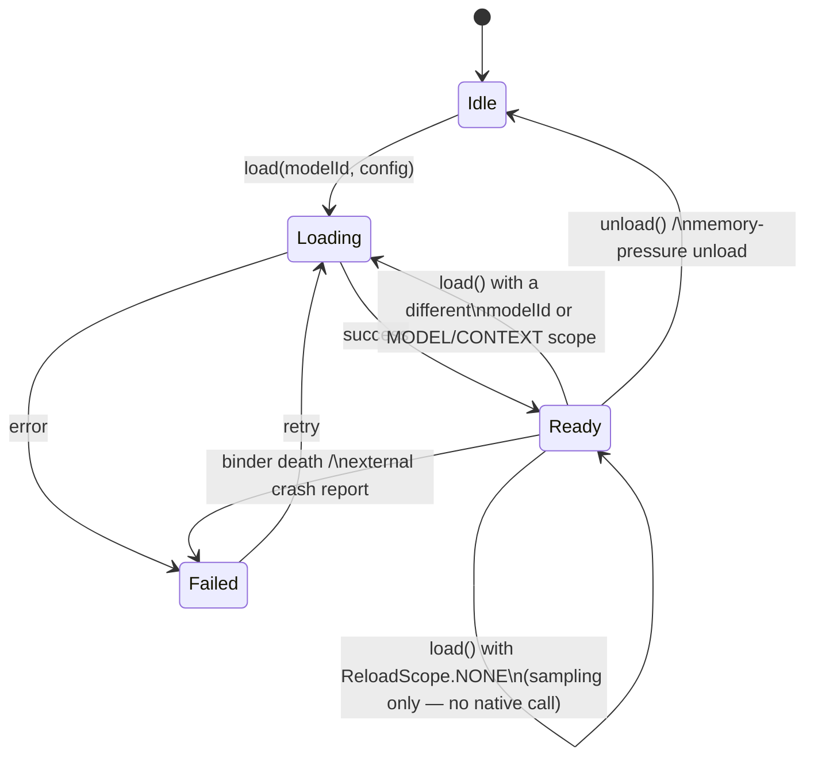
```mermaid
stateDiagram-v2
    [*] --> Idle
    Idle --> Loading: load(modelId, config)
    Loading --> Ready: success
    Loading --> Failed: error
    Ready --> Loading: load() with a different\nmodelId or MODEL/CONTEXT scope
    Ready --> Ready: load() with ReloadScope.NONE\n(sampling only — no native call)
    Ready --> Idle: unload() /\nmemory-pressure unload
    Failed --> Loading: retry
    Ready --> Failed: binder death /\nexternal crash report
```

`ModelLoadCoordinator` (`internal`, `:core:ai:local`) drives this for one `AiEngine`, against
a small `ModelLoadOps` interface (`loadModel`/`recreateContext`/`unloadModel`/
`isActuallyLoaded`) so the state machine is unit-testable on the JVM independent of whether
the real implementation is in-process JNI (`LocalAiEngine`) or AIDL calls into `:inference`
(`RemoteAiEngine`). Three guarantees it exists to get right:

- **Single-flight.** `load()` is entered under a `Mutex`; a second caller arriving mid-load
  waits and then re-checks the now-current state, rather than racing a second native call.
- **`ReloadScope` dispatch.** Loading an already-resident model with a `NONE`-scope config
  change touches nothing native — the sampler chain is already rebuilt per generation.
  `CONTEXT` calls the new `recreateContext` JNI entry point (and its AIDL counterpart,
  `IInferenceService.recreateContext`), which frees only the old context's sampler state,
  builds the new `llama_context`, and swaps it in — the resident model (and its mmap'd
  weights) is untouched, and if context creation fails the previous context stays valid
  rather than the session being torn down. `MODEL`, or a different `modelId` entirely, does a
  full `loadModel`.
- **Stale-generation guard.** Every state-changing call increments a monotonic generation
  counter. Asynchronous observers (a binder death, a memory-pressure callback) capture the
  generation at the moment they notice something via `currentGeneration()` and report through
  `reportExternalFailure(issuedGeneration, ...)`, which is a no-op if a newer generation has
  since started — mirroring Google AI Edge Gallery's identity check that prevents a stale
  cleanup callback from stomping on a newer load's state.

`isActuallyLoaded()` exists because the recorded state can go stale without the coordinator's
involvement: the `:inference` process can free the model on its own under memory pressure, so
the `ReloadScope.NONE` fast path always re-checks residency out of band before trusting it.

#### Memory-pressure unloading, in both processes

The model gets unloaded under real memory pressure independently in each process, since the
system trims them separately:

- **App process:** `InferenceMemoryPressureObserver` (`@Singleton`, `:core:ai:local`)
  registers itself as a `ComponentCallbacks2` from `PostsAiManagerApp.onCreate` (there is no
  `androidx.startup` `Initializer` already in use — WorkManager's is disabled in the manifest
  in favour of Hilt's `Configuration.Provider` — so this follows the same "inject, call from
  `onCreate`" shape rather than introducing a new pattern). On
  `TRIM_MEMORY_RUNNING_CRITICAL`/`TRIM_MEMORY_COMPLETE` it calls
  `RemoteAiEngine.onTrimMemory()`, which routes through
  `ModelLoadCoordinator.unloadOnMemoryPressure()` — a `tryLock`-based unload that backs off
  rather than blocking if a load happens to be mid-flight.
- **`:inference` process:** `InferenceService.onTrimMemory()` frees the resident model
  directly on the same two trim levels. No separate "not loaded" flag is needed for
  `IInferenceService.isReady()` to reflect this — it reads the handle directly, so
  `RemoteAiEngine` observes `isReady() == false` on its very next call and reloads lazily
  through the coordinator.

#### `LocalAiEngine` is test-only

`LocalAiEngine` (`internal`, `:core:ai:local`) is **not** the engine the app binds —
`RemoteAiEngine` is, running the same JNI layer inside the isolated `:inference` process (a
native abort there is a process kill Kotlin cannot catch; see §11.6). `LocalAiEngine` exists
so the instrumented tests that need to drive the JNI surface directly — spike tests,
template/grammar regression tests, the chat pipeline test — can do so without the AIDL
boundary in the way. Both engines share `ChatTemplateFallback.chatMl()` for the ChatML prompt
format used when a model declares no chat template of its own, rather than keeping two
hand-rolled copies in sync.

#### Module map delta

| File | Module | Adds |
|---|---|---|
| `InferenceConfig.kt`, `ConfigSpec.kt`, `InferenceOverrides.kt`, `ModelLoadState.kt` | `:core:model` | The config/overrides/schema/state types above |
| `InferenceSettingsRepository.kt`, `InferenceSettingsUseCases.kt` | `:core:domain` | The settings port and the three use cases `feature:settings` calls |
| `DataStoreInferenceSettingsRepository.kt` | `:core:ai:catalog` | DataStore-backed `InferenceSettingsRepository` |
| `InferenceConfigParcel.kt` (+ `.aidl`) | `:core:ai:local` | Carries `InferenceConfig` across the AIDL boundary |
| `ModelLoadCoordinator.kt`, `ModelLoadOps.kt` | `:core:ai:local` | The state machine and its testable native/IPC seam |
| `ChatTemplateFallback.kt` | `:core:ai:local` | Shared ChatML fallback |
| `InferenceMemoryPressureObserver.kt` | `:core:ai:local` | App-process memory-pressure unload |

---

## 6. The tool & agent layer

The mechanism that lets the model *do* things, not just talk about them.

### 6.1 Tools are adapters, not logic

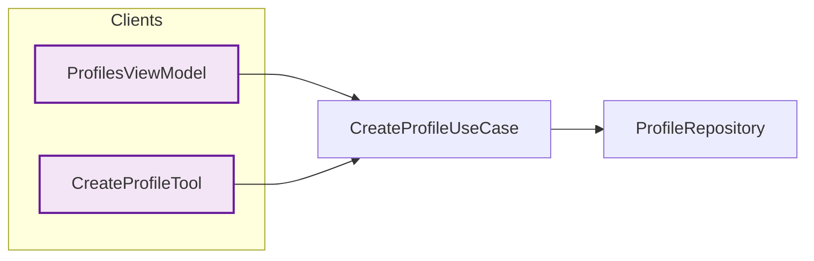
```mermaid
graph LR
    subgraph Clients
        VMx["ProfilesViewModel"]
        Toolx["CreateProfileTool"]
    end
    UCx["CreateProfileUseCase"]
    Repox["ProfileRepository"]
    VMx --> UCx
    Toolx --> UCx
    UCx --> Repox

    classDef same fill:#f3e5f5,stroke:#6a1b9a,stroke-width:2px
    class VMx,Toolx same
```

**Rule:** a tool contains argument mapping, validation and result formatting — nothing
else. If a tool needs behaviour no use case provides, add the use case. This keeps human
and model paths behaviourally identical: the AI cannot do something the UI can't, and both
respect the same invariants.

### 6.2 Tool catalog and risk tiers

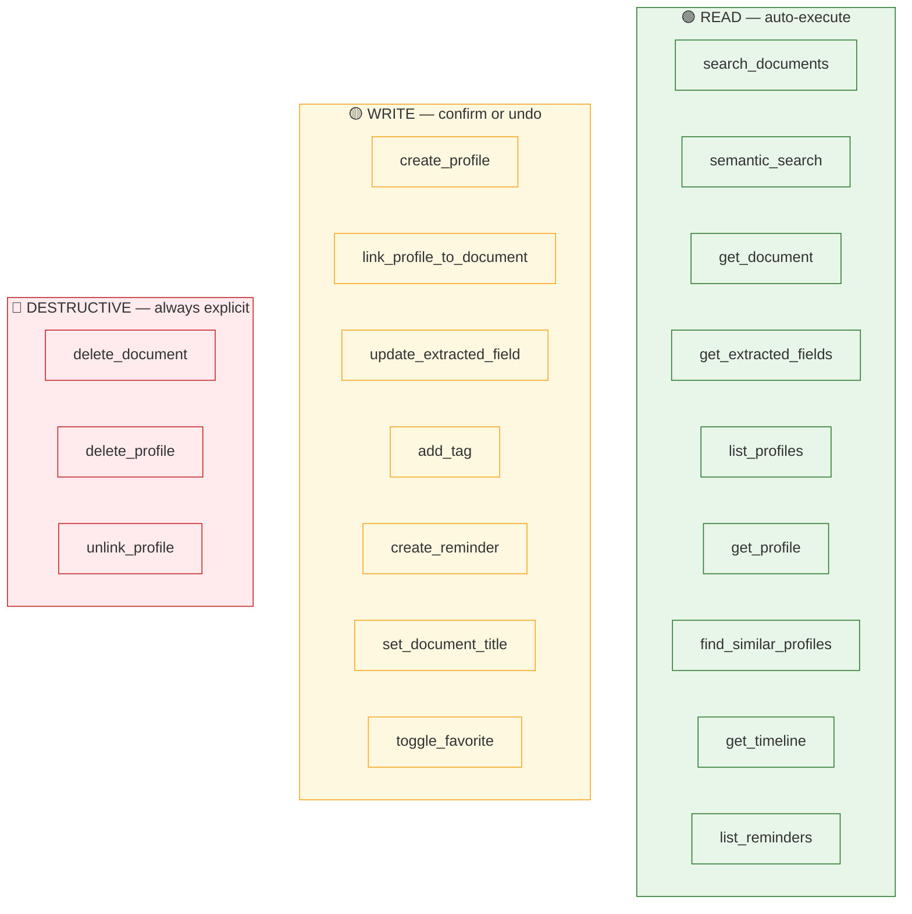
```mermaid
graph TB
    subgraph READ["🟢 READ — auto-execute"]
        R1["search_documents"]
        R2["semantic_search"]
        R3["get_document"]
        R4["get_extracted_fields"]
        R5["list_profiles"]
        R6["get_profile"]
        R7["find_similar_profiles"]
        R8["get_timeline"]
        R9["list_reminders"]
    end
    subgraph WRITE["🟡 WRITE — confirm or undo"]
        W1["create_profile"]
        W2["link_profile_to_document"]
        W3["update_extracted_field"]
        W4["add_tag"]
        W5["create_reminder"]
        W6["set_document_title"]
        W7["toggle_favorite"]
    end
    subgraph DESTRUCTIVE["🔴 DESTRUCTIVE — always explicit"]
        D1["delete_document"]
        D2["delete_profile"]
        D3["unlink_profile"]
    end

    classDef r fill:#e8f5e9,stroke:#2e7d32
    classDef w fill:#fff8e1,stroke:#f9a825
    classDef d fill:#ffebee,stroke:#c62828
    class READ,R1,R2,R3,R4,R5,R6,R7,R8,R9 r
    class WRITE,W1,W2,W3,W4,W5,W6,W7 w
    class DESTRUCTIVE,D1,D2,D3 d
```

| Risk | Local model | Remote model | UX |
|---|---|---|---|
| 🟢 READ | Auto-execute in loop | ❌ never | Silent, shown in a trace |
| 🟡 WRITE | Execute + undo snackbar | Propose only | Action card, one tap to undo |
| 🔴 DESTRUCTIVE | Explicit confirmation | Propose only | Modal confirm naming the target |

Risk is declared on `ToolSpec` and enforced by `ToolExecutor` — a tool cannot opt itself
out.

### 6.3 The protocol problem

Models express tool calls in incompatible ways, and many express none at all. One
abstraction, four implementations, best-available wins.

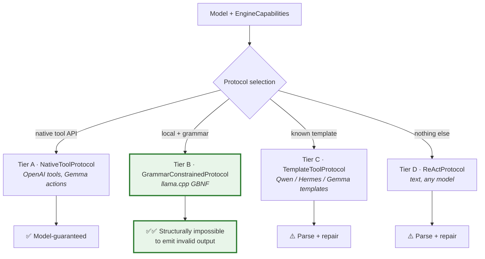
```mermaid
graph TD
    MODEL["Model + EngineCapabilities"] --> SEL{"Protocol selection"}

    SEL -->|"native tool API"| A["Tier A · NativeToolProtocol<br/><i>OpenAI tools, Gemma actions</i>"]
    SEL -->|"local + grammar"| B["Tier B · GrammarConstrainedProtocol<br/><i>llama.cpp GBNF</i>"]
    SEL -->|"known template"| C["Tier C · TemplateToolProtocol<br/><i>Qwen / Hermes / Gemma templates</i>"]
    SEL -->|"nothing else"| D["Tier D · ReActProtocol<br/><i>text, any model</i>"]

    A --> V1["✅ Model-guaranteed"]
    B --> V2["✅✅ Structurally impossible<br/>to emit invalid output"]
    C --> V3["⚠️ Parse + repair"]
    D --> V4["⚠️ Parse + repair"]

    classDef best fill:#e8f5e9,stroke:#2e7d32,stroke-width:3px
    class B,V2 best
```

**Tier B is the answer to "models that don't support action calling," and it is stronger
than tool-calling APIs.** llama.cpp supports GBNF grammars natively: the tool schema is
compiled into a grammar and the sampler is constrained to it, so a structurally invalid
call is not unlikely — it is unreachable.

```gbnf
root      ::= "{" ws "\"tool\"" ws ":" ws tool ws "," ws "\"args\"" ws ":" ws obj ws "}"
tool      ::= "\"search_documents\"" | "\"create_profile\"" | "\"add_tag\""
obj       ::= "{" ws (pair (ws "," ws pair)*)? ws "}"
pair      ::= string ws ":" ws value
```

Illustrative — the real grammar is generated per request from the active `ToolSpec` set.

This retroactively justifies choosing llama.cpp: neither ONNX Runtime GenAI nor MediaPipe
offers grammar-constrained sampling.

### 6.4 One definition, four renderings

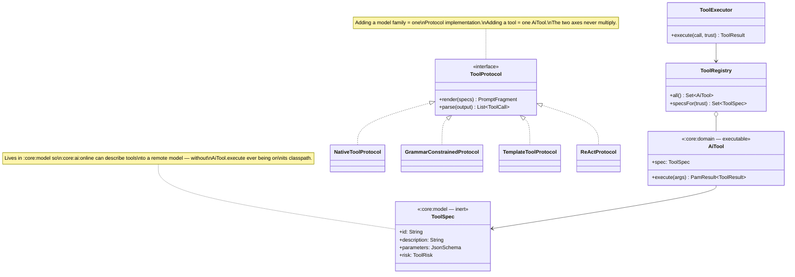
```mermaid
classDiagram
    class ToolSpec {
        <<:core:model — inert>>
        +id: String
        +description: String
        +parameters: JsonSchema
        +risk: ToolRisk
    }
    class AiTool {
        <<:core:domain — executable>>
        +spec: ToolSpec
        +execute(args) PamResult~ToolResult~
    }
    class ToolProtocol {
        <<interface>>
        +render(specs) PromptFragment
        +parse(output) List~ToolCall~
    }
    class NativeToolProtocol
    class GrammarConstrainedProtocol
    class TemplateToolProtocol
    class ReActProtocol
    class ToolRegistry {
        +all() Set~AiTool~
        +specsFor(trust) Set~ToolSpec~
    }
    class ToolExecutor {
        +execute(call, trust) ToolResult
    }

    AiTool --> ToolSpec
    ToolProtocol <|.. NativeToolProtocol
    ToolProtocol <|.. GrammarConstrainedProtocol
    ToolProtocol <|.. TemplateToolProtocol
    ToolProtocol <|.. ReActProtocol
    ToolRegistry o-- AiTool
    ToolExecutor --> ToolRegistry

    note for ToolSpec "Lives in :core:model so\n:core:ai:online can describe tools\nto a remote model — without\nAiTool.execute ever being on\nits classpath."
    note for ToolProtocol "Adding a model family = one\nProtocol implementation.\nAdding a tool = one AiTool.\nThe two axes never multiply."
```

The render/parse pair is the whole abstraction. Adding a model family costs one protocol;
adding a capability costs one tool. **N models + M tools, never N×M.**

### 6.5 Local agent loop — full autonomy

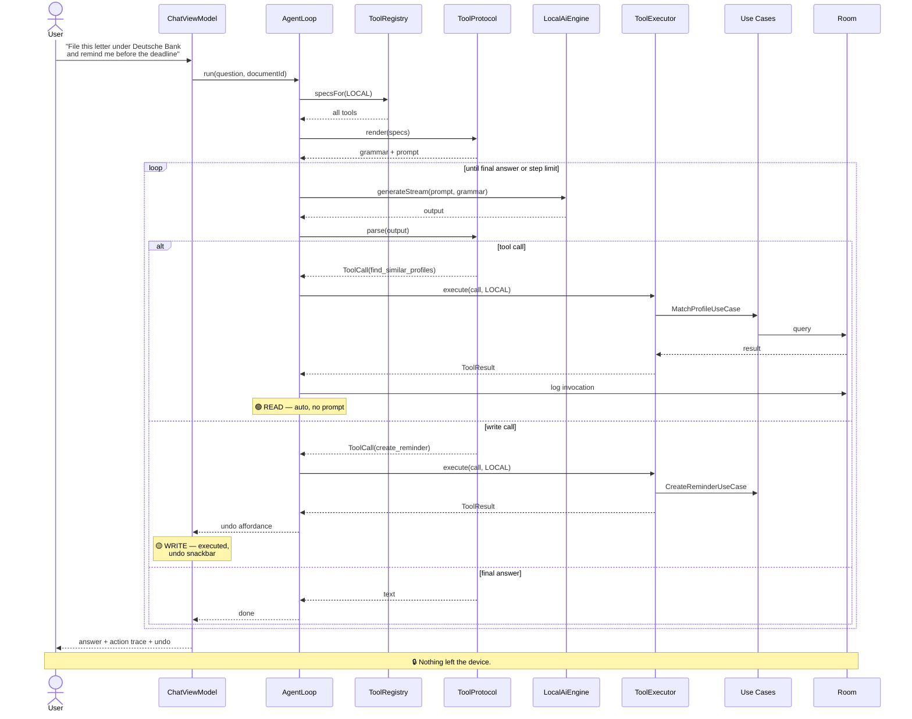
```mermaid
sequenceDiagram
    actor U as User
    participant CVM as ChatViewModel
    participant AL as AgentLoop
    participant REG as ToolRegistry
    participant PROTO as ToolProtocol
    participant AE as LocalAiEngine
    participant EX as ToolExecutor
    participant UC as Use Cases
    participant DB as Room

    U->>CVM: "File this letter under Deutsche Bank<br/>and remind me before the deadline"
    CVM->>AL: run(question, documentId)
    AL->>REG: specsFor(LOCAL)
    REG-->>AL: all tools
    AL->>PROTO: render(specs)
    PROTO-->>AL: grammar + prompt

    loop until final answer or step limit
        AL->>AE: generateStream(prompt, grammar)
        AE-->>AL: output
        AL->>PROTO: parse(output)

        alt tool call
            PROTO-->>AL: ToolCall(find_similar_profiles)
            AL->>EX: execute(call, LOCAL)
            EX->>UC: MatchProfileUseCase
            UC->>DB: query
            DB-->>EX: result
            EX-->>AL: ToolResult
            AL->>DB: log invocation
            Note over AL: 🟢 READ — auto, no prompt
        else write call
            PROTO-->>AL: ToolCall(create_reminder)
            AL->>EX: execute(call, LOCAL)
            EX->>UC: CreateReminderUseCase
            EX-->>AL: ToolResult
            AL-->>CVM: undo affordance
            Note over CVM: 🟡 WRITE — executed,<br/>undo snackbar
        else final answer
            PROTO-->>AL: text
            AL-->>CVM: done
        end
    end

    CVM-->>U: answer + action trace + undo
    Note over U,DB: 🔒 Nothing left the device.
```

Guardrails: a step limit, a wall-clock budget, no repeated identical call, and a visible
trace of every action so the loop is never a black box.

### 6.6 Remote path — proposal only

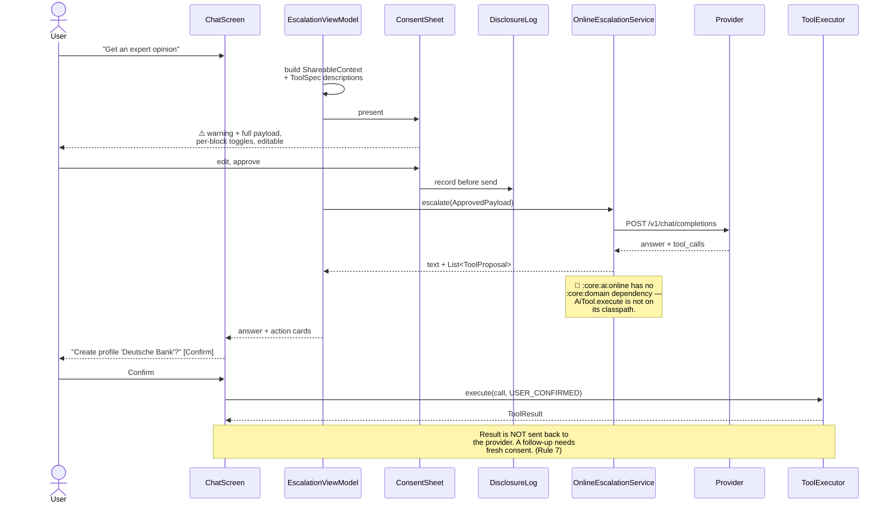
```mermaid
sequenceDiagram
    actor U as User
    participant CS as ChatScreen
    participant ESC as EscalationViewModel
    participant SHEET as ConsentSheet
    participant LOG as DisclosureLog
    participant SVC as OnlineEscalationService
    participant P as Provider
    participant EX as ToolExecutor

    U->>CS: "Get an expert opinion"
    ESC->>ESC: build ShareableContext<br/>+ ToolSpec descriptions
    ESC->>SHEET: present
    SHEET-->>U: ⚠️ warning + full payload,<br/>per-block toggles, editable
    U->>SHEET: edit, approve
    SHEET->>LOG: record before send
    ESC->>SVC: escalate(ApprovedPayload)
    SVC->>P: POST /v1/chat/completions
    P-->>SVC: answer + tool_calls
    SVC-->>ESC: text + List<ToolProposal>

    Note over SVC: 🚫 :core:ai:online has no<br/>:core:domain dependency —<br/>AiTool.execute is not on<br/>its classpath.

    ESC-->>CS: answer + action cards
    CS-->>U: "Create profile 'Deutsche Bank'?" [Confirm]
    U->>CS: Confirm
    CS->>EX: execute(call, USER_CONFIRMED)
    EX-->>CS: ToolResult

    Note over CS,EX: Result is NOT sent back to<br/>the provider. A follow-up needs<br/>fresh consent. (Rule 7)
```

### 6.7 Why the loop is local-only

| | Local | Remote |
|---|---|---|
| Multi-turn loop | ✅ Autonomous | ❌ Single turn |
| Tool execution | ✅ Direct | ❌ Proposal only |
| Results fed back | ✅ Free | ❌ Requires new consent |
| Read tools | Auto | Never |
| Write tools | Execute + undo | Confirm-then-execute locally |
| Consent | Once, at install | Every request |

A remote agent loop would need a consent prompt per iteration — unusable — or silent
data flow — unacceptable. Proposal-only is the honest resolution, and it happens to be the
better UX: the user sees a concrete action instead of a paragraph telling them to do it.

### 6.8 RAG — grounding across the corpus

A local model has a 4–8k context. A user with 200 letters cannot have them all in the
prompt.

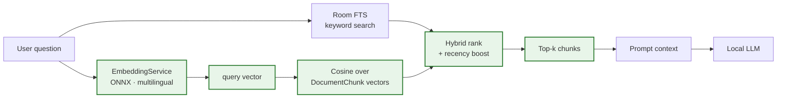
```mermaid
graph LR
    Q["User question"] --> E["EmbeddingService<br/>ONNX · multilingual"]
    E --> V["query vector"]
    V --> S["Cosine over<br/>DocumentChunk vectors"]
    K["Room FTS<br/>keyword search"] --> H
    S --> H["Hybrid rank<br/>+ recency boost"]
    Q --> K
    H --> C["Top-k chunks"]
    C --> P["Prompt context"]
    P --> LLM["Local LLM"]

    classDef new fill:#e8f5e9,stroke:#2e7d32,stroke-width:2px
    class E,V,S,H,C new
```

**Why ONNX Runtime stays.** It is already integrated and working in this project. Retargeting
it from the (cut) Arabic parser to embeddings costs nothing and buys a strong multilingual
model — `multilingual-e5-small` or `bge-m3` class — which matters for a German + Arabic +
English corpus. It also decouples retrieval from the LLM runtime: swapping or upgrading
llama.cpp later cannot break search. Cost is ~10–15 MB of arm64 native library.

**No vector database.** 200 documents × ~5 chunks × 384 dims is ~400 KB of floats. Brute-force
cosine in Kotlin is sub-millisecond. Store vectors as a `BLOB` on `DocumentChunk`. Revisit
only if a corpus reaches five figures.

**Hybrid beats pure vector.** Reference numbers, IBANs and dates are exactly what embeddings
are worst at and keyword search is best at. Run both, merge.

### 6.9 Model management

Multi-gigabyte downloads over mobile networks make **resumability a correctness
requirement**, not a nicety.

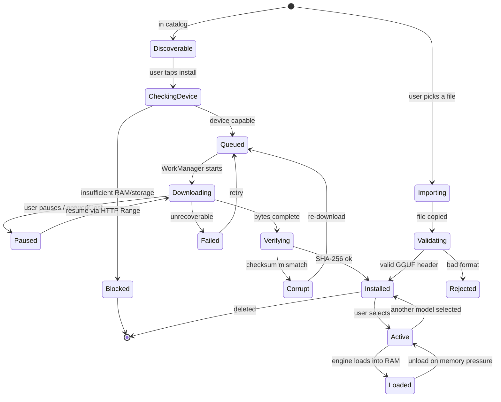
```mermaid
stateDiagram-v2
    [*] --> Discoverable: in catalog
    [*] --> Importing: user picks a file

    Discoverable --> CheckingDevice: user taps install
    CheckingDevice --> Blocked: insufficient RAM/storage
    CheckingDevice --> Queued: device capable
    Blocked --> [*]

    Queued --> Downloading: WorkManager starts
    Downloading --> Paused: user pauses / network lost
    Paused --> Downloading: resume via HTTP Range
    Downloading --> Verifying: bytes complete
    Downloading --> Failed: unrecoverable
    Failed --> Queued: retry
    Verifying --> Corrupt: checksum mismatch
    Corrupt --> Queued: re-download
    Verifying --> Installed: SHA-256 ok

    Importing --> Validating: file copied
    Validating --> Installed: valid GGUF header
    Validating --> Rejected: bad format

    Installed --> Active: user selects
    Active --> Loaded: engine loads into RAM
    Loaded --> Active: unload on memory pressure
    Active --> Installed: another model selected
    Installed --> [*]: deleted
```

| Concern | Approach |
|---|---|
| Resumability | HTTP Range, byte offset persisted, survives process death |
| Orchestration | `WorkManager` — a declared, currently unused dependency |
| Progress | Foreground service + notification — the manifest **already declares** `FOREGROUND_SERVICE`, `FOREGROUND_SERVICE_DATA_SYNC`, `POST_NOTIFICATIONS` for exactly this |
| Integrity | SHA-256 verified before a model is marked installed |
| Custom models | SAF picker, GGUF header validation |
| Device fit | RAM / ABI / storage checked **before** download |
| Metering | Wi-Fi-only default, explicit opt-in for mobile data |

### 6.10 Remote configuration

Model catalog and provider descriptors are the same problem: **data that must change
without an app update.** One subsystem serves both.

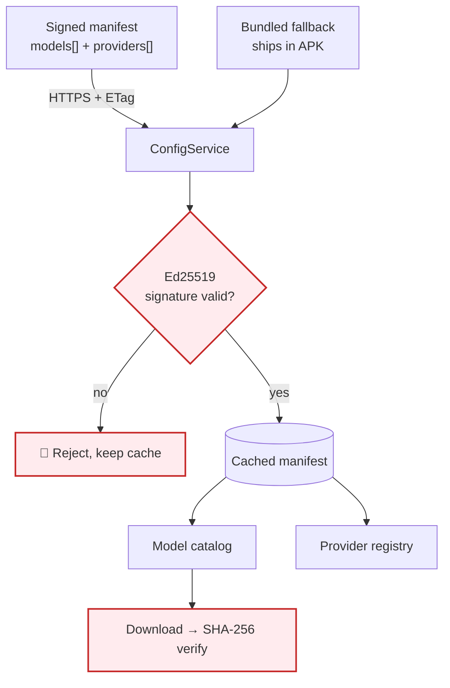
```mermaid
graph TB
    CDN["Signed manifest<br/>models[] + providers[]"] -->|"HTTPS + ETag"| FETCH["ConfigService"]
    BUNDLED["Bundled fallback<br/>ships in APK"] --> FETCH
    FETCH --> VERIFY{"Ed25519<br/>signature valid?"}
    VERIFY -->|no| REJECT["🚫 Reject, keep cache"]
    VERIFY -->|yes| CACHE[("Cached manifest")]
    CACHE --> MC["Model catalog"]
    CACHE --> PR["Provider registry"]
    MC --> DL["Download → SHA-256 verify"]

    classDef sec fill:#ffebee,stroke:#c62828,stroke-width:2px
    class VERIFY,REJECT,DL sec
```

**Signature verification is not optional.** A manifest that names model download URLs is a
supply-chain vector — a compromised CDN could point at a malicious GGUF. Two independent
checks: **Ed25519 signature on the manifest**, and **SHA-256 on the downloaded artifact**,
with the hash coming from the signed manifest. HTTPS alone is not sufficient.

Requirements: bundled fallback so a fresh install works offline · ETag/`If-None-Match` ·
schema version with forward compatibility (unknown fields ignored, unknown entries skipped)
· never block app start on a fetch.

### 6.11 Device tiering

```mermaid
flowchart TD
    A["App start"] --> B{"Total RAM"}
    B -->|"< 4 GB"| C["Tier 0 — no local AI<br/>Full document app.<br/>AI tab explains why."]
    B -->|"4–6 GB"| D["Tier 1 — ~1–3B, heavy quant"]
    B -->|"6–8 GB"| E["Tier 2 — ~3–8B"]
    B -->|"> 8 GB"| F["Tier 3 — larger models"]
    C --> G{"Escalation configured?"}
    G -->|yes| H["AI via explicit<br/>escalation only"]
    G -->|no| I["No AI.<br/>Everything else works."]

    classDef t0 fill:#ffebee,stroke:#c62828
    class C,I t0
```

**Tier 0 is a supported configuration, not a degraded one.** Scanning, OCR, extraction,
profiles, timeline, PDF, tags and reminders are non-AI features and must never gate on a
model. This also serves users who want no AI at all.

Embeddings are far cheaper than generation — a ~100 MB embedding model runs comfortably on
Tier 0/1, so **semantic search can ship even where chat cannot**.

### 6.12 Planned evolution — redaction gateway

The consent gate is deliberately a strict subset of a future automated design: the local
model rewrites the query into a PII-stripped abstraction and the user reviews *that*. Same
`ShareableContext` → `ApprovedPayload` pipeline plus one transform stage. **Not in 1.0**;
recorded so nothing built now blocks it.

---

## 7. Data model

```mermaid
erDiagram
    DOCUMENT ||--o{ DOCUMENT_PAGE : has
    DOCUMENT ||--o{ EXTRACTED_DATA : yields
    DOCUMENT ||--o{ DOCUMENT_CHUNK : "embedded as"
    DOCUMENT ||--o{ DOCUMENT_PROFILE_LINK : links
    PROFILE ||--o{ DOCUMENT_PROFILE_LINK : links
    DOCUMENT ||--o{ DOCUMENT_TAG : tagged
    TAG ||--o{ DOCUMENT_TAG : tagged
    DOCUMENT ||--o{ TIMELINE_EVENT : logs
    DOCUMENT ||--o{ REMINDER : triggers
    DOCUMENT ||--o{ DOCUMENT_RELATION : relates
    CONVERSATION ||--o{ MESSAGE : contains
    DOCUMENT ||--o{ CONVERSATION : about
    MESSAGE ||--o{ TOOL_INVOCATION : performed
    MESSAGE ||--o| DISCLOSURE : "if escalated"
    INSTALLED_MODEL ||--o{ MESSAGE : generated

    DOCUMENT_CHUNK {
        string id PK
        string documentId FK
        int ordinal
        string text
        blob embedding
        string modelId
    }
    MESSAGE {
        string id PK
        string conversationId FK
        string role
        string content
        string source "local model id | provider id"
    }
    TOOL_INVOCATION {
        string id PK
        string messageId FK
        string toolId
        string argsJson
        string risk
        string status "auto|confirmed|rejected|undone"
        long executedAt
    }
    DISCLOSURE {
        string id PK
        string messageId FK
        string providerId
        string payloadHash
        string blocksIncluded
        long sentAt
    }
    INSTALLED_MODEL {
        string id PK
        string name
        string quantization
        long sizeBytes
        string sha256
        string source "catalog|imported"
    }
```

**Four new tables:** `DOCUMENT_CHUNK` (RAG), `TOOL_INVOCATION` (what the AI did, and whether
the user confirmed it), `DISCLOSURE` (what left the device), `INSTALLED_MODEL`.

**DAO coverage today — 6 of 12 existing entities are unreachable:**

| Entity | DAO | Consequence |
|---|---|---|
| `DocumentEntity`, `DocumentPageEntity`, `ExtractedDataEntity` | ✅ | — |
| `ProfileEntity`, `DocumentProfileLinkEntity` | ✅ | — |
| `TimelineEventEntity` | ✅ | — |
| `ConversationEntity`, `MessageEntity` | ❌ | **Chat cannot persist** |
| `TagEntity`, `DocumentTagEntity` | ❌ | Tagging impossible |
| `DocumentRelationEntity` | ❌ | Doc linking impossible |
| `ReminderEntity` | ❌ | Deadline reminders impossible |

`TOOL_INVOCATION` doubles as the audit trail behind the in-chat action trace.

---

## 8. Navigation

```mermaid
stateDiagram-v2
    direction LR
    [*] --> home

    state "Bottom nav" as BN {
        home
        documents
        profiles
        settings
        assistant
    }

    home --> scanner: FAB
    home --> detail: tap card
    documents --> detail: tap card
    scanner --> detail: scan complete
    detail --> assistant: ask about this
    assistant --> consent: escalate
    consent --> assistant: approve / cancel
    settings --> models: manage models
    settings --> providers: manage providers
    settings --> disclosures: audit log
    profiles --> profileDetail: tap profile

    state "NEW — replaces the<br/>cut parser tab" as assistant
    state "NEW" as models
    state "NEW" as consent
    state "NEW — fixes PamApp.kt:92" as profileDetail
```

Cutting `feature:parser` frees the fifth bottom-nav slot; **Assistant** takes it, which is
the right hierarchy for an AI-first product. Chat stops being a detail-screen side door and
becomes a destination.

New routes: `assistant`, `models`, `model/{id}`, `providers`, `disclosures`,
`profile/{id}`, plus the consent sheet.

---

## 9. Cut: `feature:parser`

Arabic syntax analysis (iʻrāb / tashkeel) is **out of scope** — confirmed 2026-08-07.

**Removed:** `:feature:parser` · `OnnxArabicSyntaxEngine` · `ArabicTokenizer` ·
`HrmMappings` · `CaseEndingApplicator` · `DiacriticCombiner` · `ArabicStemLexicon` ·
`ArabicRootExtractor` · `KokoroTtsEngine` · `ArabicPhonemizer` ·
`tools/AndroidNativeTtsEngine` · all 8 asset files (~180 MB).

**Kept:** `NativeArabicTtsEngine` (Android system TTS) as optional document read-aloud — it
works today and costs nothing. **ONNX Runtime**, retargeted from the parser to embeddings
(§6.8).

The code being deleted is good — a real MD5-stable-hashing tokenizer, a hand-curated
150-entry lexicon, correct UD-style post-processing. It was riding on a 617-byte
placeholder model. Preserve it on a branch or in a separate repo rather than losing it.

---

## 10. Architectural rules

Konsist enforces #1–#7 in CI (Phase 11).

1. **No `feature:*` module depends on `core:data` or any `core:ai:*` implementation
   module.** Presentation talks to `core:domain`.
2. **`:core:ai:online` has no dependency on `:core:data`**, Room, DataStore, or the
   filesystem. *(Guarantee 1 — an online provider cannot read a document.)*
3. **`:core:ai:online` has no dependency on `:core:domain`.** It sees `ToolSpec` from
   `:core:model`, never executable `AiTool`. *(Guarantee 2 — cannot execute a tool.)*
4. **`OnlineEscalationService` is never an `AiEngine`.** Distinct types prevent a future
   refactor from silently routing local calls to the cloud.
5. **Tool results are never automatically returned to a remote model.**
6. **An `AiTool` contains no business logic** — it wraps a use case. If behaviour is
   missing, add the use case.
7. **`core:domain` and `core:model` contain no Android imports.**
8. **Every tool invocation is persisted** to `TOOL_INVOCATION` before or as it executes.
9. **Write and destructive tools require confirmation or an undo path.** Declared on
   `ToolSpec`, enforced by `ToolExecutor`.
10. **ViewModels expose one `StateFlow<XUiState>`** and never leak domain exceptions.
11. **Composables are stateless.** State hoisted; navigation via lambdas.
12. **Repositories return `PamResult`** for one-shot calls, `Flow` for observation.
13. **No user-facing string literals in Kotlin.** `stringResource` only.
14. **Dependencies go through `libs.versions.toml`.** No hardcoded coordinates.
15. **Every Room schema change ships a migration.** `fallbackToDestructiveMigration()` is
    removed in Phase 11.
16. **No AI capability gates a non-AI feature.**

---

## 11. Error handling & graceful degradation

The current codebase has one systemic weakness that the AI layer will amplify:
`DocumentDetailScreen.kt:364` does `catch (_: Exception) { null }` and shows a generic
toast, and `ParserViewModel.kt:66` surfaces a raw stack-trace string to the user. Adding
native inference, model downloads and HTTP providers to that foundation would be a
reliability disaster.

`PamResult` / `PamError` in `:core:common` is already a good sealed hierarchy. The work is
to **use it consistently and extend it**, not to replace it.

### 11.1 The core principle

> **Errors are values that cross layer boundaries. Exceptions never do.**

Each layer catches what it understands, translates it into its own vocabulary, and passes a
typed value outward. No layer ever sees the layer below's exception types.

```mermaid
graph LR
    subgraph Infra["Infrastructure — throws"]
        A["SQLiteException<br/>IOException<br/>OrtException<br/>JNI crash<br/>HttpException"]
    end
    subgraph Data["Data — catches, translates"]
        B["PamError.Storage<br/>PamError.Ai<br/>PamError.Network"]
    end
    subgraph Domain["Domain — composes"]
        C["PamResult&lt;T&gt;"]
    end
    subgraph Pres["Presentation — presents"]
        D["UiState.Error(<br/>ErrorPresentation)"]
    end
    subgraph User["User — acts"]
        E["What happened ·<br/>Why · What now"]
    end

    A -->|"try/catch<br/>at the boundary"| B --> C --> D --> E

    classDef bad fill:#ffebee,stroke:#c62828
    classDef good fill:#e8f5e9,stroke:#2e7d32
    class A bad
    class B,C,D,E good
```

**Rule: the only `try/catch` in the codebase lives at an infrastructure boundary.** A catch
anywhere else is a code smell. Every catch must handle, translate, or rethrow — and log.
`catch (_: Exception) { null }` is banned by lint.

### 11.2 Taxonomy by recoverability

Classifying by *what the user or system can do about it* is more useful than classifying by
origin, because it determines the UI directly.

```mermaid
graph TB
    E["PamError"] --> T["🔄 Transient<br/><i>retry automatically</i>"]
    E --> A["👤 Actionable<br/><i>user can fix</i>"]
    E --> D["📉 Degradable<br/><i>fall back silently</i>"]
    E --> F["🛑 Terminal<br/><i>operation cannot complete</i>"]
    E --> B["🐛 Defect<br/><i>our bug</i>"]

    T --> T1["Network timeout · rate limit ·<br/>download interrupted"]
    A --> A1["No model installed · no API key ·<br/>out of storage · permission denied ·<br/>model too large for device"]
    D --> D1["Embedding model missing → keyword search ·<br/>grammar unsupported → ReAct protocol ·<br/>OCR low confidence → flag, don't fail"]
    F --> F1["Corrupt model · invalid GGUF ·<br/>unsupported architecture"]
    B --> B1["Illegal state · contract violation"]

    T1 --> TU["Backoff + retry.<br/>Surface only after N failures."]
    A1 --> AU["Explain + one-tap action<br/>that resolves it."]
    D1 --> DU["Proceed degraded.<br/>Note it, don't block."]
    F1 --> FU["Clear message + escape route."]
    B1 --> BU["Crash in debug.<br/>Log + generic message in release."]

    classDef t fill:#e3f2fd,stroke:#1565c0
    classDef a fill:#fff8e1,stroke:#f9a825
    classDef d fill:#e8f5e9,stroke:#2e7d32
    classDef f fill:#ffebee,stroke:#c62828
    class T,T1,TU t
    class A,A1,AU a
    class D,D1,DU d
    class F,F1,FU f
```

**Defects are not errors.** A contract violation is a bug to fix, not a condition to
handle. Failing loudly in debug and logging in release is more honest than a `PamError`
that pretends it was expected.

### 11.3 The user-facing contract

Every error state must answer three questions. If it cannot answer the third, it is not
finished.

| | Bad (today) | Good |
|---|---|---|
| What | *"Error"* | *"Couldn't load the model"* |
| Why | *(silence)* | *"Qwen 3B needs 3.2 GB free; you have 1.1 GB"* |
| What now | *(nothing)* | **[Free up space]** · **[Choose a smaller model]** |

```kotlin
data class ErrorPresentation(
    @StringRes val title: Int,
    @StringRes val body: Int,
    val bodyArgs: List<Any> = emptyList(),
    val primaryAction: ErrorAction? = null,   // resolves the cause
    val secondaryAction: ErrorAction? = null, // escape route
    val isRetryable: Boolean = false,
)
```

Mapping `PamError` → `ErrorPresentation` happens in **one** place per feature, not scattered
through composables. Composables render an `ErrorPresentation`; they never inspect a
`PamError`.

### 11.4 Degradation ladder

The app must degrade in defined, visible steps rather than break. Each rung is a supported
configuration.

```mermaid
graph TD
    F["🟢 Full<br/>local chat + tools + RAG + escalation"] -->|no network| N["🟢 Offline<br/>everything except escalation"]
    N -->|no embedding model| K["🟡 Keyword only<br/>chat + tools, no semantic search"]
    K -->|no LLM installed| S["🟡 Search + scan<br/>full document app, no chat"]
    S -->|Tier 0 device| T["🟡 Tier 0<br/>identical to above, by design"]
    T -->|no camera permission| I["🟠 Import only<br/>existing documents readable"]

    classDef ok fill:#e8f5e9,stroke:#2e7d32
    classDef part fill:#fff8e1,stroke:#f9a825
    classDef low fill:#ffe0b2,stroke:#ef6c00
    class F,N ok
    class K,S,T part
    class I low
```

**Rule 16 restated as an invariant:** scanning, OCR, extraction, profiles, timeline, tags,
reminders and PDF export work at *every* rung. Nothing about the document app gates on AI.

Degradation is **announced, never silent**. If semantic search is unavailable, the search
screen says so — a user must never wonder why results got worse.

### 11.5 Errors inside the agent loop

This is where error handling stops being UI polish and becomes control flow.

When a tool fails, the **model** is the one that needs to know, so it can recover. A tool
failure is therefore a normal loop value, not an exception:

```mermaid
sequenceDiagram
    participant AL as AgentLoop
    participant EX as ToolExecutor
    participant UC as Use Case

    AL->>EX: link_profile_to_document(p="unknown", d="doc1")
    EX->>UC: LinkProfileUseCase
    UC-->>EX: PamResult.Error(NotFound)
    EX-->>AL: ToolResult.Failure(<br/>code="NOT_FOUND",<br/>message="No profile 'unknown'",<br/>hint="call find_similar_profiles first")
    Note over AL: Failure is fed back into<br/>the prompt as an observation.
    AL->>AL: model self-corrects
    AL->>EX: find_similar_profiles("Deutsche Bank")
    EX-->>AL: ToolResult.Success([...])
    AL->>EX: create_profile(...) → link(...)
    EX-->>AL: ToolResult.Success
```

**`ToolResult.Failure` carries a machine-readable `code` and an actionable `hint`** — the
hint is written for the model, not the user. This is the difference between a loop that
recovers and one that repeats the same failing call until the step limit.

Loop-level failure modes and their guards:

| Failure | Guard |
|---|---|
| Model loops on one failing tool | No identical consecutive call; escalate to user after 2 failures |
| Model never emits a final answer | Hard step limit + wall-clock budget |
| Protocol parse fails | One reformat retry, then fall back a tier (B → C → D), then answer without tools |
| Tool args fail schema validation | Rejected before execution; validation error returned as `ToolResult.Failure` |
| Model invents a nonexistent tool | `UNKNOWN_TOOL` failure listing valid names |
| Loop aborted mid-way | Completed write tools stay applied and remain individually undoable |

The last one matters: a partially-completed agent run is not rolled back automatically —
that would be surprising. Every write is individually undoable and visible in the action
trace.

### 11.6 Native and resource failures

The riskiest new failure class. A JNI crash in llama.cpp is a **process kill**, not a
catchable exception.

| Risk | Mitigation |
|---|---|
| Native crash kills the app | Run inference in a separate process (`android:process=":inference"`). A crash then loses the answer, not the app or unsaved work. **Decide during the Phase 7 spike.** |
| OOM loading a model | Check free RAM against the model's declared requirement *before* loading; refuse with an actionable error rather than dying |
| OOM mid-generation | Trap low-memory callbacks; unload the model, surface a degradable error |
| Model in an unknown state after failure | Load/unload is a state machine (§6.9); any failure returns it to `Installed`, never leaves it half-loaded |
| Download corrupts | SHA-256 before install; corrupt → re-download, never activate |
| ONNX session failure | Embeddings are degradable — fall back to keyword search, announce it |

The separate-process decision is a genuine trade-off — IPC overhead and complexity against
crash isolation — and should be made with spike data rather than up front.

### 11.7 Separation of concerns — what goes where

| Concern | Belongs in | Never in |
|---|---|---|
| Catching `SQLiteException`, `IOException`, `OrtException` | `:core:data` boundary | Domain, presentation |
| Mapping infra exception → `PamError` | `:core:data` | Anywhere else |
| Retry / backoff policy | Use case or repository | ViewModel |
| Deciding *whether* to degrade | Use case | Composable |
| `PamError` → `ErrorPresentation` | ViewModel (one mapper per feature) | Composable |
| Rendering an error | Composable | — |
| Tool failure → model-readable hint | `ToolExecutor` | The tool itself |
| Logging | A `PamLogger` abstraction in `:core:common` | `android.util.Log` scattered anywhere |

Three consequences worth stating:

- **`ToolExecutor` owns the failure vocabulary**, not individual tools. A tool returns a
  domain `PamResult`; the executor translates it into the model-facing `ToolResult.Failure`
  with its code and hint. Otherwise every tool reinvents error text.
- **ViewModels own presentation mapping**, so the same `PamError` can read differently in
  two screens where that is genuinely more helpful.
- **Logging is an interface.** Direct `android.util.Log` calls make `:core:domain` untestable
  and risk leaking document content into logcat. A `PamLogger` with a no-op release
  implementation for anything PII-adjacent is the only safe route.

### 11.8 Privacy constraints on error handling

Error handling is a common accidental data-leak path, and this app's whole thesis is
privacy:

1. **Never log document content, OCR text, extracted fields, or prompts** — even at debug
   level. Log identifiers and error codes.
2. **Never send document content to crash reporting.** Breadcrumbs carry error codes and
   screen names, never payloads.
3. **Never include an API key in an error message**, including "invalid key: sk-abc…".
4. **Provider error bodies are untrusted input.** Map to typed errors; never render a raw
   remote string in the UI.

---

## 12. Target production architecture

```mermaid
graph TB
    subgraph Device["📱 Android device — everything works here"]
        subgraph UI["Presentation"]
            SCR["Compose screens"]
            VMS["ViewModels"]
            CONS["Consent sheet"]
            CARDS["Action cards"]
        end
        subgraph DOM["Domain"]
            UCS["Use cases"]
            TOOLS["AiTool set"]
            CON["Contracts"]
        end
        subgraph DATA["Data"]
            RP["Repositories"]
            RM[("Room + migrations<br/>+ vectors")]
            SEC[("EncryptedPrefs<br/>BYOK keys")]
            AUD[("Tool + disclosure<br/>audit")]
        end
        subgraph AIL["On-device AI"]
            LLM["llama.cpp<br/>GGUF + GBNF"]
            EMB["ONNX embeddings"]
            AG["AgentLoop<br/>+ ToolExecutor"]
            CAT["Catalog +<br/>resumable download"]
            OCRs["ML Kit OCR"]
        end
        subgraph BG["Background"]
            WM["WorkManager"]
            NOT["Notifications"]
        end
    end

    subgraph Cloud["☁️ Optional — only through the gate"]
        GRQ["Groq"]
        NVD["NVIDIA Build"]
        OLL["Ollama / self-hosted"]
        GEM["Gemini"]
        CFG["Signed manifest<br/>models + providers"]
        CDN["Model CDN"]
    end

    SCR <--> VMS --> UCS --> CON
    VMS --> CONS & CARDS
    RP -.implements.-> CON
    RP --> RM & SEC & AUD
    UCS --> AG --> LLM
    AG --> TOOLS --> UCS
    RP --> EMB & OCRs
    LLM --> CAT
    WM --> CAT & NOT
    CAT -->|resumable| CDN
    CFG -->|Ed25519| CAT

    CONS ==>|"ApprovedPayload only"| GRQ & NVD & OLL & GEM
    GRQ & NVD & OLL & GEM -.->|"proposals only"| CARDS
    CARDS --> TOOLS
    SEC -.keys.-> GRQ & NVD & GEM
    CONS --> AUD

    classDef new fill:#e8f5e9,stroke:#2e7d32,stroke-width:2px
    classDef gate fill:#fff8e1,stroke:#f9a825,stroke-width:3px
    class LLM,EMB,AG,CAT,SEC,AUD,WM,NOT,GRQ,NVD,GEM,OLL,CDN,CFG,TOOLS new
    class CONS,CARDS gate
```

Green is new work; amber is the consent boundary every cloud path crosses. See
[03-implementation-plan.md](03-implementation-plan.md) for sequencing.
