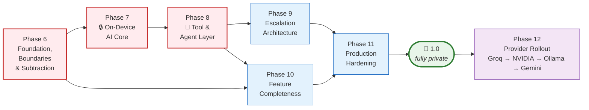
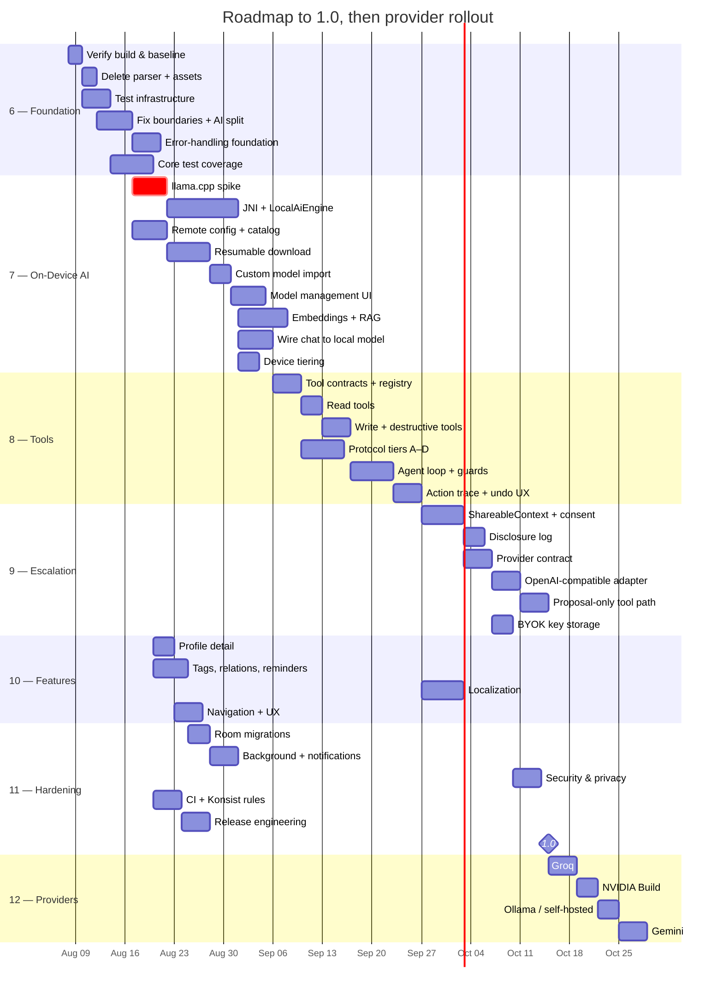
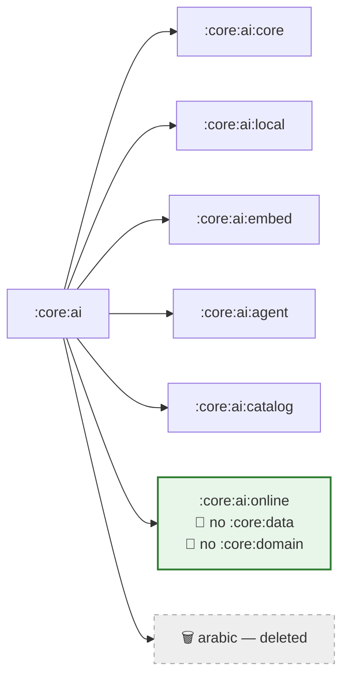
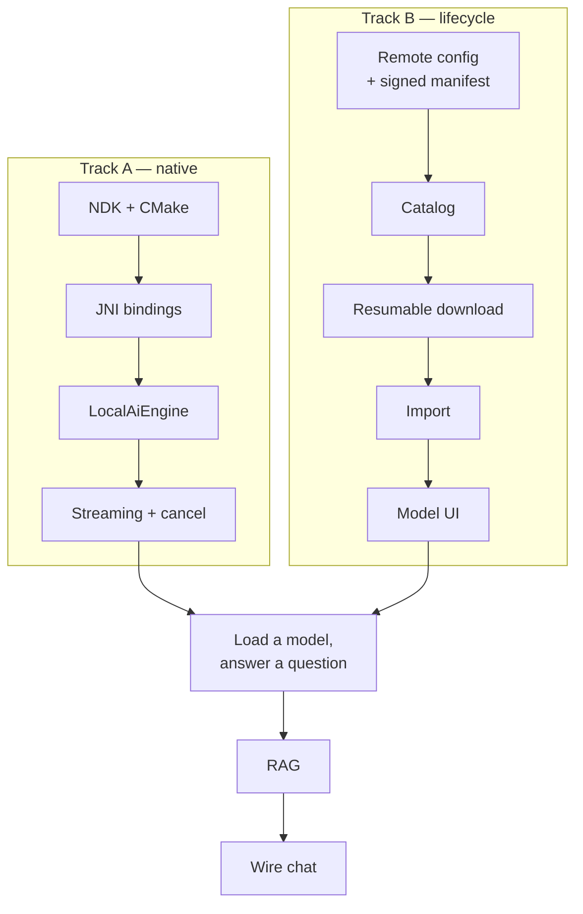
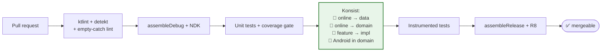
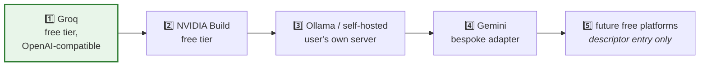

# Implementation Plan — Current State → Production Ready

Companion to [01-findings-report.md](01-findings-report.md) (what is wrong) and
[02-architecture.md](02-architecture.md) (what right looks like). This document explains
**sequence and rationale**. The executable checklist is [04-task-list.md](04-task-list.md).

**Revision log**
| Date | Change |
|---|---|
| 2026-08-07 | Initial plan from codebase audit |
| 2026-08-07 | Reversed cloud-first → on-device-first; cloud moved post-1.0 |
| 2026-08-07 | Added tool/agent layer and RAG; cut `feature:parser`; remote config; error handling as a cross-cutting discipline |

---

## 1. Strategy

Phases 0–5 are complete per the commit history. This plan continues at **Phase 6**.

### 1.1 Six principles driving the order

1. **Make it verifiable before making it bigger.** Zero tests, no CI. Everything built
   before that changes is unverifiable by construction. Phase 6 ships no user-visible value
   and still comes first.
2. **Subtract before adding.** Phase 6 deletes `feature:parser` and ~180 MB of assets. A
   smaller surface is cheaper to test, refactor and reason about — do it before the
   codebase doubles.
3. **Fix boundaries while they are cheap.** Two violations exist today; their cost grows
   with every file. Fixing them also *unblocks* testing.
4. **On-device AI is the product.** Phase 7 is the largest phase and the reason the app
   exists. Nothing cloud-related ships before it is complete.
5. **Tools before cloud.** Phase 8 makes the local model *act*, which is what makes it
   genuinely useful and reduces the pull toward escalation. It also establishes the
   execution and confirmation model that Phase 9's proposal-only path depends on.
6. **1.0 ships with zero online providers.** A completely private, fully functional
   product. Providers land in Phase 12, one at a time.

### 1.2 Why 1.0 ships with no cloud path

It is tempting to slip Groq in "since the architecture is already there." Don't:

- A release with no network AI path is the **strongest possible proof** of the privacy
  claim — it can be stated without qualification.
- It forces the local model plus tools to be genuinely good, rather than propped up by a
  fallback that quietly becomes the default.
- The consent gate matures against a test double before it faces real documents.
- Each provider then ships as an isolated, individually reviewable change.

Durations are relative effort at one full-time engineer, not commitments. Phases 7 and 8
together are roughly half the total — that is correct.

---

## 2. Cross-cutting: error handling as a discipline

Not a phase. A standard applied from Phase 6 onward, because retrofitting it after the AI
layer lands is far more expensive than building with it.

Design in [02-architecture.md §11](02-architecture.md#11-error-handling--graceful-degradation).
The rules that bind every phase:

1. **Errors are values across boundaries; exceptions never cross a layer.**
2. **`try/catch` only at infrastructure boundaries.** Every catch handles, translates, or
   rethrows — and logs. `catch (_: Exception) { null }` is lint-banned (Phase 6.4).
3. **Every error state answers three questions:** what happened, why, what can I do. If it
   cannot answer the third, it is not finished.
4. **Degradation is announced, never silent.**
5. **Never log or transmit document content, prompts, or keys.**

Per-phase obligations:

| Phase | Error-handling deliverable |
|---|---|
| 6 | Extend `PamError` taxonomy · `ErrorPresentation` + mapper pattern · `PamLogger` abstraction · delete `catch (_: Exception) { null }` · lint rule |
| 7 | Model load/OOM/download/corruption paths · native crash strategy · degradation ladder rungs for "no model" and "no embeddings" |
| 8 | `ToolResult.Failure` with machine-readable code + model-facing hint · loop guards (step limit, no-repeat, tier fallback) · partial-run semantics |
| 9 | Typed provider errors · untrusted remote error bodies never rendered raw · consent-cancelled is a normal outcome, not an error |
| 10 | Every new screen ships its error state alongside its success state |
| 11 | Crash reporting with no PII · release-build verification of every error path |

---

## 3. Phase 6 — Foundation, Boundaries & Subtraction

**Goal:** verifiable, structurally clean, and smaller.
**Exit:** build green in CI · ≥60% coverage on `core:data`+`core:domain` · zero
feature→impl edges · parser gone · error-handling foundation in place.

### 3.1 Verify the build first

The findings report infers compilation success from static reading. **That inference has
never been tested.** Run `./gradlew assembleDebug` before anything else.

### 3.2 Subtract

Cutting `feature:parser` removes far more than one module: `OnnxArabicSyntaxEngine`, the
tokenizer, `HrmMappings`, `CaseEndingApplicator`, `DiacriticCombiner`, `ArabicStemLexicon`,
`ArabicRootExtractor`, `KokoroTtsEngine`, `ArabicPhonemizer`, and all 8 asset files
(~180 MB).

Keep `NativeArabicTtsEngine` (system TTS, works, free) for document read-aloud. Keep
**ONNX Runtime** — retargeted at embeddings in Phase 7.6.

The deleted code is good work riding on a 617-byte placeholder model. Preserve it on a
branch before deleting.

### 3.3 Fix boundary violations

| Today (in `core:data`) | Add to `core:domain` | Impl stays in |
|---|---|---|
| `DocumentProcessingPipeline` | `ProcessDocumentUseCase` | `core:data` |
| `ProfileMatcher` | `MatchProfileUseCase` | `core:data` |
| `PdfGenerator` | `DocumentExporter` interface | `core:data` |

Then delete `project(":core:data")` from `feature/documents/build.gradle.kts`. **If it
still compiles, the fix is complete.**

### 3.4 Split `:core:ai` before writing AI code

The split is what makes both privacy guarantees Gradle facts rather than review habits.
Doing it now, while these modules are empty, costs almost nothing.

### 3.5 Error-handling foundation

Land the pattern before the code that needs it:

- Extend `PamError` with the §11.2 recoverability taxonomy.
- Add `ErrorPresentation` and the per-feature mapper pattern.
- Add `PamLogger` in `:core:common` with a PII-safe release implementation.
- Replace `catch (_: Exception) { null }` (`DocumentDetailScreen.kt:364`) and the raw
  debug string in `ParserViewModel.kt:66` — the latter disappears with the module anyway.
- Add the lint rule that fails the build on empty catches.

### 3.6 Priority test targets

By risk × absence of coverage: `EntityExtractor` (regex-heavy, silently wrong on malformed
input) → `ProfileMatcher` (untested scoring thresholds) → repositories against in-memory
Room → all ViewModels with Turbine.

---

## 4. Phase 7 — On-Device AI Core 🔒

**The reason the app exists.**
**Exit:** a user installs a model, asks a question about a real letter, and gets a useful
answer **with the network disabled**.

### 4.1 Runtime: llama.cpp + GGUF

| Runtime | Verdict |
|---|---|
| **llama.cpp + GGUF** | ✅ **Chosen.** Qwen and Gemma ship GGUF first; the open-weight ecosystem is overwhelmingly GGUF; Ollama-registry models become importable nearly free. **And it is the only option with GBNF grammar-constrained sampling** — which Phase 8 depends on. Cost: NDK + JNI, the heaviest integration. |
| ONNX Runtime GenAI | Tempting — ORT already ships. Rejected: narrow model coverage, per-model conversion, no grammar constraints, fails "import any custom model". |
| MediaPipe LLM Inference | Simplest. Rejected: narrowest support, no custom import, no grammar constraints. |

Two requirements decide it: **arbitrary custom models** and **grammar-constrained
decoding**. Only llama.cpp offers both.

**ABI: arm64-v8a only** for native libs, plus x86_64 for debug so the emulator works.
armeabi-v7a is 32-bit with ~3 GB usable address space — it cannot host a useful LLM, and
those devices are Tier 0 regardless.

### 4.2 Spike first ⚠️

Task 7.2.1 is a **time-boxed spike**: llama.cpp built for arm64-v8a, loading a small GGUF,
producing tokens, on a real device. It is the critical path and the largest unknown in the
project. Everything downstream assumes it succeeds; find out early.

The spike also decides §11.6's open question: **does inference run in a separate process?**
A JNI crash is a process kill, not a catchable exception. `android:process=":inference"`
buys crash isolation at the cost of IPC complexity. Decide with spike data, not up front.

### 4.3 Two independent tracks

Native integration and model lifecycle have no dependency on each other:

### 4.4 Model management is a feature, not a task

Multi-gigabyte downloads over mobile networks make **resumability a correctness
requirement**. A download restarting from zero after a tunnel is a broken product.

This finally justifies three permissions the manifest has declared since day one for a
Service that was never written — `FOREGROUND_SERVICE`, `FOREGROUND_SERVICE_DATA_SYNC`,
`POST_NOTIFICATIONS` — and makes `work-runtime-ktx` load-bearing.

### 4.5 Remote configuration — signed, or not at all

Model catalog and provider descriptors are the same problem: data that must change without
an app update. One subsystem (`:core:config`) serves both.

**Signature verification is not optional.** A manifest naming model download URLs is a
supply-chain vector; a compromised CDN could point at a malicious GGUF. Two independent
checks: **Ed25519 on the manifest**, **SHA-256 on the artifact** with the hash coming from
the signed manifest. HTTPS alone is insufficient.

Bundled fallback so a fresh install works offline. Never block app start on a fetch.

### 4.6 RAG — why ONNX Runtime stays

A local model has 4–8k of context; a user with 200 letters cannot fit them in a prompt.
Semantic retrieval is what makes cross-document questions work.

ONNX Runtime is **retargeted, not removed**: from the cut Arabic parser to embeddings. It is
already integrated (zero cost), it has the strongest small multilingual models
(`multilingual-e5-small`, `bge-m3` class) which matters for a German + Arabic + English
corpus, and it decouples retrieval from the LLM runtime so swapping llama.cpp later cannot
break search. ~10–15 MB of arm64 native library.

**No vector database.** 200 docs × ~5 chunks × 384 dims ≈ 400 KB of floats; brute-force
cosine in Kotlin is sub-millisecond. Store vectors as a `BLOB` on `DocumentChunk`.

**Hybrid, not pure vector.** Reference numbers, IBANs and dates are what embeddings are
worst at and keyword search is best at. Run both, merge.

Embeddings are far cheaper than generation, so **semantic search ships even on Tier 0
devices where chat cannot**.

### 4.7 Kill the mock

Delete `generatePlaceholderResponse()` (`ChatViewModel.kt:49-72`) and its `delay(1500)`.
Route through `AskAboutDocumentUseCase` → `SystemPromptBuilder` (which exists with **no
consumer** today) → `LocalAiEngine.generateStream`.

---

## 5. Phase 8 — Tool & Agent Layer 🔧

**Goal:** the model *does* things instead of describing them.
**Exit:** "file this under Deutsche Bank and remind me before the deadline" results in a
created profile, a link, and a reminder — each visible, each undoable, all on-device.

### 5.1 The organizing idea

> **`AiTool` is to the LLM what `ViewModel` is to Compose.**

Both are adapters over use cases for one client. A tool contains argument mapping,
validation and result formatting — nothing else. If a tool needs behaviour no use case
provides, **add the use case**. This keeps human and model paths behaviourally identical.

### 5.2 Four protocols, best available wins

Models express tool calls incompatibly, and many express none at all.

| Tier | Mechanism | Applies to | Validity |
|---|---|---|---|
| A | Native tool API | OpenAI-compatible, Gemma actions | Model-guaranteed |
| **B** | **GBNF grammar** | **Local llama.cpp — any model** | **Structurally impossible to emit invalid output** |
| C | Model-specific chat template | Qwen, Hermes, Gemma families | Parse + repair |
| D | ReAct text loop | Anything | Parse + repair |

**Tier B is the answer to "models that don't support action calling," and it is stronger
than tool-calling APIs.** The tool schema compiles to a grammar; the sampler is constrained
to it. Invalid output is not unlikely — it is unreachable. No prompt engineering, no JSON
repair, no retry loop.

Tier D is the universal fallback for remote models supporting neither A nor C.

**The abstraction is one render/parse pair.** Adding a model family costs one protocol;
adding a capability costs one tool. N + M, never N×M.

### 5.3 Risk tiers govern execution

| Risk | Local | Remote (Phase 9) | UX |
|---|---|---|---|
| 🟢 READ | Auto-execute in loop | ❌ never | Silent, in the trace |
| 🟡 WRITE | Execute + undo | Propose only | Action card + undo snackbar |
| 🔴 DESTRUCTIVE | Explicit confirm | Propose only | Modal naming the target |

Risk is declared on `ToolSpec` and enforced by `ToolExecutor` — a tool cannot opt itself
out.

### 5.4 Failure is control flow

When a tool fails, the **model** needs to know so it can recover. `ToolResult.Failure`
carries a machine-readable `code` and a `hint` written *for the model*
("call `find_similar_profiles` first"). This is the difference between a loop that
self-corrects and one that repeats a failing call until the step limit.

`ToolExecutor` owns the failure vocabulary, not individual tools — otherwise every tool
reinvents error text.

Guards: hard step limit · wall-clock budget · no identical consecutive call · escalate to
the user after 2 failures of the same tool · protocol parse failure falls back a tier
(B → C → D) then answers without tools.

**Partial runs are not rolled back.** Completed writes stay applied and remain individually
undoable — silent rollback would be more surprising than the partial result.

### 5.5 Trust is not a UI decision

Read/write/destructive gating and the local/remote distinction live in `ToolExecutor`,
which takes a trust level. The UI renders confirmations; it does not decide whether one is
required. That keeps the policy in one testable place and makes Phase 9's proposal-only
path a parameter rather than a parallel implementation.

---

## 6. Phase 9 — Escalation Architecture (zero providers)

**Goal:** complete machinery for consulting an external model, with **nothing on the other
end**.

### 6.1 What ships

| Component | Purpose |
|---|---|
| `ShareableContext` / `ContextBlock` | Structured, per-block, user-toggleable payload |
| Consent sheet | Warn → show exact payload → allow editing → require approval |
| `ApprovedPayload` | Immutable result of approval; the **only** provider input |
| `DisclosureLog` | Auditable record: what, where, when, which blocks |
| `ProviderRegistry` + descriptors | Declarative plugin contract |
| `OpenAiCompatibleProvider` | One adapter for Groq, NVIDIA, Ollama and most free tiers |
| Proposal path | Remote tool calls → action cards → local execution |
| `SecureKeyStore` | BYOK via `EncryptedSharedPreferences` |

### 6.2 The two structural guarantees

- **Guarantee 1:** `:core:ai:online` has no dependency on `:core:data` — a provider cannot
  read a document.
- **Guarantee 2:** `:core:ai:online` has no dependency on `:core:domain` — it sees inert
  `ToolSpec` from `:core:model`, never executable `AiTool`. **A provider cannot execute a
  tool.**

Both are Konsist-checked in Phase 11. Not "we won't" — **can't**.

### 6.3 Rule 7 is the one that is easy to lose

**Tool results never auto-return to a remote model.** Agentic loops are built on feeding
results back — so the loop is a local-only capability *by design, not by omission*. A
remote agent loop would need consent per iteration (unusable) or silent data flow
(unacceptable).

Proposal-only is the honest resolution, and it is the better UX anyway: the user gets a
concrete confirmable action instead of a paragraph telling them to go do something.

### 6.4 Plugin mechanism: descriptors, not dynamic loading

Groq, NVIDIA Build and Ollama all speak OpenAI-compatible `/v1/chat/completions`, as do most
emerging free platforms. One adapter plus a JSON descriptor covers them; Gemini and
Anthropic get bespoke adapters.

Descriptors are **data**, refreshable through `:core:config`. Adapters are **code** and ship
with releases. Runtime class loading would allow adding providers without an update but
carries real Play Store policy risk — explicitly rejected.

---

## 7. Phase 10 — Feature Completeness

- **`ProfileDetailScreen`** — `PamApp.kt:92` is the app's only hard navigation dead end.
- **Real re-scan** — replace the `"Re-scan coming in next update"` toast
  (`DocumentDetailScreen.kt:325`).
- **Document delete** — `DocumentsViewModel.onDeleteDocument` exists and is never called.
- **Activate three orphaned tables** — `TagEntity`, `DocumentRelationEntity`,
  `ReminderEntity` have no DAOs. The reminder case is most valuable: `EntityExtractor`
  already extracts deadlines and **currently discards them**. Phase 8's `create_reminder`
  tool depends on this.
- **Localization** — `stringResource` is used **zero times**; ~67 hardcoded literals, 37 in
  `DocumentDetailScreen.kt`. Then translate `values-de/` and `values-ar/` (each holds only
  `app_name`) and run a real-device RTL audit.

Localization is scheduled *after* Phases 7–9 deliberately: doing it before would mean
translating strings for screens that do not exist yet, then translating again.

---

## 8. Phase 11 — Production Hardening → 1.0

### 8.1 Room migrations 🔴

`fallbackToDestructiveMigration()` means **every schema change silently wipes all user
documents**. Phases 7, 8 and 10 all add tables. Remove it, export schemas, write
migrations, add `MigrationTestHelper` tests, verify an install → upgrade → data-survives
cycle manually.

### 8.2 Honour the settings

**Biometric lock** — `androidx.biometric` is not even a dependency, yet Settings shows a
toggle. **Notifications** — no channel exists repo-wide; wire to Phase 10 reminders and
Phase 7 download progress.

### 8.3 Security & privacy

- Provider keys in `EncryptedSharedPreferences` (`security-crypto` already in the catalog).
- Encrypt scanned images at rest.
- **Privacy policy** — unusually clean for 1.0: *nothing leaves the device.* Phase 12
  amends per provider.
- GDPR export/delete including the disclosure and tool-invocation logs.
- ProGuard rules for llama.cpp JNI, ONNX Runtime, ML Kit, Room. The rules file exists and
  was never customized — a likely release-only crash source.
- **Crash reporting must carry no document content.** Breadcrumbs are error codes and
  screen names, never payloads.

### 8.4 CI and architecture enforcement

The Konsist step is not polish — it is what keeps the privacy guarantees true after the
people who designed them move on.

---

## 9. Phase 12 — Provider Rollout (post-1.0)

**Groq first** — free tier, OpenAI-compatible (validating the generic adapter rather than
needing bespoke code), and fast enough that escalation feels worth the consent friction.

**Per-provider checklist:** descriptor JSON · key entry + test connection · rate-limit and
quota error mapping · privacy-policy link in the consent sheet · policy amendment · adapter
tests. If the generic adapter needs changing, the descriptor model is under-specified —
fix the model, not the provider.

**Ollama is a special case:** data goes to the user's own machine, not a third party. Same
gate, honest wording.

---

## 10. Release gates

| Gate | Criteria |
|---|---|
| **G6** | Build green in CI · ≥60% coverage on `core:data`+`core:domain` · zero feature→impl edges · `:core:ai` split · parser and assets deleted · no empty catches |
| **G7** | Model installs from catalog **and** file · download resumes across process death · a real question about a real letter answered **with the network disabled** · semantic search works · Tier 0 retains every non-AI feature |
| **G8** | Multi-step request completes end to end · every write undoable and in the trace · a model with **no** native tool support works via GBNF · loop terminates under all guard conditions |
| **G9** | Consent sheet shows the exact final payload · per-block toggles and edits work · disclosure logged before send · **Konsist proves online cannot reach data or execute tools** · zero providers enabled |
| **G10** | No dead-end navigation · zero hardcoded UI strings (lint-enforced) · RTL verified on device · deadlines produce reminders |
| **G11 — 1.0** | Migrations tested, destructive fallback removed · keys encrypted · privacy policy accurate · R8 + NDK build verified on device · crash reporting carries no PII · **no network AI path exists** |
| **G12** | Per provider: consent passed for every request · disclosure logged · policy amended · quota errors handled |

---

## 11. Risks

| Risk | Impact | Mitigation |
|---|---|---|
| **llama.cpp JNI is bigger than scoped** | Phase 7 slips; critical path | Time-boxed spike first (7.2.1). Fall back to ONNX GenAI only if the spike fails outright — accepting loss of custom import *and* GBNF, which would force Phase 8 down to Tier D. |
| **Native crash kills the app** | Data loss, bad reviews | Evaluate `:inference` process isolation during the spike. |
| **On-device quality disappoints** | Users escalate constantly; privacy story erodes | Measure honestly in Phase 7. Tools and RAG matter more than parameter count for this task. |
| **Tool loop misbehaves on small models** | Wrong actions on user data | Risk tiers, confirmation, undo, and a visible trace. GBNF removes the whole class of malformed-call failures. |
| **Multi-GB downloads on mobile data** | Bill shock | Wi-Fi-only default, explicit opt-in, size shown before download. |
| **Compromised config CDN** | Malicious model served | Ed25519 manifest signature + SHA-256 artifact hash. Two independent checks. |
| Device tiering excludes users | AI unavailable mid-range | Tier 0 is supported; document features never gate on AI; embeddings still run. |
| Consent friction | Escalation unused | Correct for 1.0. Revisit with the redaction gateway, not by weakening consent. |
| `fallbackToDestructiveMigration` ships | Total data loss | Phase 11.1, hard gate. |
| Zero tests hide existing bugs | Phase 6 finds real defects | Budget for it. Discovering them is the point. |

---

## 12. Decisions on record

| Decision | Choice | Rationale |
|---|---|---|
| Priority | On-device first, cloud post-1.0 | Privacy is the product thesis |
| Local runtime | **llama.cpp + GGUF** | Only option with both custom-model import and GBNF |
| ABI | **arm64-v8a** (+ x86_64 debug) | 32-bit cannot host a useful LLM |
| Embeddings | **ONNX Runtime, retargeted** | Already integrated; best multilingual small models; decouples search from LLM runtime |
| Vector store | **None — BLOB + brute-force cosine** | 400 KB of floats; sub-millisecond |
| `feature:parser` | **Cut** | Out of scope, confirmed 2026-08-07 |
| Kokoro TTS | **Cut**, keep system TTS | 180 MB producing noise |
| Online consent | **Per-query: warn + preview + edit + approve** | User direction, 2026-08-07 |
| Consent memory | **None — no "always allow"** | Each query carries different data |
| Remote tool execution | **Proposal-only, never executed remotely** | Rule 7 — results would leak past the gate |
| Tool protocol | **Four tiers, best available** | GBNF answers non-tool-calling models better than APIs do |
| Plugin mechanism | **Descriptors + generic OpenAI adapter** | Covers most platforms as config; avoids Play Store risk |
| Config delivery | **Signed remote manifest + bundled fallback** | New models without an update; supply chain must be verified |
| Online as `AiEngine`? | **No — separate type** | Prevents silent routing past the gate |
| 1.0 provider count | **Zero** | Unqualifiable privacy claim |
| First provider | **Groq** | Free tier, OpenAI-compatible, fast |

## 13. Open questions

1. **Separate inference process?** Decide during the Phase 7 spike with real crash data.
2. **Minimum supported device for AI?** Drives default model size and catalog curation.
   `minSdk 26` stays for the document app regardless.
3. **Who hosts and signs the config manifest?** Needs a key-management answer before
   Phase 7.5 ships.
4. **Default model** shipped in the catalog for first-run? A ~1–2 B model gets users to a
   working assistant fastest; a 3–4 B one is meaningfully better at tool use.
