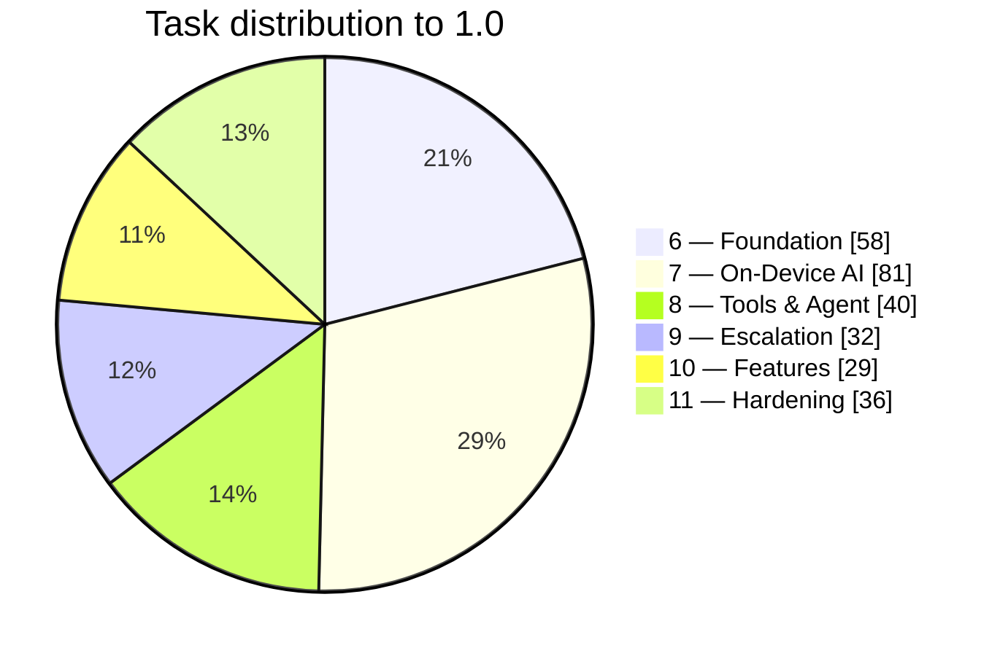

# Task List

**The working document.** Update as tasks land — the single source of truth for progress.

**Last updated:** 2026-08-07 · **Current phase:** 6 (foundation) + 7 (implementation, started) ·
**Next task:** `7.3` `LocalAiEngine` — streaming, cancellation, lifecycle, `:inference` process isolation (7.3.12). The runtime is proven; wrap it.

**Revision log**
| Date | Change |
|---|---|
| 2026-08-07 | Initial list |
| 2026-08-07 | On-device-first; cloud → Phase 12 |
| 2026-08-07 | Added tool/agent layer + RAG; cut parser; remote config; error handling woven through every phase |

---

## How to update

1. Change the box: `[ ]` → `[~]` in progress → `[x]` done. `[-]` for cut, with a reason in
   **Cut / deferred**.
2. Update the phase count in the progress table.
3. Update **Last updated** and **Next task**.
4. When a phase is fully `[x]`/`[-]`, verify its **gate**, then move on.

Rules: don't check a box until it is verified — built, tested, or run, not just written.
New work discovered mid-task becomes a sub-task, not silent scope creep.

---

## Progress

Counts are machine-recounted from this file, not estimated. Re-run after editing:

```bash
awk '/^## Phase [0-9]+/{ph=$3} /^## Cut|^## Open/{ph=""} ph&&/^- \[[ x~-]\]/{n[ph]++; if($0~/^- \[x\]/)d[ph]++} END{for(p in n)printf "Phase %s: %d (%d done)\n",p,n[p],d[p]+0}' documentation/04-task-list.md | sort -V
```

| Phase | Focus | Done | Status |
|---|---|---|---|
| 0–5 | Foundation, scan pipeline, UI, extraction, profiles, PDF | — | ✅ Pre-existing |
| **6** | **Foundation, Boundaries & Subtraction** | **23 / 58** | 🔵 Current |
| **7** | **🔒 On-Device AI Core** | **43 / 97** | 🔵 Active — **spike complete**, runtime confirmed |
| 8 | 🔧 Tool & Agent Layer | 0 / 40 | ⚪ Blocked by 7 |
| 9 | Escalation Architecture (no providers) | 0 / 32 | ⚪ Blocked by 8 |
| 10 | Feature Completeness | 0 / 29 | ⚪ Blocked by 6, 8 |
| 11 | Production Hardening → 1.0 | 0 / 36 | ⚪ Blocked by 9, 10 |
| 12 | Provider Rollout (post-1.0) | 0 / 22 | ⚪ Blocked by 1.0 |
| | **Total to 1.0** | **66 / 292** | |



### Live metrics — 2026-08-07

| Metric | Value |
|---|---|
| Build | `assembleDebug` ✅ green |
| Unit tests | **107 passing, 0 failing** across 7 modules |
| — `:core:data` | 44 (EntityExtractor 30, ProfileMatcher 14) |
| — `:core:common` | 8 (PamResult) |
| — `:feature:profiles` | 7 (ProfilesViewModel) |
| — `:feature:settings` | 5 (SettingsViewModel) |
| — `:core:model` | 11 (ModelFit, DeviceTier) |
| — `:core:config` | 12 (ManifestVerifier — real P-256 signatures) |
| — `:core:ai:catalog` | 21 (ResumePolicy, GgufReader) |
| Modules test-capable | 18 / 18 via `pam.test-conventions` |
| Debug APK | 110.2 MB (from 300.4 MB) |
| Defects found by tests | 7 fixed, 2 pinned as open (6.7.12, language-detection floor) |
| **Production features landed** | Conversation persistence · `:core:ai` split · model catalog + device fit · signed remote config · Hugging Face source + curated Gemma/Qwen repos · resumable foreground download · model management UI · GGUF import · **llama.cpp running on device at 173 tok/s with working GBNF** |

**Phase 7 is 30% of the work to 1.0.** That is the correct shape for a product whose thesis
is on-device AI — but it means the llama.cpp spike (`7.2.1`) gates nearly a third of the
remaining effort. Do it first and do it honestly.

Legend: `[ ]` todo · `[~]` in progress · `[x]` done · `[-]` cut

---

## Phase 6 — Foundation, Boundaries & Subtraction

> Verifiable, structurally clean, and **smaller**. Ships no user-visible value; everything
> after depends on it.

### 6.1 Verify the baseline

- [x] **6.1.1** ✅ **2026-08-07 — `./gradlew assembleDebug` → BUILD SUCCESSFUL in 3m 8s**
      (451 tasks). The findings report's central inference held: the project compiles.
- [~] **6.1.2** Run on device; confirm every nav tab opens without crash. *In progress —
      test case [T001](testing/cases/T001-smoke-launch.md) on device `R5CW21KC1BM`.*
- [ ] **6.1.3** Resolve `gradle.properties`: `org.gradle.tooling.parallel=true` is commented
      "Gradle 9.4+" but the wrapper is pinned to 8.9, so it is inert.
- [ ] **6.1.4** Add `.gitignore` entry for `.kotlin/sessions/`.
- [~] **6.1.5** Baseline recorded 2026-08-07: **debug APK 300 MB compressed / 402.7 MB
      uncompressed** · 15 modules · 84 Kotlin files. Cold start still to measure.
- [x] **6.1.6** ✅ **2026-08-07 — `abiFilters` set.** Release ships `arm64-v8a` only; debug
      adds `x86_64` for the emulator. `x86` and `armeabi-v7a` dropped. *Before: four ABIs,
      160.3 MB of `lib/`.*

### 6.2 Subtract — remove `feature:parser`

- [x] **6.2.1** ✅ Preserved as git tag **`archive/arabic-parser`** (annotated, on `bceb6fd`).
      Recover with `git show archive/arabic-parser:<path>`.
- [x] **6.2.2** ✅ Deleted `:feature:parser` — module dir, `settings.gradle.kts` include,
      `app/build.gradle.kts` dep, `PamApp` route + import, `TopLevelDestination.PARSER`.
- [x] **6.2.3** ✅ Deleted `OnnxArabicSyntaxEngine`, `arabiya/` (`HrmMappings`,
      `CaseEndingApplicator`, `DiacriticCombiner`, `ArabicStemLexicon`, `ArabicConstants`),
      `tokenizer/ArabicTokenizer`, `core/model/ArabicSyntaxTree.kt`.
- [x] **6.2.4** ✅ Deleted `KokoroTtsEngine`, `ArabicPhonemizer`,
      `tools/AndroidNativeTtsEngine`.
- [x] **6.2.5** ✅ Deleted all 8 asset files — `app/src/main/assets/` is now **empty**.
- [x] **6.2.6** ✅ `NativeArabicTtsEngine` kept and **rewritten** to drop the Kokoro
      fallback (10 call sites). Now pure Android system TTS.
- [~] **6.2.7** ONNX Runtime **kept** — retargeted at embeddings in 7.7. *Version-catalog
      move still pending (see 6.7.6).*
- [x] **6.2.8** ✅ **Verified 2026-08-07 — debug APK 300.4 MB → 110.2 MB (−190.2 MB, −63%).**
      Build green, `assets/` free of all deleted files, only `arm64-v8a` + `x86_64` present.
      *Release will be smaller again: no `x86_64`, plus R8 on the 67 MB of dex.*

### 6.3 Fix module boundary violations

- [ ] **6.3.1** `ProcessDocumentUseCase` in `core:domain`; `DocumentProcessingPipeline`
      behind it.
- [ ] **6.3.2** `MatchProfileUseCase` in `core:domain`; `ProfileMatcher` behind it.
- [ ] **6.3.3** `DocumentExporter` interface in `core:domain`; `PdfGenerator` implements it.
- [ ] **6.3.4** Bind all three in Hilt at the `:app` composition root.
- [ ] **6.3.5** Delete `project(":core:data")` from `feature/documents/build.gradle.kts`.
      **If it compiles, the violation is fixed.**
- [ ] **6.3.6** Refactor `DocumentDetailViewModel` to use cases only — it currently
      orchestrates pipeline, matching, PDF and field CRUD directly.

### 6.4 Split `:core:ai`

> Do this **before** writing AI code. Empty modules are free to split; full ones are not.

- [x] **6.4.1** ✅ **2026-08-07** — `:core:ai` → `:core:ai:core` (existing contracts, prompt
      builder, TTS). Kept its namespace, so no source changed.
- [-] **6.4.2** `:core:ai:local` — **create with its code** (7.2). An empty module adds
      Gradle configuration cost for no benefit; the rename above proved the split is cheap
      whenever it happens.
- [-] **6.4.3** `:core:ai:embed` — create with its code (7.7). ONNX Runtime moves here then;
      removed from `:core:ai:core` in the meantime.
- [-] **6.4.4** `:core:ai:agent` — create with its code (Phase 8).
- [x] **6.4.5** ✅ `:core:ai:catalog` created **and populated** — see 7.5/7.10.
- [x] **6.4.6** ✅ `:core:ai:online` created. Its `dependencies {}` block carries a banner
      comment stating both privacy guarantees, with `:core:data` and `:core:domain`
      commented out and marked NEVER. **The guarantees are now compile-time facts.**
- [x] **6.4.7** ✅ `:core:config` created — no domain or data dependency by design; it
      fetches, verifies and caches JSON, and consumers interpret it.
- [x] **6.4.8** ✅ `settings.gradle.kts` and `app/build.gradle.kts` rewired.
      `assembleDebug` green.

### 6.5 Error-handling foundation

> Land the pattern before the code that needs it. Retrofitting after Phase 7 is far more
> expensive.

- [ ] **6.5.1** Extend `PamError` with the recoverability taxonomy: Transient · Actionable ·
      Degradable · Terminal · Defect.
- [ ] **6.5.2** Add `ErrorPresentation` (title, body, args, primary/secondary action,
      retryable) and the one-mapper-per-feature pattern.
- [ ] **6.5.3** Add `PamLogger` in `:core:common` with a PII-safe release implementation.
      *No direct `android.util.Log` anywhere — it makes domain untestable and risks leaking
      document content into logcat.*
- [ ] **6.5.4** Replace `catch (_: Exception) { null }` (`DocumentDetailScreen.kt:364`) with
      logging + typed errors.
- [ ] **6.5.5** Audit every existing `try/catch`; move each to an infrastructure boundary or
      delete it.
- [ ] **6.5.6** Lint rule failing the build on empty/ignored catch blocks.
- [ ] **6.5.7** Retrofit existing screens so every error state answers **what happened, why,
      what can I do**.

### 6.6 Test infrastructure

- [x] **6.6.0** 🔴 ✅ **Enable the JUnit platform.** *JUnit 5 was declared in every module
      but nothing activated it — no `android-junit5` plugin, no `useJUnitPlatform()`. AGP's
      default JUnit 4 runner discovered **zero** tests and reported the task green. Anyone
      adding tests would have watched them silently not run.* Fixed via
      `testOptions { unitTests.all { it.useJUnitPlatform() } }` in `:core:data`.
- [x] **6.6.1** ✅ Created `:core:testing` — assertion stack exposed via `api`.
- [x] **6.6.2** ✅ `MainDispatcherExtension` — a JUnit 5 `Extension`, not a rule (JUnit 5
      has no `TestWatcher`).
- [x] **6.6.3** ✅ All four fakes: `FakeProfileRepository`, `FakeDocumentRepository`,
      `FakeTimelineRepository`, `FakeUserPreferencesRepository`, plus `testProfile()`,
      `testDocument()`, `testTimelineEvent()` builders.
- [x] **6.6.4** ✅ `Fixtures` — DIN 5008 Jobcenter letter, invoice, English, Arabic,
      garbled OCR, empty/whitespace.
- [~] **6.6.5** `src/test/` created in `:core:data` and `:core:common`. *Every module is now
      **capable** of running tests via `pam.test-conventions` (6.7.10) — remaining modules
      just need tests written.*
- [ ] **6.6.6** Add JaCoCo or Kover coverage reporting.

### 6.7 Core test coverage & cleanup

- [x] **6.7.1** ✅ `EntityExtractorTest` — **26 tests**, 7 nested suites. Found 3 defects
      (see 6.7.8).
- [x] **6.7.2** ✅ `ProfileMatcherTest` — **14 tests**. Found 4 defects (see 6.7.8).
- [x] **6.7.8** ✅ **2026-08-07 — all 7 defects fixed.** Every characterisation test was
      flipped from documenting the bug to asserting the fix. **44 tests, 0 failures**;
      `assembleDebug` green.
      | # | Defect | Fix |
      |---|---|---|
      | 1 | Reference regex included `\s` and was greedy — `"Aktenzeichen: AB123 Sehr geehrte…"` stored prose | Capture to end-of-line, then `cleanReferenceValue()` keeps tokens until the first pure-alphabetic word of 3+ chars. `"BG 1234/5678"` still survives whole. |
      | 2 | IBAN pattern allowed digits only after the check digits — every non-German IBAN dropped | Alphanumeric BBAN + **ISO 13616 mod-97 checksum**. Replaces the length-only filter, so false positives go too. |
      | 3 | Email regex greedy on the final class — captured the sentence period | `[\w.+-]+@[\w-]+(?:\.[\w-]+)+` — every dot must be followed by label chars. `co.uk` still works. |
      | 4 | Branched on `similar.isNotEmpty()`, not confidence — 0-confidence candidates offered | `MIN_SUGGESTION_CONFIDENCE = 0.5`; below it, fall through to `NEW_PROFILE`. |
      | 5 | `similar.first()` taken *before* scoring — best match was Room's row order | Score **every** candidate, take `maxByOrNull`. |
      | 6 | `orgContains` matched bare legal forms — `"AG"` scored 0.8 against every AG | `NON_IDENTIFYING_TOKENS` stopword set (ag, gmbh, e.V., ltd, …) + a 3-char backstop. |
      | 7 | `if (updated != profile)` was dead — `modifiedAt` was set in the same `copy()` | `modifiedAt` moved out of the comparison copy; stamped only on the write that actually happens. |

- [~] **6.7.9** Widen coverage — **fakes and ViewModel tests done 2026-08-07**.
      - [x] `FakeDocumentRepository` (+ `testDocument()`), `FakeTimelineRepository`
            (+ `testTimelineEvent()`), `FakeUserPreferencesRepository`. All
            `MutableStateFlow`-backed so reactive queries re-emit on mutation, with
            `failWith` hooks for error-path tests.
      - [x] `ProfilesViewModelTest` — **7 tests** (search, empty, restore, state exposure).
      - [x] `SettingsViewModelTest` — **5 tests** (round-trip to storage, not just accepted
            calls).
      - [ ] Repository/DAO tests against Room — **blocked on a decision**, see 6.7.11.
      - [ ] Remaining ViewModels: Home, Documents, DocumentDetail, Scanner, Chat.
- [ ] **6.7.11** 🟠 **Decide how to test Room.** In-memory Room in a JVM unit test needs
      Robolectric, which is JUnit 4 — awkward beside the JUnit 5 platform now standard here.
      The alternative is instrumented tests in `src/androidTest/` on the real device
      (already wired for the harness). *Recommendation: instrumented, since migrations
      (11.1.4) must be verified on a real SQLite anyway.*
- [ ] **6.7.12** 🔴 **ViewModels discard `PamResult` from writes.** Every `SettingsViewModel`
      setter is `viewModelScope.launch { repo.setX(...) }` with the result thrown away, so a
      failed write is invisible: the toggle silently reverts and the user is told nothing.
      Pinned by a `LIMITATION:` test. Fix alongside `ErrorPresentation` (6.5.2).
- [x] **6.7.10** ✅ **2026-08-07 — `pam.test-conventions` convention plugin, applied to all
      14 modules.**
      - New `build-logic` included build (`build-logic/convention`), matching the
        Now-in-Android structure the project already emulates.
      - Configures Gradle `Test` tasks **directly** rather than AGP's `testOptions`, so the
        plugin needs **no dependency on AGP** — AGP's unit-test tasks are ordinary `Test`
        tasks. Keeps `build-logic` tiny and fast to compile.
      - Supplies the standard test stack (junit5-api/engine, truth, mockk,
        coroutines-test, turbine) plus `project(":core:testing")`, guarded so
        `:core:testing` does not depend on itself.
      - Removed the now-duplicated `testImplementation` blocks from every module and the
        hand-patched `testOptions` block from `:core:data` — one source of truth.
      - **Proof the trap is closed:** `:core:common` had JUnit 5 declared with no platform,
        so its tests could never have run. It now executes **8 tests**.
      - Full run: **52 tests, 0 failures** (`:core:data` 44, `:core:common` 8);
        `assembleDebug` green.
      - *Note:* `:core:testing` keeps four `api(...)` declarations — `MainDispatcherExtension`
        lives in the **main** source set and needs the JUnit 5 Extension API on its compile
        classpath. Intentional, not a leftover.
- [ ] **6.7.3** Repository impls against in-memory Room.
- [ ] **6.7.4** All ViewModels with Turbine + fakes, including error paths.
- [ ] **6.7.5** Reach ≥60% coverage on `core:data` + `core:domain`.
- [ ] **6.7.6** Remove unused deps: `mlkit-language-id`, `mlkit-entity-extraction`,
      `firebase-*`, and orphan `[versions]` (`credentialManager`, `googleDrive`,
      `playServicesAuth`, `robolectric`, `protobuf`, `protobufPlugin`).
      **Keep `work-runtime-ktx`, `security-crypto`, `hilt-work`** — Phases 7 and 9 need them.
- [ ] **6.7.7** Delete unused `HomeUiState.Success.totalCount`.

### 6.8 Device-test enablement

> Discovered while building the test harness — see
> [05-test-harness.md](05-test-harness.md).

- [ ] **6.8.1** 🔴 Add `Modifier.semantics { testTagsAsResourceId = true }` at the `PamApp`
      root. *Without it, Compose nodes expose **no `resource-id`** to `uiautomator`, so
      automated tests can only match visible text and icon-only buttons are unreachable.
      Every test written before this is fragile by construction.*
- [ ] **6.8.2** Add `Modifier.testTag(...)` to bottom-nav items, the scan FAB, list items,
      and every icon-only action.
- [ ] **6.8.3** Add `contentDescription` everywhere it is missing — needed for TalkBack
      (10.4.4) *and* for test targeting. One change, two payoffs.
- [ ] **6.8.4** Commit the harness runner script so runs are reproducible rather than
      re-derived each time.

> ### 🚦 Gate G6
> Build green in CI · ≥60% coverage on `core:data`+`core:domain` · zero feature→impl edges ·
> `:core:ai` split with both online guarantees declared · parser and 180 MB of assets gone ·
> no empty catch blocks · Compose nodes addressable by test tag.

---

## Phase 7 — On-Device AI Core 🔒

> **The reason the app exists.** Exit is a real answer to a real question about a real
> letter, **with the network disabled**.

### 7.1 Conversation persistence

- [x] **7.1.1** ✅ **2026-08-07 — `ConversationDao`.** Observe-by-document, get, insert,
      update, delete, plus `insertMessageAndTouchConversation` — a `@Transaction` that
      appends a message *and* refreshes the denormalised `messageCount` / `lastMessageAt`
      atomically. Without it, a crash between the two writes corrupts `messageCount`
      permanently; there is no reconciliation pass anywhere in the app.
- [x] **7.1.2** ✅ `MessageDao` — observe-by-conversation (ordered), get, update, delete.
      *`source` column (local model id vs. provider id) deferred to the Room migration in
      11.1, since adding it now needs a schema bump the app cannot yet survive.*
- [x] **7.1.3** ✅ **`ConversationRepositoryImpl`** — the interface had **no implementation
      anywhere** since it was written. Room-backed, `PamResult`-wrapped, `flowOn(io)`.
      Enum columns decode defensively (`toEnumOr`): an unrecognised value from a future
      schema degrades to a default rather than throwing out of `valueOf` and killing the
      chat screen.
- [x] **7.1.4** ✅ Wired: `PamDatabase` exposes both DAOs, `DatabaseModule` provides them,
      `DataModule` binds the repository. `assembleDebug` + 64 tests green.
- [ ] **7.1.5** Tests for create / append / observe / cascade-delete — **blocked on 6.7.11**
      (Room testing needs the instrumented-vs-Robolectric decision).

### 7.2 Native runtime spike ⚠️ critical path

- [x] **7.2.1** ✅ **SPIKE COMPLETE — 2026-08-07, all four questions answered on a Galaxy
      S23 Ultra.** NDK 27.0.12077973 + CMake 3.22.1 installed, llama.cpp pinned at `b10299`.
      **Q1** builds (53 s, ≈5.8 MB stripped) · **Q2** loads in 297 ms and generates at
      **83–173 tok/s** · **Q3** a native abort **kills the whole process** · **Q4** **GBNF
      constrains output, producing valid tool-call JSON from a 0.5 B model**.
      **llama.cpp + GGUF confirmed; Phase 8 Tier B is viable.** Full numbers in
      **[06-llama-spike.md](06-llama-spike.md)**.
- [x] **7.2.2** ✅ **GBNF verified on device.** Same prompt/model/sampling, grammar the only
      difference: unconstrained produced a paragraph about the ocean; constrained by
      `root ::= "red" | "green" | "blue"` produced exactly `red`. A JSON tool-call grammar
      produced `{ "tool": "search_documents" }`. **Tool calling is a sampler property, not a
      model-quality one.**
- [x] **7.2.3** ✅ **DECIDED: yes, isolate.** Measured — a C++ abort inside llama.cpp
      produced `Fatal signal 6 (SIGABRT)` and `Zygote: Process exited due to signal 6`,
      killing the **entire app**. No Kotlin `try/catch` can intercept it. Implement
      `android:process=":inference"` so a bad grammar, malformed GGUF or kernel OOM loses
      the answer rather than the app. *(Implementation tracked as 7.3.12.)*
- [x] **7.2.4** ✅ **`:core:ai:local` wired** — `externalNativeBuild`, pinned
      `ndkVersion = 27.0.12077973`, `abiFilters = arm64-v8a`, and
      **`useLegacyPackaging = false`** so the library loads on Android 15+ devices using
      **16 KB memory pages** (a 4 KB-aligned `.so` is simply refused there).
- [x] **7.2.5** ✅ llama.cpp vendored at **`b10299`** (shallow clone; submodule registration once the spike concludes). `CMakeLists.txt` expects it at
      `core/ai/local/src/main/cpp/llama.cpp` (reproducible, offline-capable), trims
      tests/examples/server/CURL, sets `GGML_NATIVE OFF` to keep llama.cpp's runtime CPU
      dispatch so one binary serves every arm64 device. Fails with an actionable message if
      the submodule is absent. *Submodule not yet added.*
- [~] **7.2.6** ✅ JNI bridge written **and compiling** — `llama_jni.cpp` + `LlamaNative.kt`:
      load, generate, grammar hook, `crashForTesting()`. `ensureLoaded()` returns false on
      `UnsatisfiedLinkError` so an unsupported ABI degrades rather than crashes.
      *Streaming and cancellation come after the spike answers Q2–Q4.*
- [ ] **7.2.7** ABI: arm64-v8a for release, x86_64 added for debug.
- [x] **7.2.8** ✅ **≈5.8 MB** stripped for arm64-v8a — smaller than ML Kit's OCR library
      (10.6 MB) already shipping. APK unchanged at 110.2 MB. *The models are the weight, not
      the runtime.*
- [x] **7.2.11** ✅ **Four JNI bridge bugs fixed.** One caught by a failing test
      (double-accept desynchronising the grammar stack); **three caught by re-reading the
      code, none of which any passing test objected to** — a thread-shared `static`
      holding the batch token, `tokenToPiece` silently dropping tokens wider than its
      buffer, and an empty prompt producing a zero-length batch. `GrammarRegressionTest`
      (3 instrumented tests) now guards all of them. **6/6 device tests green.**
- [ ] **7.2.9** Measure **peak RSS** while a model is loaded — replaces the
      `minAvailableRamBytes` estimate (file size × 1.4) with a real number in the fit check.
- [ ] **7.2.10** Register llama.cpp as a **git submodule** at `b10299` (currently a shallow
      clone, gitignored) now the revision is proven good.
- [ ] **7.3.12** Implement `android:process=":inference"` isolation (from 7.2.3).

### 7.3 `LocalAiEngine`

- [x] **7.3.1** ✅ **2026-08-07 — `LocalAiEngine`.** Load/unload lifecycle, `EngineState`
      (`NoModel`/`Loading`/`Ready`/`Failed`) as a `StateFlow`, `EngineCapabilities`, typed
      `PamResult` failures. All native access serialised behind a `Mutex` — the JNI layer is
      not thread-safe per handle, and two concurrent generations sharing one context would
      corrupt each other's KV cache, surfacing as nonsense output rather than an error.
- [x] **7.3.2** ✅ **Real streaming** — a cold `Flow<String>`, verified on device emitting
      **24 separate tokens** for one prompt (a single chunk would mean it is not actually
      streaming). Built on a **pull-based** JNI API (`startGeneration`/`nextToken`/
      `stopGeneration`) so Kotlin owns the loop; C++ needs no JNI callbacks with their
      per-token thread attach/detach.
- [x] **7.3.3** ✅ **Cancellation verified.** `ensureActive()` before each token, so
      collecting in a cancellable scope stops within one token — no flag, no race. A
      `finally` block releases native state on cancellation as well as completion; the test
      cancels after 3 tokens and then runs another generation successfully, proving nothing
      dangles.
- [x] **7.3.13** ✅ 🔴 **KV cache cleared per generation.** Found while wiring the engine:
      `llama_memory_clear` was never called, so **every generation inherited the previous
      one's context** — two unrelated prompts silently conditioned on each other. That
      presents as a model-quality problem, not the state bug it is. Proven fixed: identical
      prompts under greedy sampling now produce byte-identical output
      (`first === second`), which is only possible with a cleared cache.
- [ ] **7.3.4** Model load/unload state machine — **any failure returns to `Installed`,
      never half-loaded**.
- [ ] **7.3.5** Pre-load RAM check against the model's declared requirement; refuse with an
      actionable error rather than dying.
- [ ] **7.3.6** Trap low-memory callbacks; unload and surface a degradable error.
- [ ] **7.3.7** Context-window management and truncation strategy.
- [ ] **7.3.8** `EngineCapabilities` — native tools, grammar support, context size, chat
      template. *Phase 8 protocol selection reads this.*
- [ ] **7.3.9** `NoModelEngine` fallback returning `AiError.NoModelInstalled` **with a
      one-tap action to the catalog**.
- [ ] **7.3.10** Sampling parameters with sane defaults.
- [ ] **7.3.11** Bind in Hilt.

### 7.4 Remote config (`:core:config`)

- [x] **7.4.1** ✅ **2026-08-07** — `SignedManifest` / `ManifestPayload` / `ProviderDescriptor`.
      Versioned (`schemaVersion`), forward-compatible (unknown fields ignored), and a
      newer-than-supported schema is **declined rather than misread**.
- [x] **7.4.2** ✅ **Signature verification — `SHA256withECDSA` (P-256), not Ed25519.**
      *Deviation, deliberate:* `java.security.Signature` supports Ed25519 only from **API 33**
      and `minSdk` is 26, so it would mean bundling BouncyCastle or Tink — megabytes for one
      signature check. P-256 is available from API 23, needs no dependency, and is equally
      suitable for a config blob. Verifies the **raw signed bytes before parsing**, so JSON
      canonicalisation cannot affect the result. Adds **rollback protection**: a validly
      signed but older manifest is refused (`Stale`) — otherwise replaying an old manifest
      would downgrade model URLs with no key compromise at all.
      Uses `java.util.Base64` (API 26+) rather than `android.util.Base64` so the verifier is
      pure JVM and testable without Robolectric. **12 security tests**, signing with a real
      generated P-256 keypair.
- [ ] **7.4.3** Bundled fallback manifest so a fresh install works offline.
- [ ] **7.4.4** ETag / `If-None-Match` caching.
- [ ] **7.4.5** **Never block app start on a fetch.**
- [ ] **7.4.6** 🔴 **Decide key management: who holds the signing key, rotation policy.**
      *`TrustedKeys` ships **empty** today, so every remote manifest is refused as
      `UnknownKey` and the app stays on its bundled catalog — the correct failure mode, but
      it means remote config is inert until a key exists. `keyId` indirection is already in
      place so a key can be rotated without a flag-day client update.* **Blocks 7.5.4 and
      any real download.**

### 7.5 Model catalog & storage

- [ ] **7.5.1** `InstalledModel` entity + DAO + repository.
- [x] **7.5.2** ✅ **2026-08-07 — `AiModelDescriptor`**: family, params, quantization, size,
      `minAvailableRamBytes`, context window, license, URL, SHA-256, tool support.
      `isInstallable` requires **both** a URL and a hash, so an entry that reaches the device
      without integrity data cannot be installed.
- [x] **7.5.3** ✅ **`BundledCatalog`** — Qwen2.5 0.5B/1.5B/3B and Gemma 2 2B across the
      tiers, for offline browsing on a fresh install. Deliberately carries **no URL or
      hash**: hard-coding those in the APK would create a second, unsigned supply-chain
      path that could never be revoked after release. Installation always goes through the
      signed manifest.
- [ ] **7.5.4** Decide the first-run default model. *(Open question 4)*
- [ ] **7.5.5** Storage accounting — installed size, free space, delete.
- [x] **7.5.6** ✅ **`DeviceCapabilityChecker`** — `ActivityManager.MemoryInfo`
      (total, available, `lowMemory`), `Build.SUPPORTED_ABIS`, and `StatFs` on `filesDir`
      (models live in app storage, so total disk free is the wrong number).

### 7.6 Resumable download

- [x] **7.6.1** ✅ **`ModelDownloadWorker`** (`@HiltWorker` `CoroutineWorker`) +
      `ModelDownloadManager`. Unique work per model with `ExistingWorkPolicy.KEEP`, so
      re-tapping Install **joins** the running job instead of restarting the transfer.
      `PostsAiManagerApp` now implements `Configuration.Provider` and the manifest removes
      WorkManager's default initializer, so workers are built through Hilt.
- [x] **7.6.2** ✅ `Range: bytes=N-`, offset taken from the `.part` file's length.
- [x] **7.6.3** ✅ **Resume survives process death** — progress lives in the `.part` file on
      disk, never in memory. Cancellation deliberately keeps the partial so a retry resumes.
- [~] **7.6.4** Cancel implemented (`ModelDownloadManager.cancel`, partial retained).
      *Explicit pause/resume UI pending 7.9.*
- [x] **7.6.5** ✅ **Foreground service** via `setForeground` + `ForegroundInfo` with
      `FOREGROUND_SERVICE_TYPE_DATA_SYNC` (required API 29+, enforced 34+), low-importance
      `model_downloads` notification channel created on demand. **First actual use of the
      `FOREGROUND_SERVICE` / `FOREGROUND_SERVICE_DATA_SYNC` / `POST_NOTIFICATIONS`
      permissions the manifest has declared since the first commit.**
- [x] **7.6.6** ✅ Streamed SHA-256 (a 2 GB model is never held in memory). The file is
      renamed into place **only after** the hash matches; a failed check deletes the partial
      so a retry can never resume onto unverified bytes.
- [x] **7.6.7** ✅ `NetworkType.UNMETERED` by default, `allowMetered` opt-in,
      `setRequiresStorageNotLow(true)`.
- [x] **7.6.8** ✅ Failures return `Result.retry()` (WorkManager backoff) with the partial
      preserved, so a retry resumes rather than restarts.
- [x] **7.6.10** ✅ **`ResumePolicy`** — resume/write-mode decisions extracted as pure
      functions, **12 tests**. Covers the two bugs that ruin resumable downloads:
      appending after a `200` response when the server ignored `Range` (silently doubles the
      file, fails only at the final hash), and treating `416` as an error instead of
      restarting a stale partial.
- [ ] **7.6.9** Device test: kill the app mid-download, relaunch, confirm resume from offset. *Needs a real signed manifest (7.4.6) or a test fixture URL.*

### 7.14 Document understanding (entities, profiles, layout)

*Replaces regex extraction with a model that reads the document. Ordered so each step is
useful on its own.*

- [x] **7.14.1** Provenance on extracted values — `source`, `machineValue`, tombstones,
      disagreement flag. Schema v3, migrated on device with no loss.
- [x] **7.14.2** `MergeExtractionUseCase` — user values survive re-extraction; deletions
      stick; conflicts surface instead of resolving themselves.
- [x] **7.14.3** `field_revisions` — append-only history behind every value.
- [x] **7.14.4** Route every user edit through the merge. *A device test caught the edit
      path writing raw SQL and leaving `source = MACHINE`, so reprocessing overwrote it.*
- [x] **7.14.5** Review surfacing in the detail screen — distinct states, conflict spelled
      out, count above the fields.
- [x] **7.14.6** Chat models installable — 5 pinned by revision + SHA-256, ungated, URLs
      verified. *Every catalog entry was previously `NotInstallable`.* Verified end to end:
      a 1.1 GB model downloaded through the app at its exact pinned size.
- [x] **7.14.6b** Current-generation catalog — Gemma 4 (Google QAT) and Qwen 3.5.
- [x] **7.14.7** **OCR layout capture** — normalised bounding box per block, persisted as
      JSON (schema v4). *ML Kit was already returning boxes and the pipeline discarded them.*
- [x] **7.14.8** `DocumentLayout` — band-based reading order that keeps side-by-side columns
      whole, DIN 5008 zone classification, and a zone-labelled serialisation for the model.
- [x] **7.14.9** `AiExtractionUseCase` — grammar-constrained JSON from the local model,
      given the layout description rather than flat text.
- [x] **7.14.10** Entity identification: kind (authority / company / person) **and** role in
      this document (sender / recipient / sender-contact / mentioned), plus `relation` for
      how a mentioned person connects to the recipient.
- [x] **7.14.9b** Wired into `DocumentProcessingPipeline`, with the regex extractor as the
      fallback when no model is installed, is too large, or returns something unusable.
      Model output maps to the **same canonical field slots** the patterns use, so switching
      does not strand a user's corrections.
- [ ] **7.14.9c** Verify on device against a real letter and compare with the regex result.
- [ ] **7.14.11** Profile creation and linking. *High confidence links silently, low
      confidence proposes — an auto-created profile from a half-read name is clutter the
      user has to undo.*
- [ ] **7.14.12** Contact persons belong to their organisation's profile, not standalone.
- [ ] **7.14.13** "Me" is never given a profile — the recipient is recognised, not created.
- [ ] **7.14.14** Real per-field confidence from the model, replacing the per-field-type
      constants. *Unblocks the low-confidence review queue, which cannot fire today.*
- [ ] **7.14.15** Dual-run AI against regex extraction on real letters and measure.

### 7.7 Embeddings & RAG

- [x] **7.7.1** `EmbeddingService` in `:core:ai:embed` over ONNX Runtime.
- [x] **7.7.2** Download the multilingual embedding model — *pinned by revision + SHA-256
      (`EmbeddingModelRelease`), resumable foreground download, install card on the AI
      models screen. Verified on device: card renders, pin verified against the live URL.*
- [~] **7.7.2-detail** Model chosen and
      proven on device (`distiluse-base-multilingual-cased-v2`, 768 dims, 41 ms);
      `EmbeddingModelFiles` fixes where it lives. Download UI still to come.*
      *Chosen over the `multilingual-e5-small` / `bge-m3` class because it ships a
      WordPiece `vocab.txt`; those need SentencePiece, which would have meant writing a
      second tokenizer before anything could be measured.*
- [x] **7.7.3** `DocumentChunk` entity: text, ordinal, embedding `BLOB`, model id.
- [x] **7.7.4** Chunking strategy for OCR text (overlap, page boundaries).
- [x] **7.7.5** Embed on document processing — `IndexDocumentUseCase`, called by
      `DocumentProcessingPipeline` after extraction.
- [ ] **7.7.5b** Backfill existing documents. *`documentIdsMissingEmbeddings()` and
      `documentIdsNeedingReindex()` expose the backlog; nothing consumes them yet.*
- [x] **7.7.6** Brute-force cosine retrieval. *No vector DB — 200 docs ≈ 400 KB of floats,
      sub-millisecond.*
- [x] **7.7.7** **Hybrid ranking** — merge with Room keyword search. *Reference numbers,
      IBANs and dates are what embeddings are worst at.*
- [ ] **7.7.8** Re-embed on model change; handle mixed-model corpora.
- [x] **7.7.9** Degrade to keyword-only if the embedding model is missing — **and say so in
      the UI**.

### 7.8 Custom model import

- [x] **7.8.1** ✅ **2026-08-07** — SAF `OpenDocument` picker, Import action in the top bar.
      *GGUF has no registered MIME type, so the picker cannot filter by it — the header
      check is what actually rejects a wrong file.*
- [x] **7.8.2** ✅ **`GgufReader`** — magic bytes, format version (v2/v3), and plausibility
      of the tensor/metadata counts. Validates **before** copying, so picking a photo is
      rejected in milliseconds rather than after a 2 GB copy. **9 tests**, including proof
      it reads only the 24-byte header and never drains the stream.
- [x] **7.8.3** ✅ `ModelImporter` copies with progress and computes **SHA-256 in the same
      pass** — the file is never read twice, and the recorded hash is of exactly the bytes
      that landed. Filenames are sanitised so a hostile display name cannot escape the
      models directory.
- [~] **7.8.4** File name, size and real SHA-256 captured. *Context length and architecture
      still default — they need the GGUF metadata KV block, which the engine will read in 7.2.*
- [x] **7.8.5** ✅ Distinct message per failure (not GGUF / unsupported version / truncated /
      corrupt), surfaced via snackbar. Import is the escape hatch from the signed catalog,
      so **it works today without a signing key.**

### 7.13 Hugging Face catalog source

> Prompted by Google's **AI Edge Gallery** pattern — a browsable list of open models that
> download on demand.

- [x] **7.13.1** ✅ **`HuggingFaceCatalogSource`.** *AI Edge Gallery's own list is not
      reusable: it ships **LiteRT `.task`** files for MediaPipe, while this app runs
      **GGUF** through llama.cpp. The Hub is the equivalent source for our format.*
- [x] **7.13.2** ✅ **Solves the missing-hash problem.** The Hub tree API returns each LFS
      file's `oid`, **which is its SHA-256** — exactly the integrity data
      `AiModelDescriptor.isInstallable` demands. Models become installable without anyone
      hashing multi-gigabyte artefacts by hand.
- [x] **7.13.3** ✅ Gated repos (Gemma requires accepting its licence) return 401/403 and
      produce an actionable message rather than a generic failure. Ungated repos (Qwen,
      Apache-2.0) work with no token.
- [x] **7.13.4** ✅ **Trust tier documented explicitly.** Hub-direct is weaker than the
      signed manifest: the hash still prevents a corrupted or intercepted *download*, but it
      does not prove *we* vetted the repo. Curated models stay in the signed manifest; this
      path is for repos the user explicitly chooses.
- [ ] **7.13.5** UI: add-a-repo flow, token entry for gated models, per-model trust badge.
- [x] **7.13.6** ✅ **2026-08-07 — `CuratedRepos`**, the AI Edge Gallery-style browse list.
      **Every repo verified live against the Hub API**, not guessed: Gemma 3 1B/4B
      (`unsloth`, `ggml-org`) and Qwen2.5 1.5B / Qwen3 1.7B (`Qwen`, `ggml-org`).
      **Key finding: all are ungated.** Google's own `google/gemma-*` repos require accepting
      a licence and supplying a token; the community GGUF conversions do not — so Gemma
      installs with no account at all. Also confirmed the tree API returns a real 64-hex
      SHA-256 per file (`gemma-3-1b-it-Q4_0.gguf`, 688 MB, verified), which is the integrity
      data the downloader requires.

### 7.9 Model management UI (`:feature:models`)

- [x] **7.9.1** ✅ **2026-08-07 — `:feature:models`** created and wired.
- [x] **7.9.2** ✅ Catalog browser — name, params, quantization, size, license, description,
      plus a plain-language **fit message** per model derived from `ModelFit`
      ("Needs 3.0 GB free, 2.5 GB available. You can install it now and close some apps
      before using it."). Install is disabled only for genuinely blocking reasons.
- [~] **7.9.3** Progress bar + Cancel implemented. *Explicit pause/resume UI still to do
      (7.6.4).*
- [x] **7.9.4** ✅ Installed list with an **Active** chip, "Use this model", and Remove.
- [ ] **7.9.5** Import entry point *(7.8 SAF picker not yet built)*.
- [x] **7.9.6** ✅ Device card shows **available vs total memory** and free storage —
      surfacing the number that actually decides loadability.
- [x] **7.9.7** ✅ Route `models` + a new **AI → AI models** row in Settings.
- [x] **7.9.8** ✅ **Honest empty state.** When no signing key is present the screen shows an
      "Offline catalog" notice explaining that nothing can be installed yet, and
      `install()` surfaces a snackbar rather than failing silently — the opposite of the
      swallowed-write pattern in 6.7.12.

### 7.12 Installed-model tracking

- [x] **7.12.1** ✅ **`InstalledModelStore`** — JSON index in `filesDir`, **not a Room
      table**. Adding an entity means a schema bump, and `fallbackToDestructiveMigration()`
      would wipe every user document (11.1). Storing this outside Room avoids forcing that
      trade now.
- [x] **7.12.2** ✅ **Self-healing via `reconcile()`** — entries whose `.gguf` file has
      vanished (clear-storage, manual delete, interrupted install) are dropped, so the store
      can never claim a model the engine would then fail to load. A corrupt index degrades
      to empty rather than bricking model management.
- [x] **7.12.3** ✅ First install becomes active automatically; removing the active model
      promotes another.
- [x] **7.12.4** ✅ `ModelCatalogRepository` merges catalog + installed + a **freshly
      measured** device capability on every read (never cached — available memory moves).

### 7.10 Device tiering

- [ ] **7.10.1** Detect RAM, ABI, free storage; assign tier.
- [ ] **7.10.2** Filter/annotate the catalog by tier.
- [ ] **7.10.3** 🔴 **Verify every non-AI feature works with no model installed** — scanning,
      OCR, extraction, profiles, timeline, PDF. Nothing gates on AI.
- [ ] **7.10.4** Confirm **semantic search still runs on Tier 0** — embeddings are far
      cheaper than generation.
- [ ] **7.10.5** Tier 0 messaging: explain honestly, don't hide the feature.
- [x] **7.10.6** ✅ **2026-08-07 — `ModelFit.evaluate()` keys on available memory.**
      Distinguishes a **hard** ceiling (`TooLargeForDevice` — total RAM too small, never
      downloadable) from a **soft** one (`InsufficientAvailableMemory` — downloadable now,
      free some memory before loading). `DeviceCapabilityChecker.current()` is documented
      to be re-read at every decision point, never cached. Covered by 11 tests, including
      the real Galaxy S23 Ultra numbers.
- [ ] **7.10.7** Surface available-vs-required memory in the catalog UI so "why can't I
      install this?" is answerable.

### 7.11 Wire the chat

- [x] **7.11.1** ✅ 🔴 **THE MOCK IS GONE.** `generatePlaceholderResponse()` and its
      `delay(1500)` are deleted. `ChatViewModel` now calls `SendChatMessageUseCase` against
      the real on-device engine.
- [x] **7.11.2** ✅ **`SendChatMessageUseCase`** in `:core:domain` — creates the conversation
      if absent, persists the user message **before** generation (a native abort kills the
      whole process per spike Q3, so ordering is load-bearing), loads the active model on
      demand, streams tokens, then persists the assistant message. Emits a `ChatTurn` stream
      (`PreparingModel` / `Token` / `Complete` / `Failed`) so the UI never has to guess.
      *Orchestration sits in the use case rather than the ViewModel so an `AiTool` can reuse
      it — the LLM is a client of the domain exactly as the UI is.*
      *`SystemPromptBuilder` wiring still pending — see 7.11.11.*
- [ ] **7.11.3** `AskAcrossDocumentsUseCase` using RAG retrieval.
- [x] **7.11.4** ✅ Tokens stream into a live bubble; the typing indicator only shows
      *before* the first token (a spinner beside flowing text reads as "still stuck").
      `stopGeneration()` cancels the job, and the partial reply is still persisted.
- [x] **7.11.5** ✅ History restores from `ConversationRepository` — chat survives process
      death. One conversation per document (`conv-<documentId>`), so reopening a document
      resumes rather than restarts.
- [~] **7.11.6** Typed `ChatError` with a `ChatErrorAction`; "no model installed" points at
      Settings → AI models instead of merely reporting the problem. *OOM and load-failure
      paths still need device verification.*
- [ ] **7.11.10** Chat template is hard-coded to ChatML (Qwen). **Gemma uses a different
      template**, so this must move behind `AiCapabilities` before a Gemma build ships.
- [ ] **7.11.11** Feed `SystemPromptBuilder` output (document, extracted fields, profile)
      into the prompt — it still has no consumer.
- [ ] **7.11.12** 🔴 **Verify chat end to end on device.** Blocked: the phone disconnected
      mid-verification and only an unauthorized emulator remains. Code builds; the
      install-model → chat → streamed-reply path is **unproven on hardware**.
- [ ] **7.11.7** `SummarizeDocumentUseCase` — the chat UI already offers this chip.
- [ ] **7.11.8** `DraftReplyUseCase` — likewise.
- [ ] **7.11.9** Prompt tuning against real German letters; measure quality honestly.

> ### 🚦 Gate G7
> Model installs from catalog **and** file · download resumes across process death · a real
> question about a real letter answered **with the network disabled** · semantic search
> works · Tier 0 retains every non-AI feature.

---

## Phase 8 — Tool & Agent Layer 🔧

> The model *does* things instead of describing them.
> **`AiTool` is to the LLM what `ViewModel` is to Compose.**

### 8.1 Contracts

- [ ] **8.1.1** `ToolSpec` in **`:core:model`** — id, description, JSON-schema parameters,
      risk. *Inert, so `:core:ai:online` can describe tools without seeing executable code.*
- [ ] **8.1.2** `AiTool` in **`:core:domain`** — `spec` + `execute(args)`.
- [ ] **8.1.3** `ToolCall`, `ToolResult.Success`, `ToolResult.Failure(code, message, hint)`.
- [ ] **8.1.4** `ToolRisk` enum: READ / WRITE / DESTRUCTIVE.
- [ ] **8.1.5** `TrustLevel` enum: LOCAL / USER_CONFIRMED. *Trust is a parameter, not a
      parallel implementation.*
- [ ] **8.1.6** `ToolRegistry` via Hilt multibinding.
- [ ] **8.1.7** `ToolExecutor` — validates args against schema, enforces risk × trust,
      executes, logs, translates `PamResult` → `ToolResult`.

### 8.2 Read tools 🟢

- [ ] **8.2.1** `search_documents`, `semantic_search`.
- [ ] **8.2.2** `get_document`, `get_extracted_fields`.
- [ ] **8.2.3** `list_profiles`, `get_profile`, `find_similar_profiles`.
- [ ] **8.2.4** `get_timeline`, `list_reminders`.
- [ ] **8.2.5** Result formatting tuned for a small model's context budget.

### 8.3 Write & destructive tools 🟡🔴

- [ ] **8.3.1** `create_profile`, `link_profile_to_document`.
- [ ] **8.3.2** `update_extracted_field`, `set_document_title`, `toggle_favorite`.
- [ ] **8.3.3** `add_tag` *(needs Phase 10.2.1)*, `create_reminder` *(needs 10.2.5)*.
- [ ] **8.3.4** `delete_document`, `delete_profile`, `unlink_profile` — 🔴 always explicit
      confirmation.
- [ ] **8.3.5** Undo support for every WRITE tool.
- [ ] **8.3.6** **Verify no tool contains business logic** — each wraps a use case. If
      behaviour is missing, add the use case.

### 8.4 Protocol tiers

- [ ] **8.4.1** `ToolProtocol` interface — `render(specs)` / `parse(output)`.
- [ ] **8.4.2** Tier A `NativeToolProtocol` — OpenAI `tools`, Gemma actions.
- [ ] **8.4.3** 🔴 Tier B `GrammarConstrainedProtocol` — **compile `ToolSpec` JSON schema to
      GBNF.** *The answer for models with no tool-calling support, and stronger than the
      APIs: invalid output is unreachable, not merely unlikely.*
- [ ] **8.4.4** Tier C `TemplateToolProtocol` — Qwen / Hermes / Gemma chat templates.
- [ ] **8.4.5** Tier D `ReActProtocol` — text loop, works with anything.
- [ ] **8.4.6** Protocol selection from `EngineCapabilities`; best available wins.
- [ ] **8.4.7** Tolerant parsing + one reformat retry for tiers C and D.
- [ ] **8.4.8** Tier fallback on repeated parse failure: B → C → D → answer without tools.
- [ ] **8.4.9** Tests per tier, including a deliberately non-tool-calling model.

### 8.5 Agent loop

- [ ] **8.5.1** `AgentLoop` — render → generate → parse → execute → observe → repeat.
- [ ] **8.5.2** Feed `ToolResult` back as an observation.
- [ ] **8.5.3** **Failure is control flow** — `ToolResult.Failure.hint` is written for the
      model ("call `find_similar_profiles` first"), enabling self-correction.
- [ ] **8.5.4** Guards: hard step limit · wall-clock budget · no identical consecutive call ·
      escalate to user after 2 failures of the same tool.
- [ ] **8.5.5** `UNKNOWN_TOOL` failure listing valid names when the model invents one.
- [ ] **8.5.6** **Partial runs are not rolled back** — completed writes stay applied and
      remain individually undoable.
- [ ] **8.5.7** Cancellation mid-loop leaves consistent state.

### 8.6 Action UX

- [ ] **8.6.1** `TOOL_INVOCATION` entity + DAO — persisted before or as each call executes.
- [ ] **8.6.2** In-chat action trace: what the AI did, expandable. **The loop is never a
      black box.**
- [ ] **8.6.3** Undo snackbar for WRITE tools.
- [ ] **8.6.4** Modal confirmation for DESTRUCTIVE tools, naming the target.
- [ ] **8.6.5** Action cards — the rendering surface Phase 9 reuses for remote proposals.
- [ ] **8.6.6** End-to-end test: *"file this under Deutsche Bank and remind me before the
      deadline"* → profile created, linked, reminder set, all undoable.

> ### 🚦 Gate G8
> Multi-step request completes end to end · every write undoable and visible in the trace ·
> **a model with no native tool support works via GBNF** · loop terminates under every guard
> condition.

---

## Phase 9 — Escalation Architecture (zero providers)

> Complete machinery for consulting an external model, with **nothing on the other end**.

### 9.1 Payload model

- [ ] **9.1.1** `ContextBlock` — kind, label, content, included, edited.
- [ ] **9.1.2** `ShareableContext` builder from conversation + document + `ToolSpec`s.
- [ ] **9.1.3** `ApprovedPayload` — immutable, produced only by user approval.
- [ ] **9.1.4** 🔴 **Verify nothing can be appended after approval.** What the user saw is
      what is sent.

### 9.2 Consent gate

- [ ] **9.2.1** Warning banner naming the destination provider.
- [ ] **9.2.2** Full payload rendered readably, block by block.
- [ ] **9.2.3** Per-block include/exclude toggles.
- [ ] **9.2.4** Free-text editing of any block.
- [ ] **9.2.5** Approve / cancel; **no "always allow"**. Cancel is a normal outcome, not an
      error.
- [ ] **9.2.6** Provider privacy-policy link in the sheet.
- [ ] **9.2.7** Responses badged as external, visually distinct from local answers.
- [ ] **9.2.8** Full-flow tests against a fake provider.

### 9.3 Disclosure log

- [ ] **9.3.1** `Disclosure` entity + DAO — message, provider, payload hash, blocks, time.
- [ ] **9.3.2** Write the entry **before** the request is sent.
- [ ] **9.3.3** Audit UI in Settings.
- [ ] **9.3.4** Include in GDPR export.

### 9.4 Provider plugin contract

- [ ] **9.4.1** `ProviderDescriptor` — id, name, base URL, auth style, models, streaming
      format, free-tier flag, rate limits, policy URL.
- [ ] **9.4.2** `OnlineAiProvider` taking **`ApprovedPayload` and nothing else**.
- [ ] **9.4.3** `ProviderRegistry` reading descriptors from `:core:config`.
- [ ] **9.4.4** `OnlineEscalationService` — **deliberately not an `AiEngine`**.
- [ ] **9.4.5** `OpenAiCompatibleProvider` — one adapter for Groq, NVIDIA, Ollama and most
      free tiers.
- [ ] **9.4.6** SSE streaming + incremental emission.
- [ ] **9.4.7** Typed error mapping: auth, rate limit, quota, network, context overflow.
      **Remote error bodies are untrusted — never rendered raw.**
- [ ] **9.4.8** Test against a mock OpenAI-compatible server. **No real provider enabled.**

### 9.5 Proposal-only tool path

- [ ] **9.5.1** Render `ToolSpec`s into the payload (visible in the consent sheet).
- [ ] **9.5.2** Parse tool calls from the response into `ToolProposal`.
- [ ] **9.5.3** Surface proposals as action cards; **never auto-execute**.
- [ ] **9.5.4** Execute locally via `ToolExecutor` with `TrustLevel.USER_CONFIRMED`.
- [ ] **9.5.5** 🔴 **Verify tool results are never returned to the provider.** A follow-up
      requires fresh consent. *(Rule 7 — the easiest rule to lose.)*

### 9.6 BYOK key storage

- [ ] **9.6.1** `SecureKeyStore` on `EncryptedSharedPreferences`.
- [ ] **9.6.2** Key entry UI with "test connection".
- [ ] **9.6.3** Never log, export, or back up keys; never include one in an error message.

> ### 🚦 Gate G9
> Consent sheet shows the exact final payload · toggles and edits work · disclosure logged
> before send · **Konsist proves online cannot reach data or execute tools** · zero
> providers enabled.

---

## Phase 10 — Feature Completeness

### 10.1 Close the dead ends

- [ ] **10.1.1** `ProfileDetailScreen` + ViewModel. *`PamApp.kt:92` — the app's only hard
      navigation dead end.*
- [ ] **10.1.2** Linked documents + timeline on the profile.
- [ ] **10.1.3** Profile edit + delete with orphaned-link handling.
- [ ] **10.1.4** Wire `onProfileClick`.
- [ ] **10.1.5** Real re-scan — replace the `"Re-scan coming in next update"` toast
      (`DocumentDetailScreen.kt:325`).
- [ ] **10.1.6** Swipe-to-delete with undo — `DocumentsViewModel.onDeleteDocument` exists and
      is never called.
- [ ] **10.1.7** Read real page dimensions in `ScannerViewModel.kt:54-55` (hardcoded
      `width = 0, height = 0`).
- [ ] **10.1.8** Remove or implement the no-op Version row (`SettingsScreen.kt:119-124`).

### 10.2 Activate the orphaned tables

- [ ] **10.2.1** `TagDao` + repository *(unblocks tool 8.3.3)*.
- [ ] **10.2.2** Tag CRUD UI + filter by tag.
- [ ] **10.2.3** `DocumentRelationDao` + repository.
- [ ] **10.2.4** "Related documents" UI on the detail screen.
- [ ] **10.2.5** `ReminderDao` + repository *(unblocks tool 8.3.3)*.
- [ ] **10.2.6** 🟢 Auto-create reminders from extracted deadlines. *`EntityExtractor`
      already finds them and currently discards them — highest value here.*
- [ ] **10.2.7** Reminder list + management UI.

### 10.3 Localization

> Scheduled after Phases 7–9 deliberately — doing it earlier means translating screens that
> don't exist yet, twice.

- [ ] **10.3.1** Externalize `DocumentDetailScreen.kt` (37 literals).
- [ ] **10.3.2** Externalize `ProfileEditSheet.kt` (19 literals).
- [ ] **10.3.3** Externalize the remaining existing files.
- [ ] **10.3.4** Externalize all Phase 7–9 strings: model management, consent sheet, action
      cards, error presentations.
- [ ] **10.3.5** Verify `stringResource` usage is non-zero. *Used **zero** times today.*
- [ ] **10.3.6** Translate `values-de/` — currently only `app_name`.
- [ ] **10.3.7** Translate `values-ar/` — currently only `app_name`.
- [ ] **10.3.8** **RTL audit on a real device**, every screen including the consent sheet.
- [ ] **10.3.9** Lint rule failing the build on new hardcoded UI strings.

### 10.4 Navigation & polish

- [ ] **10.4.1** Type-safe navigation replacing raw route strings in `PamApp.kt`.
- [ ] **10.4.2** **Assistant** as the fifth bottom-nav tab, replacing the cut parser slot.
- [ ] **10.4.3** Onboarding: explain the privacy model, prompt for a first model install.
- [ ] **10.4.4** Accessibility: content descriptions, touch targets, TalkBack.
- [ ] **10.4.5** Dark-theme audit on every screen.

> ### 🚦 Gate G10
> No dead-end navigation · zero hardcoded UI strings (lint-enforced) · RTL verified on
> device · extracted deadlines produce reminders.

---

## Phase 11 — Production Hardening → 1.0

### 11.1 Room migrations 🔴

- [ ] **11.1.1** Remove `fallbackToDestructiveMigration()`. **Every schema change currently
      wipes all user data**, and Phases 7, 8 and 10 all add tables.
- [ ] **11.1.2** Enable schema export; commit the JSON.
- [ ] **11.1.3** Write migrations from the current version.
- [ ] **11.1.4** `MigrationTestHelper` tests for every path.
- [ ] **11.1.5** Manual install → upgrade → data-survives verification.

### 11.2 Background & notifications

- [ ] **11.2.1** Notification channels — none exist repo-wide.
- [ ] **11.2.2** Download progress notifications (7.6.5).
- [ ] **11.2.3** `ReminderWorker` (10.2.6).
- [ ] **11.2.4** `DocumentProcessingWorker` for large scans.
- [ ] **11.2.5** Wire the Settings notification toggle to real behaviour.

### 11.3 Security & privacy

- [ ] **11.3.1** Add `androidx.biometric` — **the dependency does not exist**, yet Settings
      shows a toggle.
- [ ] **11.3.2** Gate app entry on `BiometricPrompt` when enabled.
- [ ] **11.3.3** Encrypt scanned images at rest.
- [ ] **11.3.4** **Privacy policy** — unusually clean for 1.0: *nothing leaves the device.*
- [ ] **11.3.5** GDPR export/delete including disclosure and tool-invocation logs.
- [ ] **11.3.6** Certificate pinning for provider endpoints (ready for Phase 12).
- [ ] **11.3.7** 🔴 **Audit: no document content, OCR text, prompts, or keys in any log,
      breadcrumb, or crash report.**

### 11.4 Release engineering

- [ ] **11.4.1** ProGuard/R8 rules for llama.cpp JNI, ONNX Runtime, ML Kit, Room. *The rules
      file exists and was never customized.*
- [ ] **11.4.2** 🔴 Build and verify a release build **on a real device** — native + R8 is the
      highest-risk combination in this project.
- [ ] **11.4.3** Release signing config with secrets outside VCS.
- [ ] **11.4.4** `versionCode`/`versionName` strategy.
- [ ] **11.4.5** Crash reporting that transmits no document content.
- [ ] **11.4.6** Baseline profile for startup performance.
- [ ] **11.4.7** Play Store listing, screenshots, data-safety form.
- [ ] **11.4.8** APK/AAB size review with native libs included.

### 11.5 CI & architecture enforcement

- [ ] **11.5.1** GitHub Actions workflow — **no CI exists.**
- [ ] **11.5.2** ktlint + detekt + empty-catch lint on PR.
- [ ] **11.5.3** Unit tests + coverage gate on PR.
- [ ] **11.5.4** 🔴 **Konsist: `:core:ai:online` must not depend on `:core:data`.**
      *(Guarantee 1 — cannot read a document.)*
- [ ] **11.5.5** 🔴 **Konsist: `:core:ai:online` must not depend on `:core:domain`.**
      *(Guarantee 2 — cannot execute a tool.)*
- [ ] **11.5.6** Konsist: no `feature:*` → impl module; no Android imports in `core:domain`.
- [ ] **11.5.7** Konsist: no `try/catch` outside infrastructure boundaries.
- [ ] **11.5.8** NDK build + instrumented tests in CI.

### 11.6 Observability

- [ ] **11.6.1** `PamLogger` wired throughout; no direct `android.util.Log`.
- [ ] **11.6.2** Local-only quality metrics: extraction success, inference latency, tokens/s,
      tool success rate.
- [ ] **11.6.3** Verify every error path renders an `ErrorPresentation` with an action.

> ### 🚦 Gate G11 — 1.0
> Migrations tested, destructive fallback removed · keys encrypted · privacy policy accurate ·
> R8 + NDK build verified on device · no PII in any log or crash report ·
> **no network AI path exists in the shipped build.**

---

## Phase 12 — Provider Rollout (post-1.0)

### 12.1 Groq — first

- [ ] **12.1.1** `groq.json` descriptor.
- [ ] **12.1.2** Verify the generic adapter needs **no changes**. *If it does, the descriptor
      model is under-specified — fix the model, not the provider.*
- [ ] **12.1.3** Key entry + test connection.
- [ ] **12.1.4** Rate-limit and quota error mapping.
- [ ] **12.1.5** Privacy-policy link in the consent sheet.
- [ ] **12.1.6** Amend the app privacy policy.
- [ ] **12.1.7** E2E: escalate → consent → response → proposals → disclosure logged.
- [ ] **12.1.8** Verify tool proposals are never auto-executed.

### 12.2 NVIDIA Build

- [ ] **12.2.1** `nvidia.json` descriptor.
- [ ] **12.2.2** Auth flow differences.
- [ ] **12.2.3** Per-provider checklist (12.1.3–12.1.8).

### 12.3 Ollama / self-hosted

- [ ] **12.3.1** `ollama.json` with user-supplied host.
- [ ] **12.3.2** Host validation + reachability check.
- [ ] **12.3.3** Model discovery from the server.
- [ ] **12.3.4** **Distinct consent wording** — data goes to the user's own machine, not a
      third party. Same gate, honest framing.
- [ ] **12.3.5** Per-provider checklist.

### 12.4 Gemini

- [ ] **12.4.1** Bespoke `GeminiProvider` — not OpenAI-compatible.
- [ ] **12.4.2** Streaming format handling.
- [ ] **12.4.3** Native tool-calling via Tier A protocol.
- [ ] **12.4.4** Per-provider checklist.

### 12.5 Ongoing

- [ ] **12.5.1** Document how to add a free platform as a descriptor entry.
- [ ] **12.5.2** Remote descriptor refresh so new platforms need no app update.

---

## Cut / deferred

| ID | Item | Decision | Date | Rationale |
|---|---|---|---|---|
| — | `feature:parser` (Arabic syntax) | **Cut** | 2026-08-07 | Out of scope. Preserve code on a branch first (6.2.1). |
| — | Kokoro TTS | **Cut** | 2026-08-07 | 180 MB producing noise — real model, fake tokenizer. System TTS kept. |
| — | ONNX Runtime | **Kept, retargeted** | 2026-08-07 | Embeddings for RAG. Already integrated; best multilingual small models; decouples search from the LLM runtime. |
| — | Cloud-provider-first strategy | **Reversed** | 2026-08-07 | On-device is the product. |
| — | armeabi-v7a | **Not supported** | 2026-08-07 | 32-bit, ~3 GB address space; cannot host a useful LLM. |
| — | Vector database | **Rejected** | 2026-08-07 | 400 KB of floats; brute-force cosine is sub-millisecond. |
| — | On-device redaction gateway | Deferred past 1.0 | 2026-08-07 | Per-query consent ships first; current design is a strict subset. |
| — | Runtime-loadable plugins | Rejected | 2026-08-07 | Play Store policy risk. Descriptors are data; adapters are code. |
| — | Remote agent loop | **Rejected by design** | 2026-08-07 | Would need consent per iteration (unusable) or silent data flow (unacceptable). Proposal-only. |
| — | Anthropic/Claude provider | Not scheduled | 2026-08-07 | Paid-only. Add on request via the bespoke-adapter path. |

---

## Open questions

1. **Separate inference process?** Decide during the Phase 7 spike (task 7.2.3) with real
   crash data.
2. **Minimum supported device for AI?** Drives default model size and catalog curation.
   `minSdk 26` stays for the document app regardless.
3. **Who hosts and signs the config manifest?** Needs a key-management answer before 7.4
   ships.
4. **First-run default model?** A 1–2 B model reaches a working assistant fastest; a 3–4 B
   one is meaningfully better at tool use.
