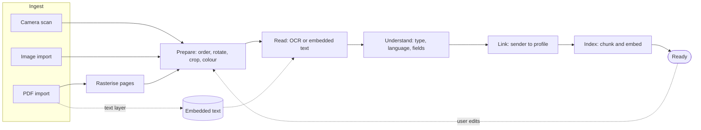
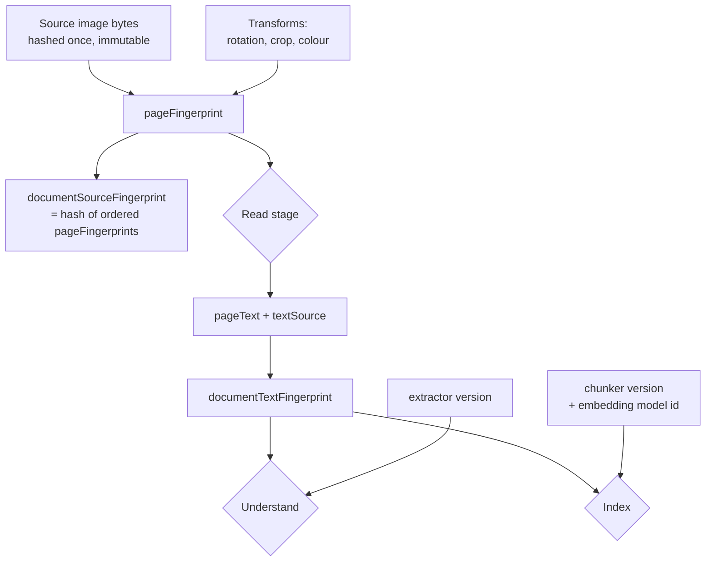
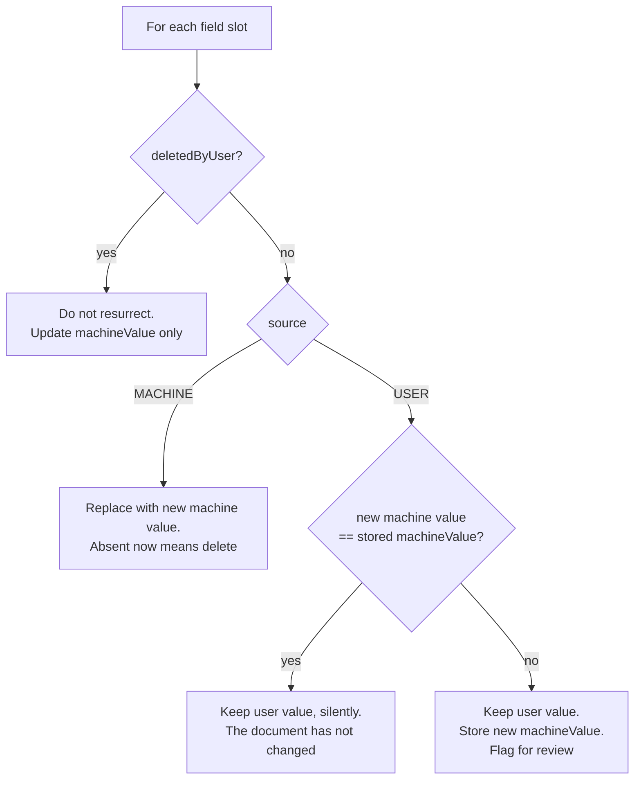
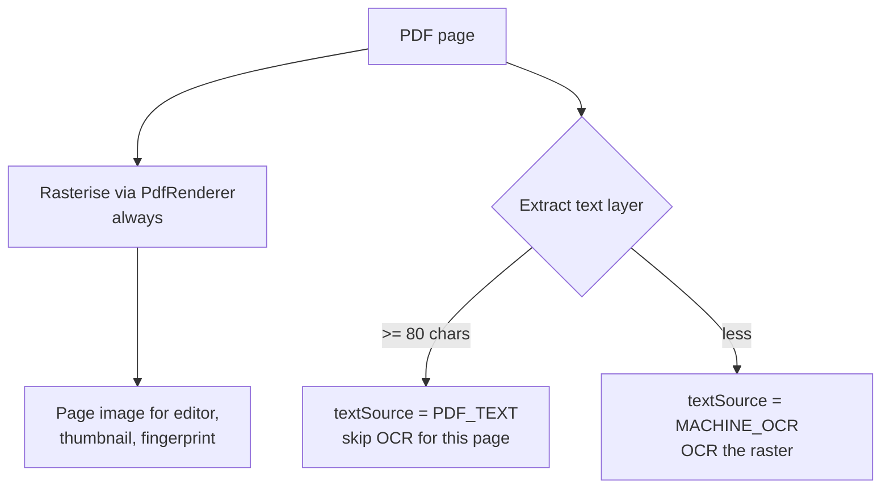
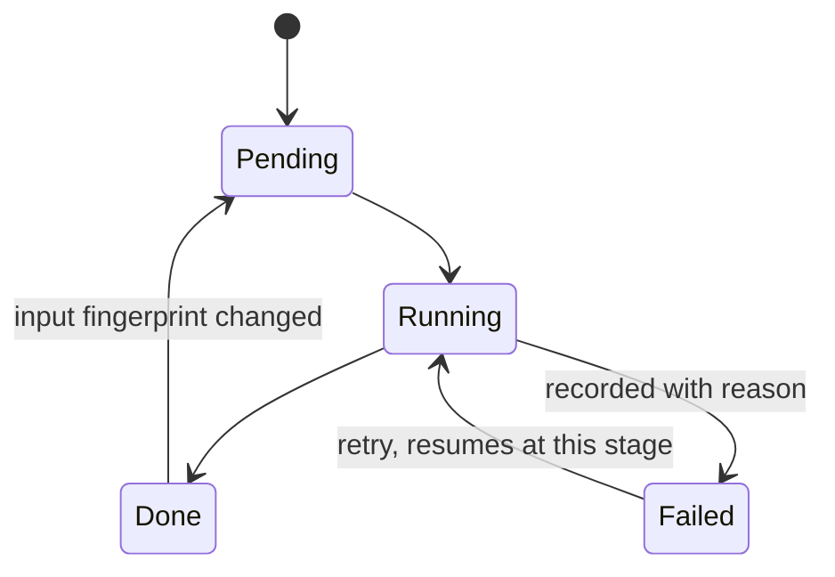

# 07 — The Document Pipeline

How a piece of paper becomes a document the assistant understands, and what happens when
someone changes it afterwards.

## Why this document exists

Two defects made the need for it concrete.

**Reprocessing destroys the user's work.** `DocumentProcessingPipeline` runs
`DELETE FROM extracted_data WHERE documentId = :docId` before re-inserting. `ExtractedData`
has no field recording who produced a value, so the pipeline cannot tell a machine guess
from a correction someone typed. Every user-added field and every fix is lost on the second
run. Nothing warns, and the loss looks like the extractor changing its mind.

**A scanned document is not searchable until it is opened.** Scanning saves it as `NEW`;
processing only starts from `DocumentDetailViewModel.startProcessing()`. A user who scans
ten letters and never opens them has ten documents the assistant cannot see.

Both come from the same absence: the pipeline is a function that runs start-to-finish, not a
described sequence of stages with recorded inputs. This document defines the stages.

---

## 1. The shape



Every ingest path converges on **Prepare**, and every path leaves it in the same state: an
ordered set of pages, each with an immutable source image and a set of transforms. From
there, nothing downstream knows or cares whether a page came from a camera, a gallery or a
PDF.

That convergence is the point. Today the camera path goes through ML Kit's own crop-and-
filter UI while an import does not, so "the same document" behaves differently depending on
how it arrived.

## 2. Stages

Each stage is **idempotent**, **resumable**, and **skippable** when its input has not
changed. A stage never reads another stage's internals — only its recorded output.

| Stage | Consumes | Produces | Skip when |
|---|---|---|---|
| **Capture** | camera / picker / PDF | immutable source images | — (entry) |
| **Prepare** | source images + transforms | ordered, oriented, cropped pages | page fingerprints unchanged |
| **Read** | prepared page | text + confidence + source | page fingerprint unchanged |
| **Understand** | document text | type, language, subject, fields | text fingerprint + extractor version unchanged |
| **Link** | fields + text | profile matches / suggestions | understand output unchanged |
| **Index** | document text | chunks + embeddings | text fingerprint + chunker + embedding model unchanged |

`DocumentStatus` stays as the coarse, user-facing state. Stage bookkeeping lives in a new
`document_stages` table, one row per (document, stage): input fingerprint, engine version,
completed-at, outcome. Additive — no existing column changes meaning.

### Why a table rather than a status enum

A status says where a document got to. It cannot say *why* a stage should run again. Two
documents both at `EXTRACTED` may need completely different work: one because its pages were
reordered, one because the embedding model changed. The fingerprint is what distinguishes
them, and it has to be stored per stage.

## 3. Fingerprints, and what re-runs



The definitions:

```
pageFingerprint            = H(sourceImageHash, rotation, cropRect, colourMode)
documentSourceFingerprint  = H(pageFingerprint[0..n] in page order)
documentTextFingerprint    = H(pageText[0..n] in page order)
extractionInput            = H(documentTextFingerprint, extractorVersion)
indexInput                 = H(documentTextFingerprint, chunkerVersion, embeddingModelId)
```

A stage runs if and only if its recorded input fingerprint differs from the current one.

This falls out neatly for the cases that actually happen:

| The user… | What re-runs | What does not |
|---|---|---|
| reorders pages | Understand, Link, Index | OCR — page fingerprints unchanged |
| rotates one page | Read for that page, then everything after | OCR of the other pages |
| corrects OCR text | Understand, Link, Index | all of Read |
| corrects a field | Link, Index | Read, Understand |
| installs the embedding model | Index | everything else |
| gets a new app with a better extractor | Understand, Link, Index | Read |

That last row is why `engineVersion` is part of the fingerprint rather than a separate
check. Shipping a better extractor should re-derive machine values across the corpus without
touching a single OCR result — and without a migration that hard-codes "re-run everything".

**Source images are immutable and transforms are data.** Rotating a page does not rewrite
pixels; it records `rotation = 90`. Non-destructive editing is what makes reprocessing
deterministic, undo possible, and fingerprints cheap — the alternative is re-hashing
multi-megabyte bitmaps on every comparison.

## 4. Edits, provenance, and the merge

The hard requirement: a document must be editable, edits must push it back through the
pipeline, and the pipeline must never quietly overwrite what a person decided.

That is a three-way merge, and it needs three things recorded.

### 4.1 What each value carries

`extracted_data` gains:

| Column | Purpose |
|---|---|
| `source` | `MACHINE` or `USER` — who authored the current value |
| `machineValue` | the last value the extractor produced for this slot, kept even when a user has overridden it |
| `machineConfidence` | confidence of `machineValue` |
| `deletedByUser` | tombstone: the user removed this field |
| `hasUnreviewedMachineChange` | the extractor now disagrees with what the user overrode |
| `engineVersion` | which extractor produced `machineValue` |
| `updatedAt` | for ordering and for the timeline |

`machineValue` is the piece that makes this a merge rather than a coin flip. Without it,
when the extractor produces something different from the stored value, there is no way to
tell "the extractor changed its mind" from "the user corrected it and the extractor still
says the same wrong thing".

Field identity also has to become stable. Today `id` is a fresh UUID per run, so nothing
matches a new extraction to an old one. Slots are keyed by `(documentId, fieldName)`.

### 4.2 The merge



Stated plainly:

- **Machine values are disposable.** Re-extraction overwrites them freely; that is what they
  are for.
- **User values are never overwritten.** Not by a better extractor, not by a higher
  confidence score.
- **Deletions stick.** A field the user removed does not come back on every reprocess. This
  is the difference between a tool that learns what you want and one that argues with you.
- **Disagreement surfaces, it does not resolve itself.** If the user corrected a date to
  31.01. and the extractor — reading a re-cropped page — now says 28.02., neither value is
  obviously right. The user's value stands and the change is flagged. Silently keeping the
  old one hides that the document says something else; silently taking the new one destroys
  a correction.

The same rules apply to OCR text: `document_pages` gains `textSource`, and a page whose text
a user edited is not re-read unless they explicitly ask.

### 4.3 Where the flag goes

`hasUnreviewedMachineChange` is not a dialog. It is a marker on the field in the detail
screen — "the document now reads *28.02.2026* here" — with accept and dismiss. Reprocessing
happens in the background, often while the user is elsewhere, and a modal interrupt for a
low-stakes disagreement is worse than the disagreement.

## 5. PDF import

A PDF is not an image, and pretending otherwise loses the thing that makes it valuable.

Most official German correspondence now arrives as a **digital** PDF with an exact text
layer. OCR of a rendered page is strictly worse than that text: our own scan test produced
`Müllerstralße` for `Müllerstraße` and `gesondeter` for `gesonderter`. Running OCR over a
page whose exact characters are already present is throwing away accuracy and spending
seconds to do it.

But a **scanned** PDF is just images in a wrapper, and needs OCR like anything else. And
both kinds still need page images, because the editor and the thumbnails need something to
show.

### The evaluation

| Approach | Digital PDF | Scanned PDF | Editing parity | Cost |
|---|---|---|---|---|
| Rasterise + always OCR | ✗ loses exact text | ✓ | ✓ | none |
| Text layer only | ✓ | ✗ no text at all | ✗ no page images | none |
| **Rasterise + text layer when present** | ✓ | ✓ | ✓ | one dependency |

### The recommendation

**Always rasterise, and prefer the embedded text per page when it is real.**



Every page ends up with an image *and* text, so one downstream path serves both. The
threshold is per page, not per document — mixed PDFs exist, where a digital letter has a
photographed attachment stapled on.

`PdfRenderer` is in the platform since API 21, so rasterising costs nothing. Text extraction
is not in the platform: `PdfRenderer` only draws. The leading candidate is **PdfBox-Android**
(Apache-2.0, so licence-compatible; note iText is AGPL and is not an option here). Its APK
cost has **not been measured** and must be, against a current baseline of 110 MB, before it
is adopted. If the cost is unacceptable, the fallback is rasterise-and-OCR everywhere —
which is correct, just less accurate on exactly the documents this app is best at.

`80` characters is a starting threshold, not a measured one. Some PDFs carry a junk text
layer of ligature artefacts; it should be validated against real correspondence and moved
into config.

## 6. Preparation parity

ML Kit's document scanner provides crop, rotate and colour filtering for camera capture.
Imports get none of that today.

The fix is to make the **page preparation screen a stage, not a capture detail**: the same
screen for camera output, gallery imports and rasterised PDF pages. ML Kit's result feeds
*into* it rather than bypassing it.

It needs: reorder, rotate, crop, colour mode (colour / greyscale / high-contrast), delete a
page, and re-run. All of them write transforms, none of them touch source pixels.

Colour mode matters for more than looks — a high-contrast mode measurably helps OCR on a
photographed page and hurts on a clean digital one, which is a reason the user needs the
control rather than a heuristic guessing for them.

## 7. When processing starts

Capture completion enqueues processing. Unique work per document, so a re-enqueue joins
rather than duplicates. Foreground service only when the work is long enough to outlive the
screen — a single page rarely is, a twenty-page PDF is.

This removes the "scanned but invisible" state entirely: a document becomes searchable
because it was captured, not because someone opened it.

The detail screen keeps a manual **Reprocess**, which becomes meaningful rather than
mandatory: it forces stages whose fingerprints match, for when a user thinks the extractor
got it wrong and wants another pass.

## 8. Failure

Stages fail independently and record it. A document whose Understand stage failed is still a
document with readable text, still searchable by keyword, still viewable.



The rule already established for indexing generalises: **a later stage failing never
invalidates an earlier stage's output.** Indexing a document does not fail the scan; linking
a profile does not fail the extraction.

## 9. Schema changes

Database v2 → v3, additive:

- `document_stages` — document, stage, input fingerprint, engine version, state, completed-at, error
- `document_pages` + `sourceHash`, `rotation`, `cropRect`, `colourMode`, `textSource`
- `extracted_data` + `source`, `machineValue`, `machineConfidence`, `deletedByUser`,
  `hasUnreviewedMachineChange`, `engineVersion`, `updatedAt`
- `extracted_data` unique index on `(documentId, fieldName)` — the slot key

Existing rows migrate as `source = MACHINE`, `machineValue = fieldValue`, except where
`isConfirmed = true`, which becomes `source = USER`. That is the honest reading: a confirmed
field is one a person looked at and accepted, and it should survive the next run.

## 10. What this changes in code

| Change | Where |
|---|---|
| Stop deleting extracted data on reprocess; merge instead | `DocumentProcessingPipeline` |
| `MergeExtractionUseCase` implementing §4.2 | `:core:domain` |
| Stage records, fingerprints, skip logic | `:core:domain` + `:core:data` |
| Enqueue processing on capture | `feature:scanner` → WorkManager |
| Page preparation screen for all ingest paths | `feature:scanner` |
| PDF rasterise + text-layer read | `:core:data` |
| Provenance in the detail UI, review affordance for flagged fields | `feature:documents` |

Ordered by what protects the user first: the merge comes before the new ingest paths,
because every day the current behaviour ships is a day someone's corrections can be erased.
