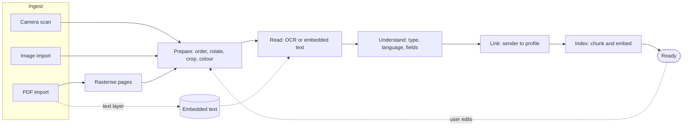
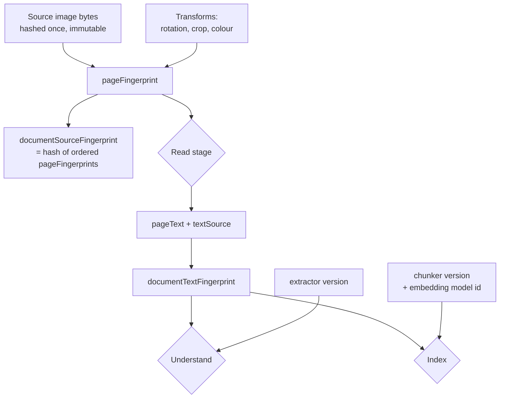
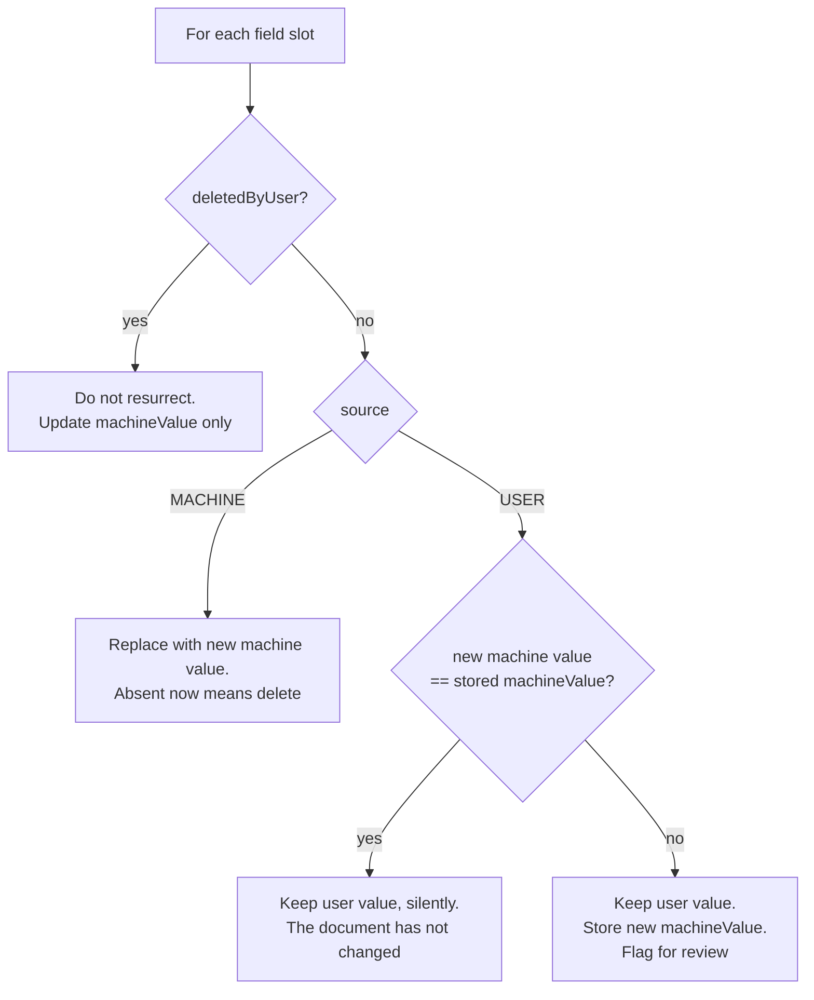
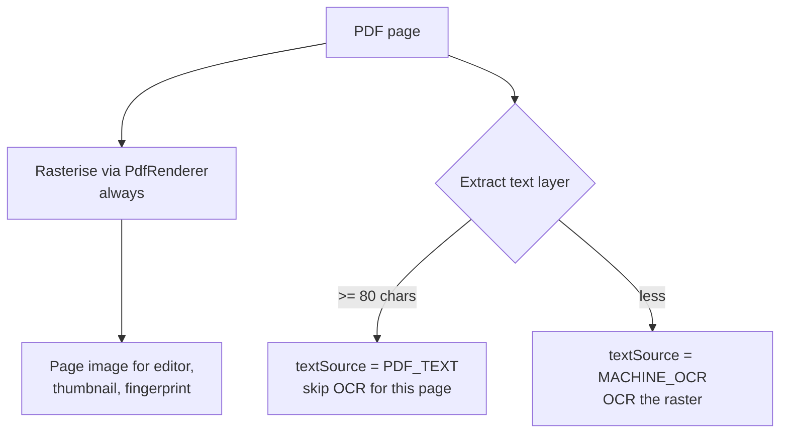
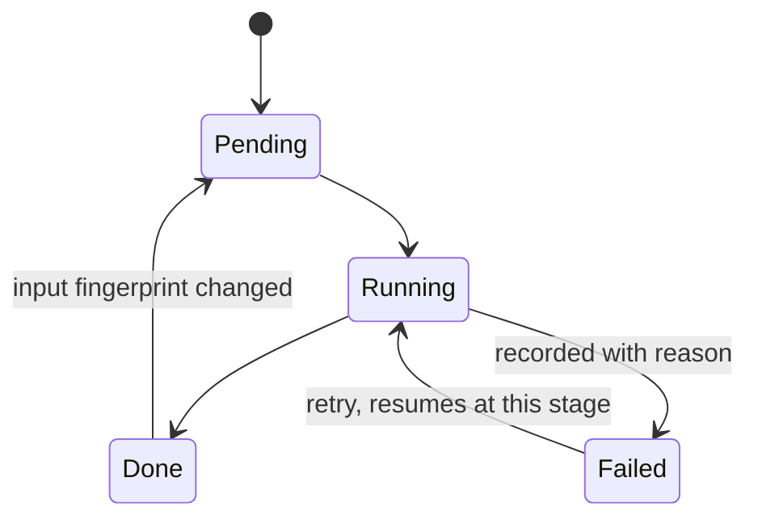

# 07 — The Document Pipeline

How a piece of paper becomes a document the assistant understands, and what happens when
someone changes it afterwards.

## Why this document exists

Two defects made the need for it concrete.

**Reprocessing destroys the user's work.** `DocumentProcessingPipeline` runs
`DELETE FROM extracted_data WHERE documentId = :docId` before re-inserting. `ExtractedData`
has no field recording who produced a value, so the pipeline cannot tell a machine guess
from a correction someone typed. Every user-added field and every fix is lost on the second
run. Nothing warns, and the loss looks like the extractor changing its mind.

**A scanned document is not searchable until it is opened.** Scanning saves it as `NEW`;
processing only starts from `DocumentDetailViewModel.startProcessing()`. A user who scans
ten letters and never opens them has ten documents the assistant cannot see.

Both come from the same absence: the pipeline is a function that runs start-to-finish, not a
described sequence of stages with recorded inputs. This document defines the stages.

---

## 1. The shape


```mermaid
flowchart LR
    subgraph Ingest
        CAM[Camera scan]
        IMG[Image import]
        PDF[PDF import]
    end

    CAM --> PREP
    IMG --> PREP
    PDF --> RASTER[Rasterise pages]
    PDF -.text layer.-> TEXTLAYER[(Embedded text)]
    RASTER --> PREP

    PREP[Prepare: order, rotate, crop, colour] --> READ
    READ[Read: OCR or embedded text] --> UNDERSTAND
    TEXTLAYER -.-> READ
    UNDERSTAND[Understand: type, language, fields] --> LINK
    LINK[Link: sender to profile] --> INDEX
    INDEX[Index: chunk and embed] --> READY([Ready])

    READY -.user edits.-> PREP
```

Every ingest path converges on **Prepare**, and every path leaves it in the same state: an
ordered set of pages, each with an immutable source image and a set of transforms. From
there, nothing downstream knows or cares whether a page came from a camera, a gallery or a
PDF.

That convergence is the point. Today the camera path goes through ML Kit's own crop-and-
filter UI while an import does not, so "the same document" behaves differently depending on
how it arrived.

## 2. Stages

Each stage is **idempotent**, **resumable**, and **skippable** when its input has not
changed. A stage never reads another stage's internals — only its recorded output.

| Stage | Consumes | Produces | Skip when |
|---|---|---|---|
| **Capture** | camera / picker / PDF | immutable source images | — (entry) |
| **Prepare** | source images + transforms | ordered, oriented, cropped pages | page fingerprints unchanged |
| **Read** | prepared page | text + confidence + source | page fingerprint unchanged |
| **Understand** | document text | type, language, subject, fields | text fingerprint + extractor version unchanged |
| **Link** | fields + text | profile matches / suggestions | understand output unchanged |
| **Index** | document text | chunks + embeddings | text fingerprint + chunker + embedding model unchanged |

`DocumentStatus` stays as the coarse, user-facing state. Stage bookkeeping lives in a new
`document_stages` table, one row per (document, stage): input fingerprint, engine version,
completed-at, outcome. Additive — no existing column changes meaning.

### Why a table rather than a status enum

A status says where a document got to. It cannot say *why* a stage should run again. Two
documents both at `EXTRACTED` may need completely different work: one because its pages were
reordered, one because the embedding model changed. The fingerprint is what distinguishes
them, and it has to be stored per stage.

## 3. Fingerprints, and what re-runs


```mermaid
flowchart TD
    SRC[Source image bytes<br/>hashed once, immutable] --> PF
    TF[Transforms:<br/>rotation, crop, colour] --> PF
    PF[pageFingerprint] --> DSF[documentSourceFingerprint<br/>= hash of ordered pageFingerprints]
    PF --> READ{Read stage}
    READ --> PT[pageText + textSource]
    PT --> DTF[documentTextFingerprint]
    DTF --> EXT{Understand}
    DTF --> IDX{Index}
    EV[extractor version] --> EXT
    CV[chunker version<br/>+ embedding model id] --> IDX
```

The definitions:

```
pageFingerprint            = H(sourceImageHash, rotation, cropRect, colourMode)
documentSourceFingerprint  = H(pageFingerprint[0..n] in page order)
documentTextFingerprint    = H(pageText[0..n] in page order)
extractionInput            = H(documentTextFingerprint, extractorVersion)
indexInput                 = H(documentTextFingerprint, chunkerVersion, embeddingModelId)
```

A stage runs if and only if its recorded input fingerprint differs from the current one.

This falls out neatly for the cases that actually happen:

| The user… | What re-runs | What does not |
|---|---|---|
| reorders pages | Understand, Link, Index | OCR — page fingerprints unchanged |
| rotates one page | Read for that page, then everything after | OCR of the other pages |
| corrects OCR text | Understand, Link, Index | all of Read |
| corrects a field | Link, Index | Read, Understand |
| installs the embedding model | Index | everything else |
| gets a new app with a better extractor | Understand, Link, Index | Read |

That last row is why `engineVersion` is part of the fingerprint rather than a separate
check. Shipping a better extractor should re-derive machine values across the corpus without
touching a single OCR result — and without a migration that hard-codes "re-run everything".

**Source images are immutable and transforms are data.** Rotating a page does not rewrite
pixels; it records `rotation = 90`. Non-destructive editing is what makes reprocessing
deterministic, undo possible, and fingerprints cheap — the alternative is re-hashing
multi-megabyte bitmaps on every comparison.

## 4. Edits, provenance, and the merge

The hard requirement: a document must be editable, edits must push it back through the
pipeline, and the pipeline must never quietly overwrite what a person decided.

That is a three-way merge, and it needs three things recorded.

### 4.1 What each value carries

`extracted_data` gains:

| Column | Purpose |
|---|---|
| `source` | `MACHINE` or `USER` — who authored the current value |
| `machineValue` | the last value the extractor produced for this slot, kept even when a user has overridden it |
| `machineConfidence` | confidence of `machineValue` |
| `deletedByUser` | tombstone: the user removed this field |
| `hasUnreviewedMachineChange` | the extractor now disagrees with what the user overrode |
| `engineVersion` | which extractor produced `machineValue` |
| `updatedAt` | for ordering and for the timeline |

`machineValue` is the piece that makes this a merge rather than a coin flip. Without it,
when the extractor produces something different from the stored value, there is no way to
tell "the extractor changed its mind" from "the user corrected it and the extractor still
says the same wrong thing".

Field identity also has to become stable. Today `id` is a fresh UUID per run, so nothing
matches a new extraction to an old one. Slots are keyed by `(documentId, fieldName)`.

### 4.2 The merge


```mermaid
flowchart TD
    START[For each field slot] --> TOMB{deletedByUser?}
    TOMB -->|yes| KEEPDEAD[Do not resurrect.<br/>Update machineValue only]
    TOMB -->|no| SRC{source}
    SRC -->|MACHINE| REPLACE[Replace with new machine value.<br/>Absent now means delete]
    SRC -->|USER| CMP{new machine value<br/>== stored machineValue?}
    CMP -->|yes| KEEP[Keep user value, silently.<br/>The document has not changed]
    CMP -->|no| FLAG[Keep user value.<br/>Store new machineValue.<br/>Flag for review]
```

Stated plainly:

- **Machine values are disposable.** Re-extraction overwrites them freely; that is what they
  are for.
- **User values are never overwritten.** Not by a better extractor, not by a higher
  confidence score.
- **Deletions stick.** A field the user removed does not come back on every reprocess. This
  is the difference between a tool that learns what you want and one that argues with you.
- **Disagreement surfaces, it does not resolve itself.** If the user corrected a date to
  31.01. and the extractor — reading a re-cropped page — now says 28.02., neither value is
  obviously right. The user's value stands and the change is flagged. Silently keeping the
  old one hides that the document says something else; silently taking the new one destroys
  a correction.

The same rules apply to OCR text: `document_pages` gains `textSource`, and a page whose text
a user edited is not re-read unless they explicitly ask.

### 4.3 The history

`machineValue` alone records only the last thing the extractor said. That is enough to
*decide* a merge, and not enough to *explain* one. The question a user will actually ask is
not "which value wins" but "what happened here" — what did it read originally, what did I
change it to, when, and what has it said since.

So every value ever held by a slot is appended to `extracted_data_revisions`:

| Column | |
|---|---|
| `documentId`, `fieldName` | the slot |
| `value` | what it was set to |
| `source` | `MACHINE` or `USER` |
| `confidence` | for machine revisions |
| `engineVersion` | which extractor, for machine revisions |
| `createdAt` | when |

Append-only. `extracted_data` holds the current effective state for fast reads; the
revision log is the authority on how it got there. `machineValue` on the row is a cache of
the latest `MACHINE` revision, kept because the merge consults it for every field on every
run.

#### Worked example

Extraction reads a letter and gets the receiver wrong at low confidence. The user fixes it.
Later the pages are re-cropped and a newer extractor runs.

| # | Event | `value` | `source` | conf | Row after |
|---|---|---|---|---|---|
| 1 | first extraction | `Frau Aylin Mustermann` | MACHINE | 0.42 | value = machine, `source = MACHINE` |
| 2 | user corrects it | `Aylin Mustermann` | USER | — | value = user, `source = USER`, `machineValue` still #1 |
| 3 | re-extraction, v2 engine | `A. Mustermann` | MACHINE | 0.81 | **value unchanged**, `machineValue` = #3, flagged |

At step 3 the user's value stands despite the machine being roughly twice as confident.
Confidence measures how sure the extractor is about its own reading; it says nothing about
whether a person has already looked at that field and decided. Letting 0.81 beat a human
correction would mean the app argues more forcefully the more wrong it is.

What the flag can now say, because the history exists:

> The document now reads **A. Mustermann** here.
> You changed this from *Frau Aylin Mustermann* on 9 August.
> [Keep mine] [Use the new reading] [See history]

Without the log, the same flag can only say "this changed", which is not enough for anyone
to decide anything.

#### What the history is worth beyond one field

- **Reverting.** "Put it back to what the scan said" is a lookup, not a re-run.
- **Trust.** This app's premise is that the assistant works on private documents. Being able
  to see exactly which values a machine authored and which a person did is part of that
  premise, not a debugging feature.
- **A signal about the extractor.** A slot corrected by the user on document after document
  from the same sender is the extractor being reliably wrong in a specific way. That is
  worth surfacing before it is worth automating — and the log is where it would be read
  from. Deliberately not built yet.

#### Confidence drives attention, not authority

Low confidence is exactly where corrections come from, so it should route the user's eye:
fields below a threshold are collected into a short "worth checking" list on the document
rather than left to be noticed. But once a person has touched a field, its confidence stops
mattering for merging — `source` decides, and confidence only ever informs what to show.

### 4.4 Where the flag goes

`hasUnreviewedMachineChange` is not a dialog. It is a marker on the field in the detail
screen — "the document now reads *28.02.2026* here" — with accept and dismiss. Reprocessing
happens in the background, often while the user is elsewhere, and a modal interrupt for a
low-stakes disagreement is worse than the disagreement.

## 5. PDF import

A PDF is not an image, and pretending otherwise loses the thing that makes it valuable.

Most official German correspondence now arrives as a **digital** PDF with an exact text
layer. OCR of a rendered page is strictly worse than that text: our own scan test produced
`Müllerstralße` for `Müllerstraße` and `gesondeter` for `gesonderter`. Running OCR over a
page whose exact characters are already present is throwing away accuracy and spending
seconds to do it.

But a **scanned** PDF is just images in a wrapper, and needs OCR like anything else. And
both kinds still need page images, because the editor and the thumbnails need something to
show.

### The evaluation

| Approach | Digital PDF | Scanned PDF | Editing parity | Cost |
|---|---|---|---|---|
| Rasterise + always OCR | ✗ loses exact text | ✓ | ✓ | none |
| Text layer only | ✓ | ✗ no text at all | ✗ no page images | none |
| **Rasterise + text layer when present** | ✓ | ✓ | ✓ | one dependency |

### The recommendation

**Always rasterise, and prefer the embedded text per page when it is real.**


```mermaid
flowchart TD
    PDF[PDF page] --> R[Rasterise via PdfRenderer<br/>always]
    PDF --> T{Extract text layer}
    T -->|>= 80 chars| USE[textSource = PDF_TEXT<br/>skip OCR for this page]
    T -->|less| OCR[textSource = MACHINE_OCR<br/>OCR the raster]
    R --> PAGE[Page image for editor,<br/>thumbnail, fingerprint]
```

Every page ends up with an image *and* text, so one downstream path serves both. The
threshold is per page, not per document — mixed PDFs exist, where a digital letter has a
photographed attachment stapled on.

`PdfRenderer` is in the platform since API 21, so rasterising costs nothing. Text extraction
is not in the platform: `PdfRenderer` only draws. The leading candidate is **PdfBox-Android**
(Apache-2.0, so licence-compatible; note iText is AGPL and is not an option here). Its APK
cost has **not been measured** and must be, against a current baseline of 110 MB, before it
is adopted. If the cost is unacceptable, the fallback is rasterise-and-OCR everywhere —
which is correct, just less accurate on exactly the documents this app is best at.

`80` characters is a starting threshold, not a measured one. Some PDFs carry a junk text
layer of ligature artefacts; it should be validated against real correspondence and moved
into config.

## 6. Preparation parity

ML Kit's document scanner provides crop, rotate and colour filtering for camera capture.
Imports get none of that today.

The fix is to make the **page preparation screen a stage, not a capture detail**: the same
screen for camera output, gallery imports and rasterised PDF pages. ML Kit's result feeds
*into* it rather than bypassing it.

It needs: reorder, rotate, crop, colour mode (colour / greyscale / high-contrast), delete a
page, and re-run. All of them write transforms, none of them touch source pixels.

Colour mode matters for more than looks — a high-contrast mode measurably helps OCR on a
photographed page and hurts on a clean digital one, which is a reason the user needs the
control rather than a heuristic guessing for them.

## 7. When processing starts

Capture completion enqueues processing. Unique work per document, so a re-enqueue joins
rather than duplicates. Foreground service only when the work is long enough to outlive the
screen — a single page rarely is, a twenty-page PDF is.

This removes the "scanned but invisible" state entirely: a document becomes searchable
because it was captured, not because someone opened it.

The detail screen keeps a manual **Reprocess**, which becomes meaningful rather than
mandatory: it forces stages whose fingerprints match, for when a user thinks the extractor
got it wrong and wants another pass.

## 8. Failure

Stages fail independently and record it. A document whose Understand stage failed is still a
document with readable text, still searchable by keyword, still viewable.


```mermaid
stateDiagram-v2
    [*] --> Pending
    Pending --> Running
    Running --> Done
    Running --> Failed: recorded with reason
    Failed --> Running: retry, resumes at this stage
    Done --> Pending: input fingerprint changed
```

The rule already established for indexing generalises: **a later stage failing never
invalidates an earlier stage's output.** Indexing a document does not fail the scan; linking
a profile does not fail the extraction.

## 9. Schema changes

Database v2 → v3, additive:

- `document_stages` — document, stage, input fingerprint, engine version, state, completed-at, error
- `document_pages` + `sourceHash`, `rotation`, `cropRect`, `colourMode`, `textSource`
- `extracted_data` + `source`, `machineValue`, `machineConfidence`, `deletedByUser`,
  `hasUnreviewedMachineChange`, `engineVersion`, `updatedAt`
- `extracted_data` unique index on `(documentId, fieldName)` — the slot key
- `extracted_data_revisions` — append-only trail: slot, value, source, confidence, engine
  version, created-at. Indexed on `(documentId, fieldName, createdAt)`

Existing rows migrate as `source = MACHINE`, `machineValue = fieldValue`, except where
`isConfirmed = true`, which becomes `source = USER`. That is the honest reading: a confirmed
field is one a person looked at and accepted, and it should survive the next run.

## 10. What this changes in code

| Change | Where |
|---|---|
| Stop deleting extracted data on reprocess; merge instead | `DocumentProcessingPipeline` |
| `MergeExtractionUseCase` implementing §4.2 | `:core:domain` |
| Append a revision on every value change, machine or user | `:core:data` |
| Field history view, revert, and the "worth checking" low-confidence list | `feature:documents` |
| Stage records, fingerprints, skip logic | `:core:domain` + `:core:data` |
| Enqueue processing on capture | `feature:scanner` → WorkManager |
| Page preparation screen for all ingest paths | `feature:scanner` |
| PDF rasterise + text-layer read | `:core:data` |
| Provenance in the detail UI, review affordance for flagged fields | `feature:documents` |

Ordered by what protects the user first: the merge comes before the new ingest paths,
because every day the current behaviour ships is a day someone's corrections can be erased.

## 11. Deleting documents

Delete is soft by default. `documents.deletedAt` (migration 11→12, nullable, additive — the
same pattern as every migration in §9) is null for a live document and a timestamp for a
trashed one. Every read path that feeds a list, a count or search — the documents list, Home,
search, `DocumentProcessingRecovery`, and the chat corpus (`DocumentChunkDao.getAll`, joined
against `documents`) — filters `deletedAt IS NULL` in the DAO query itself, not in the UI.
`getById`/`observeById` stay unfiltered: the detail screen, restore, and a citation chip's
"gone" check all need to find a trashed (or already-deleted) document by id.

**Trashing** (`DocumentRepository.moveToTrash`) cancels the document's `WorkManager` work and
stamps `deletedAt`. Files and every child row (pages, extracted data, revisions, chunks…) are
left alone — restore is a plain field flip. A worker already mid-run when the document is
trashed is the race this can't cancel away: `DocumentProcessingPipeline.processDocument`
re-checks `deletedAt` itself, once before Step 1 (nothing written yet) and once more right
before it persists this run's extraction results, and stops without writing either time.

The document's conversation (`conv-<id>`) is not deleted, only hidden along with the document
— it reappears on restore. A citation chip pointing at a trashed or permanently deleted
document renders disabled, labelled "Deleted document" (`ChatViewModel.toChatSource`,
`ChatScreen`'s `SourceChip`) rather than navigating somewhere that no longer exists.

**Permanent delete** (`DocumentRepository.deletePermanently`, called directly from the trash
screen or by the 30-day auto-purge) runs in this order:

1. cancel any processing work (idempotent);
2. one DB transaction (`RoomDatabase.withTransaction`) that deletes the document's own
   conversation and any stray `message_sources` elsewhere that cite it — `conversations` and
   `message_sources.documentId` carry no FK to `documents`, so nothing cascades them — then
   deletes the `documents` row itself, whose own `ON DELETE CASCADE` FKs remove every child
   row (pages, extracted data, revisions, chunks, tags links, relations, profile links,
   dismissed entities);
3. once that transaction commits, the on-disk page images (`filesDir/documents/<id>/`).

Files are deleted only *after* the transaction commits, so a failed delete never leaves a
document row with no images behind it. Profiles and tags are never touched — only the link
rows (`document_profile_links`, `document_tags`), via cascade. Cached/shared PDFs
(`cacheDir/shared_pdfs`) are deliberately left alone: they're named from the document's title
at export time, not its id, so there's no way to attribute one back to a specific document
without risking another document's export that happens to share a title — and that cache is
OS-reclaimable, not the source of truth.

Auto-purge (`PurgeExpiredDocumentsUseCase`, 30-day retention) runs once on app start, gated
behind `isMainProcess()` exactly like `DocumentProcessingRecovery` — see
`PostsAiManagerApp.onCreate`.

## 12. Extraction v2: how a letter becomes fields

The extraction stage (`extractionInput`, §3) is the v2 pipeline in `core/domain/.../extraction`. The model is never
asked to *find* a value; code finds every value, the model *decides what each one means*, and code verifies the
decision. One owner per step:

```
OCR blocks -> layout -> candidates -> template + zones -> family + topics -> parties + slots (scoring, joint decoder)
 (ML Kit)   (geometry) (extractor)   (a convention)        (Yes/No log-odds)   (Yes/No log-odds, one value, one question)

   -> structured address -> verifier -> adapter -> storage (stage 1) -> language, extras, summary (stage 2) -> storage
      (shape + scored lines)  (checks)  (stored understanding)
```

This section describes what extraction-v2-2 (`ExtractorVersion.CURRENT`, database v15) implements. Sections 12.1 to 12.11 follow the
order of the pipeline and what is stored; 12.10 is the checklist for adding a country or a language.

| Step | Owner | What it does |
|---|---|---|
| Layout | `extraction/layout` | Reads OCR blocks into lines and geometric zones (header, sender, address window, reference block, body, footer). |
| Candidates | `extraction/candidates` | A language-neutral extractor finds every amount, date, IBAN, reference, phone and name in the letter, each with an id. Recall is measured (96.8% on the benchmark). |
| Template and zones | `extraction/zones` (`TemplateMatcher`, `LayoutTemplates`, `SlotPlacements`) | Matches the page to a layout template, a convention (§12.2), and maps each question to the zones where its answer usually sits. A placement is a prior, never a rule. |
| Family and topics | `FamilyClassifier`, `ExtractionSchema` | What the document is and what it is about (§12.1). One scored batch; the family decides which slots are asked. |
| Scoring interpreter | `ZoneScoringInterpreter` | For each slot, asks the model "Is «X» the <slot>?" for every candidate of the zone and reads its own log-odds of Yes against No (`PromptSession.score`). Nothing is offered as a list, so the model cannot prefer the first option. Every scored question also keeps its runner-up candidates (up to three), which become the Edit sheet's alternatives. With `ScoringProfile.prefixTree` on, questions that share a zone block or a value are scored as a prefix tree (§12.11); it is off. Extras are values no slot took that score above a threshold; they and the free text (language, extra names, subject, summary, suggested questions) are the second stage. A single neutral session for scoring and writing was tried and reverted (16 letters: field match 84.6% to 79.1%, roles 86.7% to 80.0%). |
| Joint decoder | `SlotDecoder` port, `JointAssignment` | Decides all questions together from the same scores: a value answers one question, so a best candidate goes to the question that needs it more. Sharing rules and the secondary party tier are data (`DecoderSpec`). |
| Structured address | `extraction/address` (`StructuredAddressReader`) | Reads the recipient's and the sender's address block into parts (§12.3). |
| Verifier | `SelectionVerifier`, `AddressVerifier` | Checks ids, quotes and plausibility against the letter (and an address against its country's format), and derives the final confidence. |
| Adapter and storage | `ExtractionV2Adapter`, `UnderstandingToFields` | Maps the verified result to the stored `DocumentUnderstanding`; revisions, provenance and the merge are §4 and §12.6. |

The confidence word of a slot or party comes from the scores (`ScoreCuts`: the winner's margin over the runner-up and its
own score), not from the model's self-report.

### 12.1 Families and topics

A document has two independent properties, and the old single type list mixed them (`bill` and `receipt` are what a document *is*;
`health`, `school`, `authority_tax` and `insurance_contract` are what it is *about*). `ExtractionSchema` (`extraction/v2`) is the one
owner of both:

- **Family** (`DocFamily`): what the document is; it decides the slots asked. **12 families**: `official_letter`, `invoice_bill` (a
  payment reminder is an invoice with a fee and an original due date), `receipt`, `form_application`, `statement`, `contract_policy`,
  `certificate_id`, `medical`, `ticket_booking`, `outgoing_letter`, `payment_proof` and `free_form`. For a document the user
  receives, **9 are scored** (the first nine; the other two are for the direction the app does not capture yet, `DocFamily.directions`
  and `ExtractionSchema.familiesFor`). `free_form` is **never scored**: it is the abstain outcome, taken when no family's log-odds
  beat the `family` threshold. A scored "anything else" gets a middling Yes on every letter and wins, so the catch-all cannot be a
  candidate. Each family also carries its legacy `DocumentType`, whether it is `actionable`, whether it has a recipient block (a
  structured recipient address is worth reading) and whether it is `sensitive`.
- **Topic** (`Topic`): what it is about. **14 topics**: government, tax, health, insurance, bank_finance, housing_utilities, work,
  school_education, vehicle, telecom, shopping, travel, legal, personal. Any number can hold, but the best two (as ranked by score)
  add their slots (tax adds the tax number and case number, health adds an appointment, and so on); a third is stored and asks
  nothing more (`ExtractionSchema.slotsFor`).

`FamilyClassifier` decides both in one batched scoring on the letter's open session: "Is this document <family description>?" for
each scored family and "Does this document concern <topic description>?" for each topic, 9 + 14 = 23 scores for an incoming letter. The
family is the argmax if it beats the `family` threshold, else `free_form`; its confidence word comes from the margin
(`ScoringProfile.confidence`), `LOW` for an abstain. The topics are all those above the `topics` threshold. A family a person forced
("Read again as", §12.9) skips the family scores and scores only the topics. The shipped thresholds for both are 0.0, the model's own
indifference between Yes and No (see the fit in `ModelProfiles.QWEN35_08B`).

**Where the topics are read.** `ModelProfile.topicsInFirstStage` is a profile flag. For Qwen3.5-0.8B it is **false**: the topic scores
ran in the first stage cost about 17 s on the reference phone, so the topics are read in stage 2 (`FamilyClassifier.topics`, in the
body session) and stored there. The consequence is that the topics of a letter read this way add no slots (the letter was already
read); the family, which is scored in stage 1, still sets the slots. A model whose profile sets the flag true gets the topics (and
their slots) in stage 1.

**Sensitivity.** `medical` is a sensitive family and `health` a sensitive topic (`DocFamily.sensitive`, `Topic.sensitive`, data).
`ObserveChatVisibleDocumentsUseCase.isChatVisible` is the one owner of the rule: a trashed or sensitive document is not named or
quoted in the **all-documents chat** (its titles list, its retrieved chunks, and the starter questions it suggests); in its own
document chat it stays fully available. A document stored under a legacy type id is judged through `LegacyTypes` (the legacy `health`
type maps to the `medical` family and the `health` topic), so it stays hidden until it is read again. **Sensitivity is sticky across
model re-reads** (`ReprocessOverwritePolicy`): a re-read that scores no health topic, or a non-medical family, cannot clear it; only a
person's action (Change type, an edit) can. An empty topic list from a reading means "not scored yet", not "no topics".
Known limit: a pre-v2 document with a NULL type is chat-visible until it is read again; the durable fix is a user-set "sensitive"
flag (08).

### 12.2 Layout templates are conventions

A letter's layout is a convention of where it was written, and a convention is exactly a `LayoutTemplate` (`LayoutTemplates.ALL`):
a geometry signature, the zones with their hints and the questions each carries. Matching (`TemplateMatcher`) is by geometry alone,
and below its threshold the page is `GENERIC` (the whole letter as one text). Shipped:

| Template | Convention |
|---|---|
| `DIN5008_A`, `DIN5008_B` | DIN 5008 forms A and B (German, Austrian, Swiss letters): a return-address line above the address window, a reference block at the right. |
| `UK_LETTER` | A British business letter: the sender's block top right, the date under it, the recipient's address at the left below. |
| `US_BLOCK` | An American full-block letter: everything flush left. |
| `RTL_DIN` | A DIN-like letter mirrored for a right-to-left script. |
| `INVOICE_TABLE`, `RECEIPT_NARROW`, `FORM_KV` | An invoice with a line-item table, a narrow till receipt, a form of labelled boxes. |

`UK_LETTER` and `US_BLOCK` are priors recalled from published layout conventions and the window envelope sizes, not measurements
of a standard; zone accuracy on the benchmark letters is unchanged (the matcher picks them only for a letter that looks like them).
A template can carry a `LocaleHint(countries, scripts)` (ISO 3166 and ISO 15924 codes, as data). It is only a tie-break: a matching
code adds `LOCALE_TIE_BREAK` (0.03) to a template's rank and never lifts it over the match threshold, so geometry decides. The
hints are written in English because they are priors handed to the model next to the text; the letter may be in any language.

### 12.3 The structured address

For a family with a recipient block, `StructuredAddressReader` reads the addressee's address and the sender's into a `PostalAddress`
(`core/model`: the raw `lines`, always kept; one `AddressPartValue(value, lineIdx, bbox, confidence)` per part found: recipient names,
organisation, department, care-of, street, house number, address extra, postcode, city, region, country, post office box,
packstation; plus the `formatId` it was verified against and `notes`). The rule is the pipeline's rule: structure by shape, meaning
by score, checks by code.

1. **Shape pass** (`AddressLineLabeler`, 0 scores). The country line (a line that is a country's name in the formats data), the
   postcode+place line (a postcode of a format at the position that format prints it), the street line with its house number, and
   lines a party already settled (a line that is, as a whole, the name the model gave a party) are found by shape.
2. **Scored line labels.** What is left is scored, never generated (a generated label has label-token bias; measured at 45% and 13%
   against scoring's 68% and 87% in the roadmap): each word-only line is scored under four statements (a private person, an
   organisation, a department, a routing instruction such as care-of); a street-shaped line is scored for being a post office box or
   a parcel locker. Both are `PromptSession.scoreGrid` batches in `LineAsk` order. A label is taken only when its best score beats the
   `addr_label` (or `addr_delivery`) threshold (0.0 in the shipped profile); otherwise the line stays a raw line. The budget is data
   (`AddressBudget`): at most 16 scores for the recipient and 8 for the sender.
3. **The country** is the country line's, else the one format whose postcode shape fits the postcode line, else none (the confidence
   is capped at MEDIUM, since nothing was checked against a format).
4. **The runner-up retry.** If the chosen template's address zone holds no postcode-shaped line and the runner-up template is within
   `ScoringProfile.addressRetryMargin` (0.1) of the chosen one, the runner-up's own address region is read instead, once. Nothing in
   this code names a country or a template: the runner-up is whatever the matcher ranked second and its region is data.
5. **The sender picker** (`SenderAddressPicker`, 0 scores): the return line, the letterhead stack and the footer are shaped; the
   first that verifies wins, in the data order letterhead, return line, footer. The others become `senderAddressAlternatives`, offered
   as chips on the sender's raw-lines row. Only the winner's leftover word lines are scored.
6. **Verification** (`AddressVerifier`, the code half): the postcode has the country's shape; the parts the country requires are
   present; the lines are one block; the addressee's name is among the name lines. Each failed check caps the confidence of the parts
   it concerns through `ConfidenceCombiner` (no new bands, nothing is raised by a pass), and `verified` is true only when a format
   applied and no check failed.

**Address formats are data**: `core/domain/src/main/resources/address/formats.json`, read by `AddressFormats` through the class
loader (the domain stays plain Kotlin). One entry per country: ISO code, postcode pattern, whether the postcode stands before the city
or on its own line, an optional whole-line shape, whether the house number comes first, the parts the country requires, the order it
prints them, and its names (local and English, used only to verify a country line). Shipped: **DE, GB, US, AE, SA, EG**. The data is
derived from the Google libaddressinput address metadata (CC-BY-4.0; see [THIRD_PARTY.md](THIRD_PARTY.md)).

The structured address is stored as rows (`AddressRows`): `addressee.name|organisation|department|care_of|street|house_number|extra|
postcode|city|region|country|po_box|packstation|raw`, and the same under `sender.`. They are ordinary `extracted_data` rows, so
review, the merge, the history and reprocess protection apply with no special case; the party-name rows `sender` and `addressee` are
unchanged. Their labels are rendered from the key (`SlotLabels`), so a new part needs a string.

### 12.4 Title and summary

- **The title is composed, not asked** (`TitleComposer`, pure, no model call). It is a coded title: `Document.titleCode = "composed"`
  with `titleArgs` of three fixed positions (the family id, the sender's name or `""`, the subject or `""`), rendered by the UI as
  "{family label} · {sender} · {subject}" with empty slots left out, in the user's language from string resources. The stored `title`
  is the plain-text fallback for search and file names. `DocumentTitlePolicy` is unchanged: a person's title is never touched, nor a
  title in real words an older reading wrote; an app default or an earlier composed title is replaced.
- **The summary** (`SummaryWriter`, in the second stage) is written from verified facts only: the sender, the addressee, the amount
  and due date, the subject (when it is printed in the letter). One ask lists the FACTS and asks for one or two sentences of at most
  30 words in the document's language, using only those facts. **`SummaryGate`** (code) checks the answer: every number, amount and
  date occurs in the letter's text or the facts (digits are folded, so Arabic-Indic digits compare equal); every span of capitalised
  words is made only of words the letter printed (a span with an unprinted word is an invented name; a script without capitals has no
  spans); and the answer is rejected when one line of the letter holds 70% or more of its words (anti-copy). A rejected answer is asked
  again once with an instruction not to copy; a second rejection, or an engine failure, falls back to the **template summary**: no
  text is stored, `summaryCode = "template"` with `summaryArgs` from the verified fields, and the UI renders the localised sentence.
  The summary therefore always exists. `Document.summarySource` is `MODEL`, `TEMPLATE` or `USER`.

### 12.5 Two stages

A person needs the type, the parties, the amounts and the dates; the language, the extras, the topics (for this profile), the
subject and the summary can wait. So a staged interpreter (`DocumentInterpreter.staged`) reads in two stages
(`ExtractionV2Pipeline.Stages`):

1. **First** (`Stages.FIRST`): the family (and the topics, if the profile asks), the parties, the slots and the addresses are scored,
   verified, adapted and stored; the document is EXTRACTED and shown. The result carries an `EnrichmentTicket` (the family and the
   candidate ids already taken), and the document is marked `enrichmentPending`.
2. **Second** (`Stages.SECOND`): `DocumentEnrichmentWorker`, unique per document (`enrich-document-<id>`), quiet, reads the stored
   text again (same candidate ids) and asks for the extras, the language, the late topics, the free text (subject, suggested
   questions) and the summary. It merges only the rows it owns (`UnderstandingToFields.writtenInSecondStage`: the extras and the
   subject line) through `MergeExtractionUseCase`, so a value a person wrote or confirmed stands, and writes the composed title and the
   summary through `ReprocessOverwritePolicy`. A new scan cancels every second stage (they keep their tickets in
   `DocumentProcessingPipeline`) and they come back once that scan's first stage is stored. The detail screen says "Summary coming..."
   while one is pending (`DocumentProcessor.enrichingDocuments`).

**A lost second stage is recovered, and bounded.** Startup recovery looks for EXTRACTED documents of the current extractor version with
`enrichmentPending` set (not for a missing summary: a re-read keeps its earlier summary, so a lost re-read would never be found by that)
and rebuilds the ticket from the stored fields and text (`EnrichmentTicketRebuilder`). `EnrichmentRetryPolicy` counts every second
stage that ended without a summary (`Document.enrichmentAttempts`); at **three** attempts the document settles on the template summary
and is no longer pending, so a document the model cannot read costs three runs, not one per launch. A new reading starts the count
again.

An interpreter that is not staged reads everything in `interpret`/`writeText` and leaves no ticket. `Stages.ALL` (the benchmark)
runs both stages in one call.

### 12.6 Review state and the merge

`extracted_data.reviewState` is the single owner of review: `UNREVIEWED`, `CONFIRMED`, `EDITED` or `IGNORED`. `isConfirmed` and
`deletedByUser` are kept in step with it by every writer (a test per writer), they do not decide anything. The merge of §4.2 reads it:

- `MergeExtractionUseCase.isProtected` is `reviewState != UNREVIEWED`. A protected row keeps its value; a differing new reading is
  stored as `machineValue` and flagged. An `IGNORED` row is a tombstone: it is never resurrected and never re-asked.
- **A stored row sharing a fresh row's name is paired by the merge, never replaced.** The insert is `REPLACE` on
  `(documentId, fieldName)`, which would otherwise delete a confirmed row the merge had not seen: the pipeline passes the stored rows
  whose names collide with the fresh rows as `existing`, so the merge pairs them (by slot key, then name, then value) and keeps the
  reviewed one.
- `EDITED` is only set with a value (the Edit path); `setFieldReviewState` rejects it otherwise.

### 12.7 Reprocessing: what a re-read may write

`ReprocessOverwritePolicy` is the one place that writes the document-level half of "a person's choice is never undone":

| Column | A model re-read may replace it when |
|---|---|
| family, topics, confidence | `familySource == MODEL` (a person's "Change type" or "Read again as" sets `USER`); sensitive family and topics stay (§12.1); an empty topic list keeps the stored one |
| layout template | always (it is the letter's own shape, not a choice) |
| title | `DocumentTitlePolicy` allows (never a person's, never real words an older reading wrote) |
| summary | `summarySource != USER` |
| extracted rows | the merge: only `UNREVIEWED` rows |

A document read before this version is re-read in the background when `ExtractorVersion.isOutdated`: not trashed, EXTRACTED, at most
five per app start (newest first), as low-priority unique work that waits for a charger or for the device to be idle (and not for a low
battery), and only with the "Update older letters automatically" setting on and an extraction model installed
(`ReprocessOutdatedDocumentsUseCase`, `ReprocessDocumentWorker`). A re-read that failed twice (a `reprocess_failed` timeline event each)
is left alone. Until a document is re-read it renders from its stored data: legacy type ids are mapped to families and topics by
`LegacyTypes`, in the migration and wherever a type id is read.

### 12.8 Database v15

`MIGRATION_14_15` (version 15; `ExtractorVersion.CURRENT` is `extraction-v2-2`) is additive except for one drop, and is verified by
the instrumented `MigrationTest` on a device (16 cases, including every backfill). It adds:

- `extracted_data.reviewState` (default `UNREVIEWED`) and `alternatives` (JSON, the runner-ups). Backfill, later rule winning:
  confirmed becomes `CONFIRMED`; a confirmed value that differs from the machine's (or has no machine value) becomes `EDITED`;
  `deletedByUser` becomes `IGNORED`.
- `documents.topics` (JSON), `familySource`, `titleSource` (a person's title is `USER`, a coded default `DEFAULT`, other real words
  `MODEL`), `summarySource` (an existing summary is `MODEL`), `summaryCode`, `summaryArgs`, `layoutTemplate`, `enrichmentAttempts`
  (default 0) and `enrichmentPending` (default 0: a migrated document owes nothing).
- `documents.extractionType` now holds a family id: the legacy ids are rewritten and their topics filled by the SQL `LegacyTypeSql`
  generates from `LegacyTypes` (the one owner of the mapping), so old documents render before they are re-read.
- It **drops `entity_proposals`** (the "is this you?" proposals are gone with the code that wrote them; `dismissed_entities` stays, so a
  deleted machine-made profile does not come back).

### 12.9 The Extracted tab

The tab (`feature/documents`, `ExtractedPresentation`, `ExtractedTab`) renders from data, with no per-family when-chain:
`FamilyPresentation` is one `PresentationSpec` (a list of sections, each a kind and its slot keys) per family; a slot a spec does not
name is placed by its `SlotKind` (money and deadlines under Action, dates under Dates, references under References), so a topic's
extra slot needs no entry. Letters, invoices, statements, contracts and medical letters show a Recipient block and a Sender block (the
address parts assembled from their rows, uncertain parts marked), then Action, References, Dates and Other details (collapsed);
receipts show Merchant, Total and payment, Dates, References; `free_form` and the families with no address block keep the grouped
people/text/amounts layout. Behaviour:

- **Header:** an editable **family chip** ("Invoice or bill ▾") with a confidence dot, and read-only topic chips. The chip's menu has
  **Change type** (stores the person's family at once, `familySource = USER`, and re-presents the sections) and **Read again as...**
  (re-reads with that family forced, through `ReadAgainAsFamilyUseCase`, which accepts only a family of the schema; reviewed rows are
  protected by the merge).
- **Check first:** the fields below `ConfidenceCombiner.REVIEW_BELOW` (0.75) are collected in a "Check these (n)" group at the top,
  expanded; the count includes only rows that are drawn. The main button reads "Confirm n confident" while uncertain rows remain
  and "Confirm all" when none do; the undo snackbar stays.
- **Inline actions on every row:** Confirm, Edit and Ignore (each named after its row for screen readers). An address block has
  Confirm and Ignore for the whole block and Edit per part. Confirmed rows collapse to one line. Ignored rows move to a collapsed
  "Ignored (n)" footer with Restore.
- **Edit sheet:** the prefilled value, a row of **alternatives** (the runner-up candidates with their page, or the sender's other
  address candidates) and **Show on page**, which opens the page preview (`PagePreviewDialog`, shared with the chat's citation
  preview) with the field's box highlighted. Edit state survives rotation (`rememberSaveable`).
- **Summary card:** the composed title, a badge (the model's summary, the summary from the fields, or the person's own), "Summary
  coming..." while stage 2 is pending, and a pencil that stores the person's own text (`summarySource = USER`).

### 12.10 Adding a country or a language

Adding a country or a language is **data only**; no pipeline code changes. Checklist:

1. **Layout convention.** If its letters are laid out like an existing template, nothing. Otherwise add one `LayoutTemplate` to
   `LayoutTemplates.ALL` (signature regions and zone hints) with a `LocaleHint(countries = ..., scripts = ...)`. A template is a prior,
   so add its synthetic fixture to the benchmark and check zone accuracy does not drop on the existing letters.
2. **Address format.** Add one entry to `core/domain/src/main/resources/address/formats.json`: `iso2`, `postcode` (a regex; omit if the
   country has none), `postcodeBeforeCity`, `postcodeOwnLine`, `lineShape` (only for a specific whole-line shape such as
   `Town, ST 12345`), `houseNumberFirst`, `requires`, `lineOrder` (parts from `AddressPart` keys) and `countryNames` (local, English
   and, where letters name it in another language, those). Add a case to `AddressFormatsTest`. If the data comes from libaddressinput,
   it is already covered by the attribution (§12.3, THIRD_PARTY.md); another source needs its own entry there.
3. **Strings.** Nothing in `feature/documents` names a country, and every user-visible word comes from a string resource: the family
   labels (`doctype_<family id>`), the topic labels (`topic_<id>`), the section titles, the address part labels (`addr_<role>_<part>`),
   the template-summary sentences (`summary_*`) and the badges. The shipped UI strings are English only so far, so a new *language*
   of the UI is a `values-xx/strings.xml` next to each module's `values/strings.xml` (translating the same keys). A new *family or
   topic* needs its `ExtractionSchema` line (§12.1), its `FamilyPresentation` line (or none: unknown families get the free-form
   layout) and its label string; a new address part needs a label in `SlotLabels.addressParts` (a guard test fails without it).
4. **Recognition.** The pipeline is script-neutral and reads whatever OCR produced, but ML Kit's Latin recognizer cannot read Arabic
   script: an Arabic letter needs the Arabic recognizer (08, "Arabic OCR"), which is not implemented yet.
5. **Check:** the JVM gate (`BenchmarkGateTest`, `AddressFormatsTest`, the Konsist architecture test) and a synthetic letter of the
   country through the template matcher and the address reader.

### 12.11 The prefix tree (off)

`ScoringProfile.prefixTree` scores questions that share a zone block or a value as a prefix tree (`PromptSession.score`'s shared
level, `scoreGrid`): the shared text is decoded once and each question is rolled back to it. It is faster, but a split decode is not
the same arithmetic as a whole one, and the 0.8B model's scores sit within +-1 of zero, so close calls flip. Measured on the 16
benchmark letters: the recorded scores moved by up to 0.8 log-odds (mean about 0.15), and the best candidate changed in 25 of 138
questions. It is **off** in the shipped profile, so a reading is exactly what the recordings hold.

### The ModelProfile registry

How a model reads a letter is data, not code: `ModelProfiles` maps a catalogue model id to a `ModelProfile` (window,
`InterpreterStrategy`, and for `ZONES_SCORING` a `ScoringProfile` holding the abstain thresholds, confidence cuts and
decoder). `ProfileInterpreterFactory` builds the interpreter from it. A model with no profile falls back to the single
JSON call. A new model, or a new reading strategy for an existing one, is a registry entry plus a benchmark run; no
pipeline code changes. Shipped: Qwen3.5-0.8B on `ZONES_SCORING` with the joint decoder and scored extras.

The strategy is evaluated offline first: benchmark recordings hold the model's raw scores per letter, so thresholds,
decoders and family sets are re-decided in the JVM in seconds, and the device is only needed when new scores are required.
See [08-extraction-optimization-roadmap.md](08-extraction-optimization-roadmap.md).

### 12.12 The "Gemma reads the letter" trial (off by default)

A trial of direction A of `plans/18-research-extraction.md`: the chat model (LiteRT-LM Gemma 4) reads a letter in one schema-constrained
call instead of the zone scorer. **Off** in debug and release builds alike (`GemmaReaderTrial`, preferences `gemma_reader_trial`); only a
debug build offers a way to turn it on: a switch in Settings > Debug, and "Read again with Gemma (trial)" on a document's Extracted tab.
While it is off, `DocumentProcessingPipeline` asks `GemmaTrialReading` first, gets null at once and runs the reading above unchanged.

- **Input** (`GemmaLetterBuilder`, `GemmaPrompt`): the OCR lines with ids `L1..Ln` (zone and position as context), the candidates with their
  own ids (`M` names, `D` dates, `A` amounts, `I` accounts, `N` references, `T` phones, `E` e-mails; `K...` for a value only ML Kit found),
  each linked to its line, and the first two page pictures (the chat's scaled copies, by file path over AIDL).
- **ML Kit Entity Extraction** (`EntityAnnotator`, `MlKitEntityAnnotator`, `EntityCandidateMerger`): dates and times, money, IBAN, phone,
  e-mail and address spans for German, English and Arabic, merged next to the shape candidates (it only adds; an address only tags its
  lines). Its models are downloaded on demand; until one is on the phone it is not used and the reading goes on with the shape candidates.
- **Output** (`GemmaSchema`, built per letter): `ConversationConfig(enableResponseFormat = true)` and `ResponseFormat.json(schema)` of
  LiteRT-LM 0.18, thinking off, low temperature. The party ids enum only this letter's name candidates and lines; the dates, amounts and
  references enum only its candidates of that kind; the words (meanings, action kinds, categories, kinds of reference) come from the
  registries (`ValueMeanings`, `ActionKinds`, `DocCategory`, the schema's reference slots). Free text: a name of at most 60 characters,
  a short summary, up to six key facts of a label (at most 30 characters) and a value.
- **Code verifies** (`GemmaReadingVerifier`, then the pipeline's own `SelectionVerifier`): every id exists and is of the right kind; the
  sender is never the addressee; a date is a real calendar date and a due date is not before the letter's date; an amount parses; an
  account is an IBAN with a right checksum; the name, the summary and the key facts are grounded in the letter
  (`DocumentNameVerifier`, `SummaryGate`, `KeyInfoVerifier`). What fails is dropped, the field stays empty and the reason is in the trace.
- **Same output types:** the result is a `RawInterpretation` (meanings stored with their slots through `MeaningSlots`), then the usual
  verifier and `ExtractionV2Adapter`, so the list, the Extracted tab, the contacts and the chat read it unchanged. The actions are bound to
  the stored slots (`GemmaActionBinder`) and stored with the reading (it is one stage: no second stage, no timeline event of the letter).
- **A page the OCR could not read (Arabic, a blurred photo):** with no line to point at, the trial reads from the picture alone
  (`GemmaImageOnly`). Names and values are then free strings the code cannot ground in any text: every value is stored below the review
  line with a note saying so ("to check"), and only what code can still refute is dropped (a date that is not a calendar date, an amount
  that does not parse, an account with a wrong checksum).
- **Fallback:** Gemma not installed or not a LiteRT-LM model, the model busy (a chat reply or another reading holds it: never queued),
  a failed or unusable answer, or no answer in 120 s (the service cancels the generation): the usual reading runs. A document is never
  left unread, and a quiet background re-read is never the trial's.
- **Logs for the comparison:** the engine's one `PamTiming` line (total, backend, picture yes or no, the JSON's length, prefill and
  decode tokens and rates), a `PamTiming` line per document, and a `DocProcessing` line of the fields decided and dropped (counts and
  keys, never a word of the letter).

## 12. Importing PDFs and images

A PDF or an image becomes a document through the scan path: `ImportFilesUseCase` turns the files into page images and hands them to
`CreateDocumentFromPagesUseCase` (`SourceType.PDF_IMPORT` for a PDF, `UPLOAD` for images), so OCR, extraction, people, actions,
reminders and search run unchanged.

- **`PageImageSource`** (port in `:core:domain`, `AndroidPageImageSource` in `:core:data`, UI-free so the chat can reuse it): copies a
  `content://` file at once into the import batch's private folder (`filesDir/import/<batchId>/`), checks the real type from the first
  bytes (`FileTypeSniffer`), 50 MB per file, 50 pages per PDF, then renders. A PDF page goes through the platform's `PdfRenderer` on a
  white background, longest side 2480 px, as JPEG; an image goes through `ImageDecoder` (EXIF rotation applied, EXIF dropped by the
  re-encode, same size cap). A password PDF asks for its password on Android 15+ (`LoadParams`); below that it is refused with a clear
  message. Everything of a batch is removed by `discard`.
- **Entry points** all end in `ImportActivity` behind the app lock (`AppLockGate` composes its content only after unlock, and the
  files are staged from that content): Home "+" (`OpenMultipleDocuments`), the share sheet (`ACTION_SEND`, `ACTION_SEND_MULTIPLE`) and
  "Open with" (`ACTION_VIEW`, PDF). Only `content://` URIs are read.
- **Grouping** (`ImportGrouping`, decided from the files' kinds and one switch): one PDF is one document; images shared together are one
  document in the shared order, or one each with the switch "Each image is its own document"; in a mix each PDF is its own document.
- **Background:** the confirmed request is stored in the batch folder and an expedited WorkManager job (`ImportFilesWorker`) runs the
  use case, so a 50-page PDF survives leaving the app. Home shows "Importing…" (`ImportQueue.status`) until the documents exist.
- **DB v21:** `documents.sourceHash` (SHA-256 of the file; for several images the hash of their hashes) powers "You added this file on
  <date>" with an add-again switch; `documents.originalFilePath` keeps the original PDF as `documents/<id>/original.pdf`, offered as
  "Open original" and "Share original" through the FileProvider and deleted with the document's folder.
